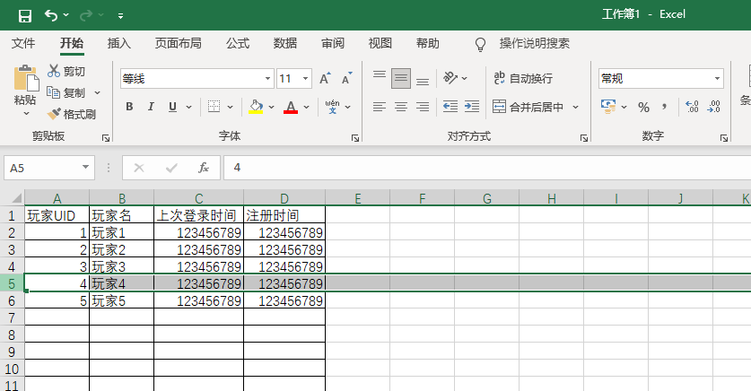
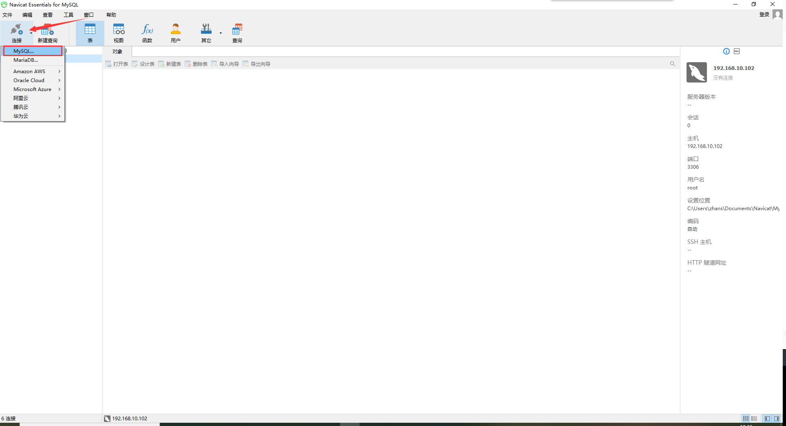
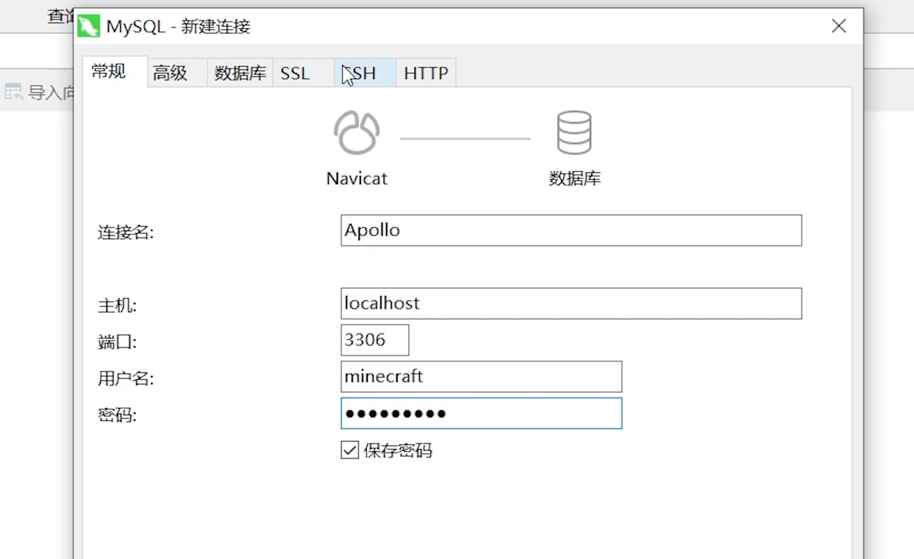
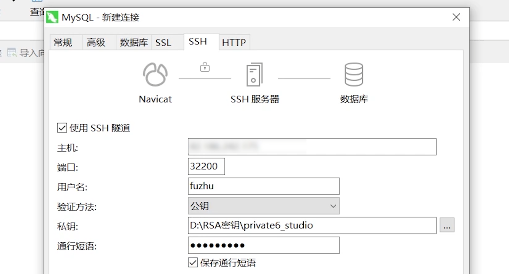
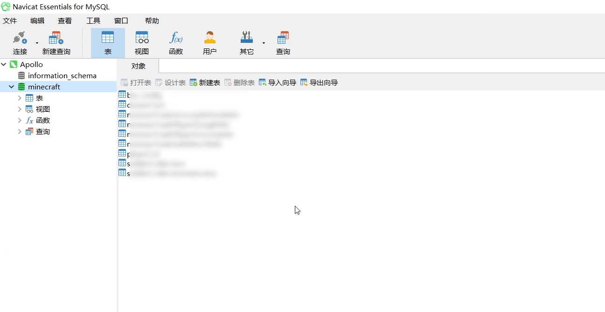

# 数据库的概念

在服务器插件的开发中，大多数数据都会被存储到数据库。

## 简介

数据库在很多服务器软件的开发中，它起到了非常重要的数据存储和筛选的作用，在Apollo插件的开发中也不例外。

Apollo目前支持3种数据库，MySQL、Redis和MongoDB它们各有各的特点，下面将进行依次介绍。

### MySQL

MySQL是一种关系型数据库，它的数据存储格式和我们常用的excel非常相似。

每个MySQL的数据表中，都有提前设定好的列，用来代表这一列的数据的类型和名称。各个列的数据组合，叫做行。位于同一行的数据可以一同被选择。

为了更好的理解，下面举一个Excel和MySQL对比的例子。



如上图所示，这个是一个Excel表格，其中需要记录4种数据，分别是**玩家UID，玩家名，上次登录时间，注册时间**。这些就是这个数据表的列。

我们需要将每一个玩家都记录到这个表中，那么一个玩家的所有数据就占一行。

表现在MySQL数据表中，就如下图所示。


在实际应用中，我们就可以通过uid查找到玩家的注册时间（第一次登陆时间），上次登录时间和玩家名。

### Redis

Redis是一款既可以基于内存，也可以持久化的Key-Value型数据库。

此数据库在Apollo插件开发中，主要用来存储一些经常需要改变的值。

操作过程非常像Python中的dict，此处不再举例说明。

例如玩家的在线统计——一个玩家进入服务器时，就需要操作数据库，修改总在线+1。同理，退出时，需要操作数据库，修改总在线-1。

### MongoDB

MongoDB是一款介于关系数据库和非关系数据库之间的数据库。

它可以轻松地将Python中常用的dict或json对象存储到数据库中，并很方便地对其中某个参数进行筛选和查询。

还是以上方的玩家信息为例，假如一个玩家的json对象是```{"uid":1,"name":"玩家1","reg_date":123,"last_login":123}```

那么将其插入到数据库中，即可通过```{"uid":1}```这样的条件，来查询到玩家的整条json信息。


开发者可以根据自己的习惯和实际用途，来选择使用不同的数据库。


## 前端工具

这里将以Navicat为例，给大家演示如何使用连接到服务器的MySQL数据库。其他数据库连接同理。

Navicat官网链接: https://www.navicat.com.cn/

### 视频教程

<iframe src="https://cc.163.com/act/m/daily/iframeplayer/?id=6181002648e2749089200cbe" height="600" width="800" allow="fullscreen" />

### 准备内容

- 支持MySQL的Navicat数据库管理软件
- 用于机器连接的RSA密钥
- 确保当前IP在服务器白名单内

### 操作步骤

1. 首先，打开Navicat软件，点击左上角的连接按钮，选择MySQL。

   

2. 在“常规”标签页下，输入连接名(任意，用于区分连接)，用户名 *minecraft*，密码 *minecraft* (以上均为默认密码)。

   

3. 在“SSH”标签页下，勾选使用SSH隧道，填写主机，端口*32200*，用户名*fuzhu*，验证方法*公钥*，选择私钥路径。通行短语输入你创建RSA密钥时输入的密码。勾选保存通行短语并保存。

   

4. 随后可在左边区域看到你新建的连接，双击即可进行连接。

   

