# 小小云连接

在阅读此教程前，首先需要安装XShell和XFtp。

XShell和XFtp均有免费的个人版，可在官网下载，链接: https://www.netsarang.com/zh/free-for-home-school/

## 小小云

小小云是一台云服务器，在这台云服务器上，预装了Debian操作系统和Apollo的运行环境。

Debian操作系统和常见的Windows操作系统不同。Debian是一种Linux系统，这种系统是为了服务器设计的，具有较高的稳定性，并且一般不安装图形操作界面，需要用户自行输入命令行命令来操作该系统。

下面将讲解如何申请和使用小小云。

## 创建密钥

### 视频教程

<iframe src="https://cc.163.com/act/m/daily/iframeplayer/?id=6180ffe7b8a81f8fa07ed443" height="600" width="800" allow="fullscreen" />

### 文字教程

在申请服务器前，你需要首先准备用于连接服务器的RSA密钥，并为其设置密码，操作步骤如下。

1. 打开XShell，找到菜单栏。依次点击**工具->新建用户密钥生成向导**

   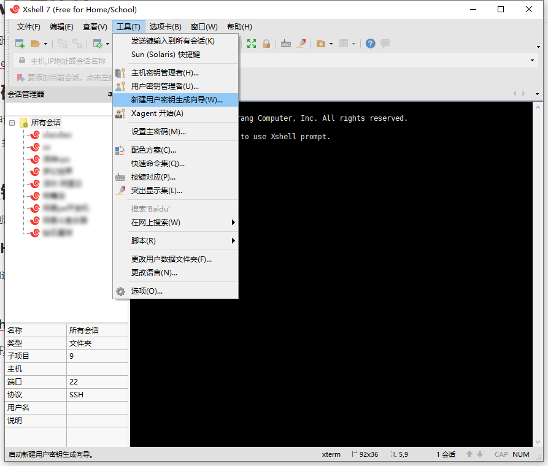

2. 密钥类型选择RSA，长度默认2048位

   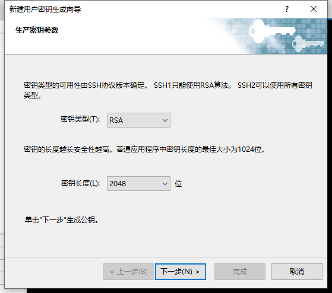

3. 输入一个方便区分的密钥名称，并为密钥设置密码，此密码需要牢记，丢失后只能重新创建密钥，**无法找回**！

   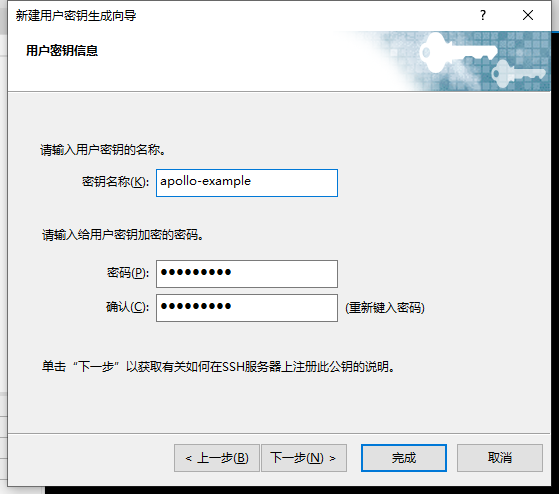

4. 点击完成，密钥创建完成。

5. 选中刚刚创建的私钥，点击导出，并在对话框中输入密码。将私钥文件存储好，方便后面Studio的配置。

   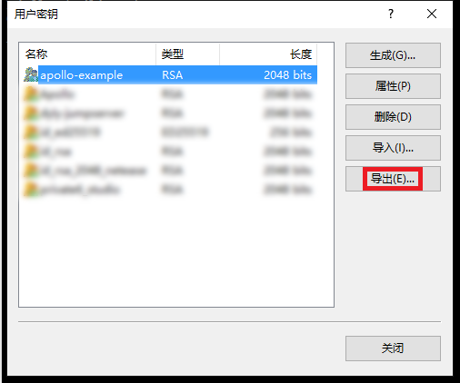

6. 接下来的步骤，是导出公钥并上传到开发者平台。选中刚刚创建的密钥，点击属性。

   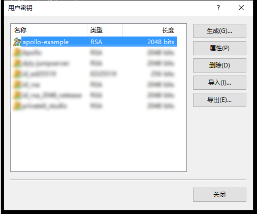

7. 切换到公钥选型卡，点击保存为文件，并上传到开发者平台即可。

   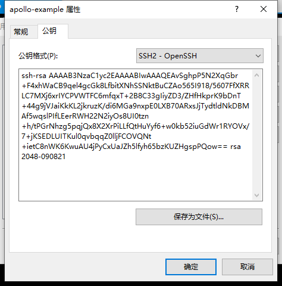
## 获取白名单网站

在访问开发机前，需要先获取白名单。

打开浏览器，输入 http://temp-white-list.mc.netease.com:9999/?machine=开发机IP地址

例如，如果你的开发机IP是42.186.1.1，就在浏览器中访问网址 http://temp-white-list.mc.netease.com:9999/?machine=42.186.1.1

访问后效果如下，稍候即可连接服务器。

## 私钥使用

### 视频教程

<iframe src="https://cc.163.com/act/m/daily/iframeplayer/?id=6180ffa948e2749089200cba" height="600" width="800" allow="fullscreen" />

### SSH

SSH连接是Linux服务器远程连接并进行管理的主要途径之一。下面将介绍使用XShell的基本使用方法，来连接到小小云。

1. 在XShell中点击左上角的新建按钮。

   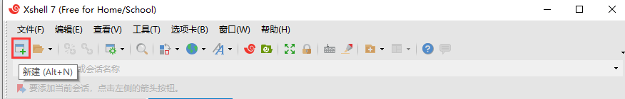

2. 在弹出的界面中输入开发机地址，端口。名称仅用作区分，可任意输入。

   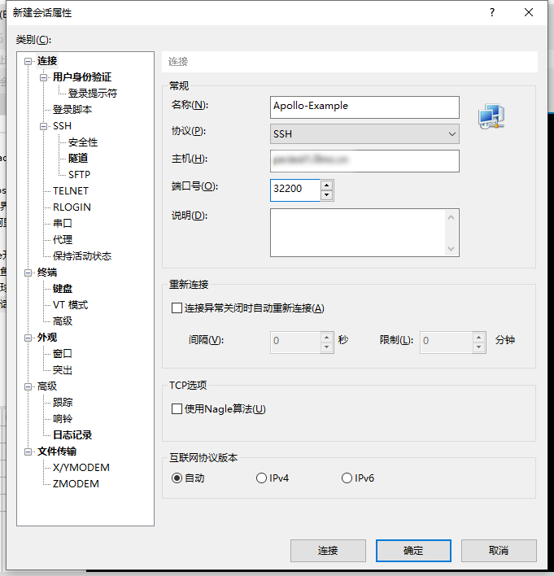

3. 在左侧的树形菜单中，找到**连接->用户身份验证**。填写用户名，方法中取消勾选**Password**，勾选并选中**Public Key**。

   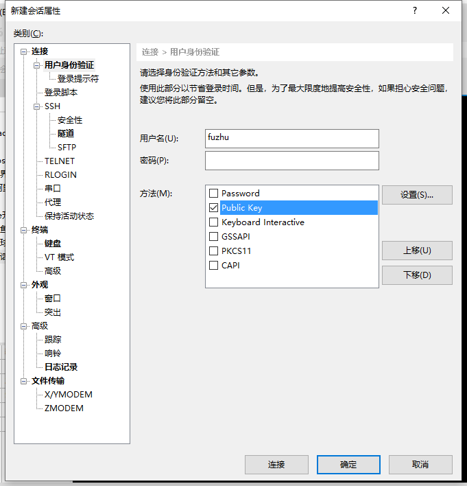

4. 点击设置，选择之前创建的用户密钥，并输入密码。

   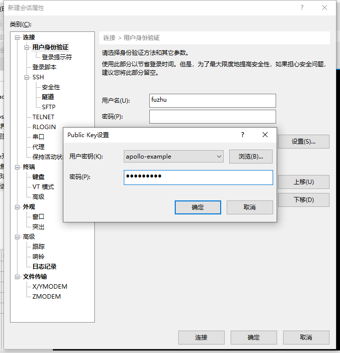

5. 点击确定，双击左侧列表中刚刚创建的连接，即可通过SSH登录到服务器。如果是第一次登陆，需要接受主机密钥，点击接受并保存即可。

   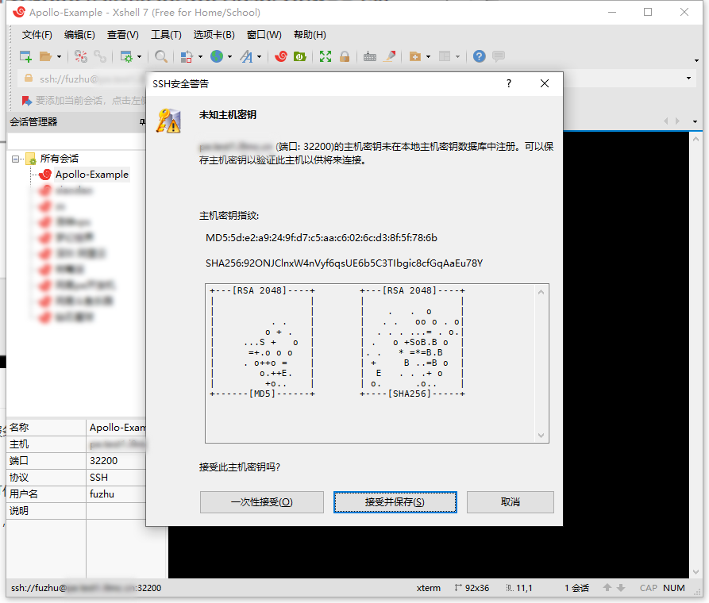

上方仅为XShell的操作，XFtp同理。不同的是，XShell访问的是服务器命令行控制台，XFtp访问的是服务器文件目录。

下图为XFtp连接后的示意。

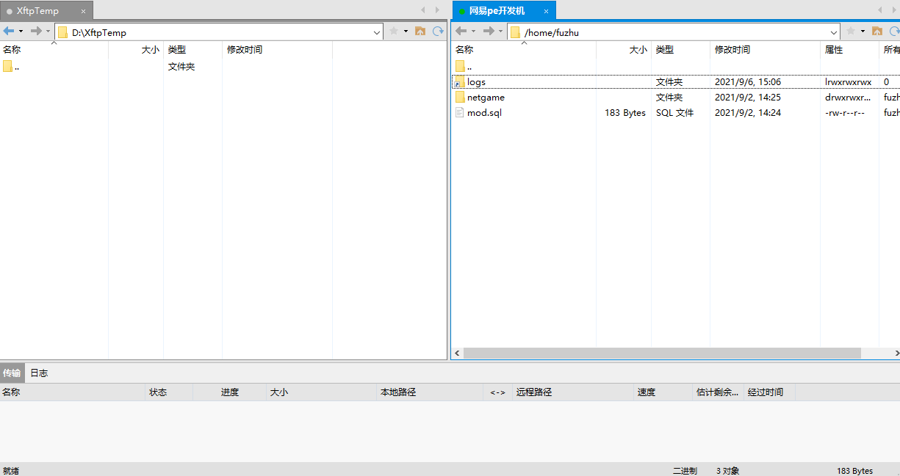

### Studio

下面将介绍如何在Studio中配置私钥。

1. 登录Studio，在**新建**中，选择**基岩版网络服**。创建一个任意类型的服务器，本教程使用空白网络服作为示例。

2. 选择之前在XShell中导出的私钥文件，填写密码。

   

3. 翻到底部的**服务器设置**，在机器列表的文本框中填写开发机IP地址。如果配置正确且有白名单，**完成**按钮就会亮起，点击完成即配置完成。

   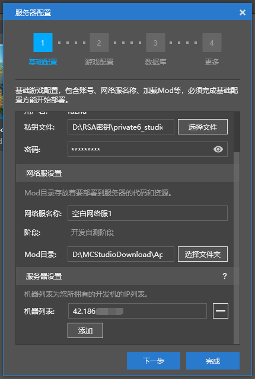

