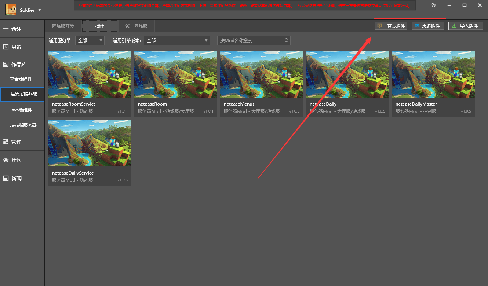
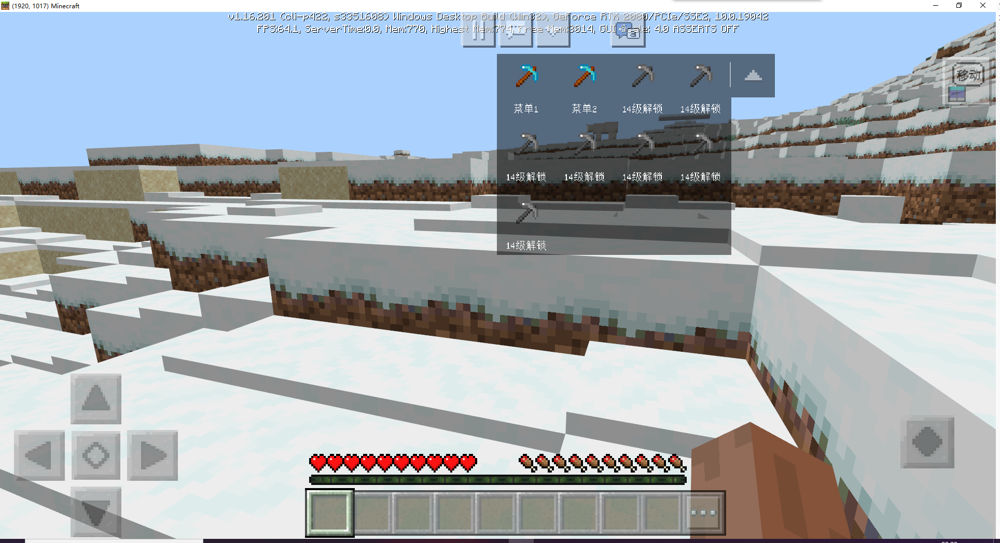

# 插件下载

本节将展示官方插件，第三方插件的使用流程，供读者了解。

## 下载入口

在基岩版网络服的插件标签页下，右上角可以看到官方插件和更多插件按钮。

目前官方插件和第三方插件涵盖了大部分的类型。包括但不限于:

- 聊天
- 工具
- 世界管理
- 经济
- 机制

未来官方会继续上传更多官方插件，并扶持、培养更多第三方开发者，扩充插件库，降低Apollo的开服门槛。

## 插件展示

### neteaseDaily

该插件给服务器带来了每日登录奖励的功能。

效果如图。

### neteaseMenus

该插件为服务器提供了快捷菜单功能。

效果如图。

