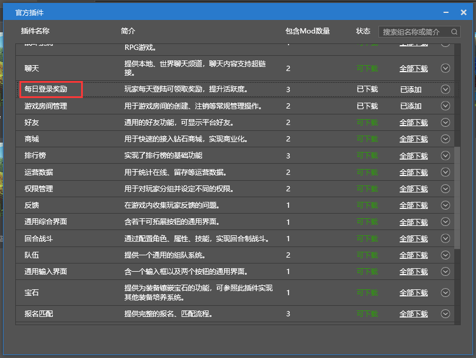
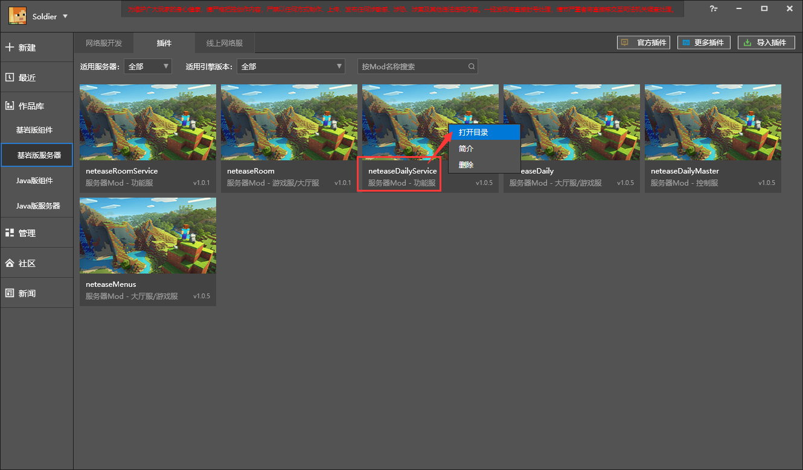
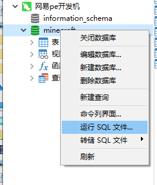
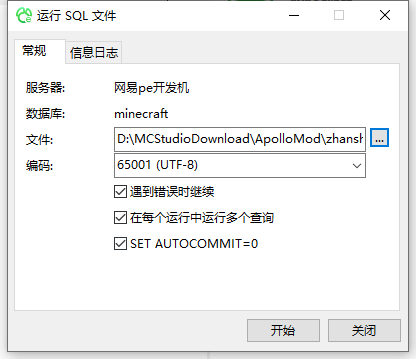

# 应用插件

本节会以官方插件每日登陆奖励为例，介绍如何应用插件在Apollo框架中。

## 视频教程

<iframe src="https://cc.163.com/act/m/daily/iframeplayer/?id=618100dc75882ab49553e983" height="600" width="800" allow="fullscreen" />

## 文字教程

1. 打开Studio基岩版网络服标签。

2. 点击官方插件

   

3. 点击官方插件，找到每日登陆奖励，点击全部下载，点击后效果如图。

   

4. 关闭官方插件界面，找到neteaseDailyService，点击更多，打开目录，复制mod.sql文件。

   

5. 在Navicat中连接到开发机，数据库minecraft。

6. 对minecraft数据库右键，点击运行sql文件。

   

7. 选择文件，粘贴mod.sql文件，点击开始。

   

8. 关闭界面，回到Studio。网络服开发 中，找到你创建的网络服。右键点击，选择服务器配置。

   

9. 游戏配置->大厅服->Mod 勾选neteaseDaily；控制服->Mod勾选neteaseDailyMaster；如果按照教程创建的空白模板，没有功能服，则新增一个功能服，Mod勾选neteaseDailyService。点击完成。

   

10. 鼠标移到网络服上，点击部署。

    

11. 部署完成后，点击开发测试。即可进入游戏。

体现本mod的功能需要调用接口，会放在后面讲解。也可以跟着[视频](#视频教程)操作进行尝试。效果图见[插件下载](./1-插件下载.html)。

