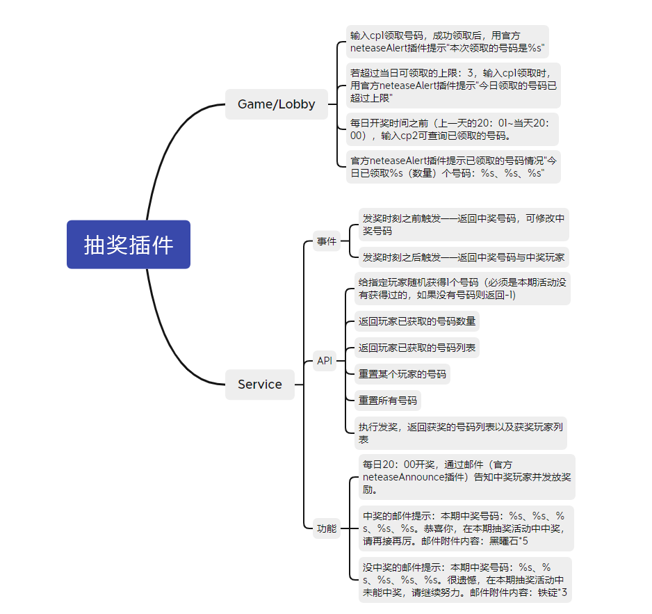
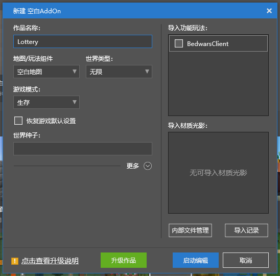
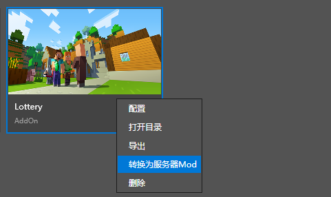

# 插件编写——制作篇（上）

## 需求分析

之前提到过，Apollo插件拥有3种不同的类型，我们在开始编写前，首先需要思考哪些需求可以运行在哪个类型的服务器上。

结构图如下

### Game/Lobby

- 输入cp1领取号码，成功领取后，用官方neteaseAlert插件提示“本次领取的号码是%s”
- 若超过当日可领取的上限：3，输入cp1领取时，用官方neteaseAlert插件提示“今日领取的号码已超过上限”
- 每日开奖时间之前（上一天的20：01~当天20：00），输入cp2可查询已领取的号码。
- 官方neteaseAlert插件提示已领取的号码情况“今日已领取%s（数量）个号码：%s、%s、%s”

> 为什么聊天输入相关的监听需要做在Game/Lobby服务器

因为玩家只会在Game/Lobby上在线，只有在这两种服务器上才能监听玩家的聊天信息。

### Service

- 每日20：00开奖，通过邮件（官方neteaseAnnounce插件）告知中奖玩家并发放奖励。
- 中奖的邮件提示：本期中奖号码：%s、%s、%s、%s、%s。恭喜你，在本期抽奖活动中中奖，请再接再厉。邮件附件内容：黑曜石*5
- 没中奖的邮件提示：本期中奖号码：%s、%s、%s、%s、%s。很遗憾，在本期抽奖活动中未能中奖，请继续努力。邮件附件内容：铁锭*3
- 服务器API——给指定玩家随机获得1个号码（必须是本期活动没有获得过的，如果没有号码则返回-1)
- 服务器API——返回玩家已获取的号码数量
- 服务器API——返回玩家已获取的号码列表
- 服务器API——重置某个玩家的号码
- 服务器API——重置所有号码
- 服务器API——执行发奖，返回获奖的号码列表以及获奖玩家列表
- 发奖时刻之前触发——返回中奖号码，可修改中奖号码
- 发奖时刻之后触发——返回中奖号码与中奖玩家

> 为什么“每日20：00开奖，通过邮件（官方neteaseAnnounce插件）告知中奖玩家并发放奖励。”需要做在Service服务器

因为发奖需要统一操作，而不可能所有玩家都在同一个Game/Lobby中，数据处理放在Service上则可以统一处理，更方便。

### Master

无

# 开发查询和参考链接

### Mod SDK

对游戏相关SDK不熟悉，可以在这里查询。

- 接口: <a href="../../../mcdocs/1-ModAPI/接口/通用/索引.html" rel="noopenner"> 链接 </a>
- 事件:<a href="../../../mcdocs/1-ModAPI/事件/世界.html" rel="noopenner"> 链接 </a>

### Apollo

对Apollo的专用接口有疑问，可以在这里查询。

- <a href="../../../mcdocs/2-Apollo/4-SDK/1-大厅与游戏服事件.html" rel="noopenner"> 链接 </a>

### Apollo 插件地址

在这里可以查看已经制作好的插件，并了解它们各自的功能。

- 官方插件：<a href="../../../mcdocs/2-Apollo/5-官方插件简介.html" rel="noopenner"> 链接</a>
- 第三方插件：<a href="../../../mcdocs/2-Apollo/6-第三方插件简介.html" rel="noopenner"> 链接</a>

# 代码编写

首先点击新建空白Addon，作品名称填写Lottery为例

点击启动编辑，会打开编辑器。但是我们创建项目的目的是为了快速生成一个Apollo插件模板，所以在弹出编辑器窗口后关闭即可。

随后在基岩版组件中，找到我们刚刚创建的名为Lottery的AddOn，右键选择，点击转换为服务器Mod。

弹出的窗口中，选项不需要做特别修改，直接点击转换。

随后在基岩版服务器插件中，找到刚刚创建的Lottery，右键打开目录。因为我们之前已经将需求归类，总结出需要Game/Lobby服和Service服的插件，所以我们将文件夹复制，并重命名成符合规范的。这里我们复制一份Lottery并重命名成soldierLottery，再将原来的文件夹重命名成soldierLotteryService。

操作完成后文件夹的样子应该如截图所示。

