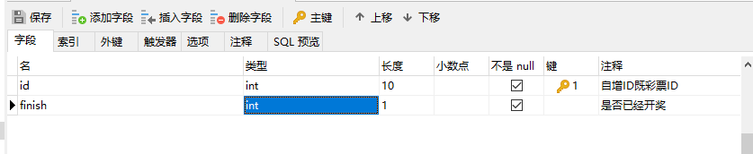

# 插件编写——制作篇（中）

## Service编写

根据之前对Service的了解，Service中是只应该有developer_mods文件夹的，而我们现在的soldierLotteryService文件夹，因为是从Game/Lobby复制而来的，所以需要手动将没有用的文件夹删除。只留下developer_mods文件夹，删除下图中选择的文件夹。


然后我们根据官方插件规范，将soldierLotteryService/developer_mods的Lottery文件夹，改名为soldierLotteryDev。

这里使用IntelliJ IDEA (PyCharm同理)为例，介绍插件代码的编写。

进入IDEA后，打开soldierLotteryService的项目，找到mod.json，按照官方规范进行修改，修改后的mod.json供参考。需要注意的是，support_server_type需要更改成service，否则无法在Service服部署。

```json
{
  "netgame_mod_name": "soldierLotteryDev",
  "netgame_mod_version": "1.0.0",
  "min_app_version": "1.23.0.release20210722",
  "author": "Soldier",
  "module_names": "soldierLottery",
  "support_server_type": [
    "service"
  ],
  "group": "soldierLottery"
}
```

随后我们就可以开始编写代码了，Service服的入口modMain和一般Mod的结构非常相似，创建一个consts.py用来存放一些常量后，就可以参照下方代码编写了。

modMain.py

```python
# coding=utf-8
from mod.common.mod import Mod
import mod.server.extraServiceApi as serviceApi

from soldierLotteryScripts.consts import ModName, ModVersion, ServiceSystemName, ServiceSystemClsPath


@Mod.Binding(name=ModName, version=ModVersion)
class SoldierLotteryService(object):
    @Mod.InitService()
    def InitService(self):
        serviceApi.RegisterSystem(ModName, ServiceSystemName, ServiceSystemClsPath)
        print "SoldierLotteryService启动"

    @Mod.DestroyService()
    def DestroyService(self):
        print "SoldierLotteryService卸载"

```

lotteryServiveSystem.py

```python
# coding=utf-8
from mod.server.system.serviceSystem import ServiceSystem

from soldierLotteryScripts.mysqlManager import MysqlManager


class LotteryServiceSystem(ServiceSystem):

    def __init__(self, namespace, systemName):
        ServiceSystem.__init__(self, namespace, systemName)
```

随后我们可以开始编写MySQL数据库相关的代码。

在编写数据库的代码之前，我们首先需要设计好数据表结构。分析需求，可以得出该插件需要两张数据表，分别用来存储抽奖信息和玩家信息。

### 抽奖信息表

主要需要记录 抽奖id，是否开奖



因为这张表我们只需要通过id来设置是否已经开奖，而id又是主键，自带索引。所以无需创建索引，直接设计好后将SQL复制到mod.sql中即可。

```sql
CREATE TABLE `soldierLotteryState`  (
    `id` int(10) UNSIGNED NOT NULL AUTO_INCREMENT COMMENT '自增ID既抽奖ID',
    `finish` int(1) UNSIGNED NOT NULL COMMENT '是否已经开奖',
    PRIMARY KEY (`id`)
);
```

### 玩家信息表

主要需要记录 玩家uid，玩家持有的抽奖id，对应抽奖的号码

则可以使用Navicat设计出数据表如下图所示。其中需要注意的是，玩家uid的类型必须为**无符号 int**，在sql命令中表达为 ```UNSIGNED INT```，不能是int。


由于功能上需要查询指定抽奖id的玩家拥有的号码，同时需要检索player和lottery两列数据，所以我们需要给它们加上索引来提高后续的搜索速度。

索引添加如下图。（索引涉及到的知识要求相对较高，如果不理解，可以在MySQL相关教程处学习，这里我们简单理解成需要检索哪一列就给哪一列添加索引）


随后在SQL预览处将SQL复制出来，自行修改表名，粘贴到mod.sql中。

```sql
CREATE TABLE `soldierLotteryPlayer`  (
    `id` int UNSIGNED NOT NULL AUTO_INCREMENT COMMENT '自增ID',
    `player` int UNSIGNED NOT NULL COMMENT '玩家UID',
    `lottery` int(10) NOT NULL COMMENT '抽奖ID',
    `number` int(10) NOT NULL COMMENT '玩家持有的抽奖号码',
    PRIMARY KEY (`id`),
    INDEX `player_lottery`(`player`, `lottery`) USING BTREE COMMENT '玩家uid和抽奖id的索引'
);
```

### 数据接口

设计完数据表，就可以根据需求，编写可能会用到的数据相关接口。

这里我们对照接口一项一项编写，下面展示```mysqlManager.py```的一部分代码。

```python
# coding=utf-8
import random
from collections import OrderedDict

from apolloCommon import mysqlPool

from soldierLotteryScripts import consts


class MysqlManager(object):
    """
    MysqlManager主要用来管理数据库数据
    提供函数快捷获取玩家数据
    """

    def __init__(self, serviceSystem):
        self.mServiceSystem = serviceSystem
        print "初始化MySQL数据库连接"
        mysqlPool.InitDB(10)
        self.mPlayerCache = {}  # 玩家数据缓存
        self.mStateCache = OrderedDict()  # 抽奖状态缓存
        self.mLotteryNumbers = {}  # 抽奖号码缓存
        self.CacheLotteryStates()
        self.CacheAllNumbers()

    def Destroy(self):
        mysqlPool.Finish()
        print "关闭MySQL连接"

    def GetPlayerCache(self, uid):
        """
        获取玩家缓存，没有缓存则从数据库获取，并返回None
        :param uid:
        :return:
        """
        cache = self.mPlayerCache.get(uid)
        if cache is not None:
            return cache

        def callback(uid, result):
            data = {}
            if result:
                for line in result:
                    tmp = data.get(line[0], [])
                    tmp.append(line[1])
                    data[line[0]] = tmp
            print "缓存玩家{}的数据为{}".format(uid, data)
            self.mPlayerCache[uid] = data

        sql = "SELECT `lottery`,`number` FROM `{}` WHERE `player` = %s;".format(consts.LotteryPlayerTable)
        mysqlPool.AsyncQueryWithOrderKey("cache_player_{}".format(uid), sql, (uid,),
                                         lambda result: callback(uid, result))
        return None

    def RemovePlayerCache(self, uid):
        """
        移除玩家缓存，退出时触发
        :param uid: 玩家UID
        :return:None
        """
        cache = self.mPlayerCache.get(uid)
        if cache is None:
            # 因为正常获取过缓存数据的玩家，都存储过cache为{}，不可能是None。所以此处是None的话不处理
            return
        del self.mPlayerCache[uid]
```

需要从这串代码中注意的是，所有数据都采用了缓存的方式来处理。即玩家加入游戏，从MySQL获取数据并缓存；玩家退出游戏，如果玩家的数据发生了变化，则存到数据库并删除缓存，如果没变化则直接删除缓存。

并且，在执行SQL命令时，需要注意尽量让每个操作的**OrderKey**唯一，这样就可以使SQL命令并发执行，提高效率。

### 发送邮件

在需求中，有一条是使用官方邮箱插件发送奖励。所以我们首先需要下载官方的邮箱插件，并查看他的简介。

简介可以在官方插件页面下载后，在插件的右键菜单中找到。

在简介中可以找到发送邮件的接口

> （7）向一组指定uid的玩家发送私人邮件（功能服用）
> 函数：OutSendMailToMany(touids, title, content, itemList=[], expire=None, srcName="")
> 参数：
>     touids:list(int), 玩家唯一ID的列表
>     title:str, 邮件标题
>     content:str, 邮件正文
>     itemList:list(dict), 附件物品列表，格式与通用的【物品信息字典】相同（参照ModSDk中往背包中塞物品的字典），额外支持【durability】关键字定义耐久度。另外，如果同经济插件一起使用，还支持货币，格式为：
> itemType为"currency"表示货币类型，itemName对应经济插件mod.json中dough_id配置，icon对应济插件mod.json中dough_icon配置，count表示货币数量。
>     expire:int, 邮件有效期，单位秒
>     srcName:str, 邮件发送者名字
> 示例：
>     import server.extraServiceApi as serviceApi
>     itemDict = {
>         'itemName': 'minecraft:bow',
>         'count': 1,
>         'enchantData': [(19, 1),],
>         'auxValue': 0,
>         'customTips':'§c new item §r',
>         'extraId': 'abc'
>     }
>     currencyDict = {
>         'itemName' : 'RMB',
>         'itemType' : 'currency',
>         'icon' : 'textures/ui/netease_trade/icon03@3x.png',
>         'count' : 3
>     }
>     mailSystem = serviceApi.GetSystem("neteaseAnnounce", "neteaseAnnounceService")
>     mailSystem.OutSendMailToMany([123,234], "欢迎新人", "欢迎首次登录，开发组送上弓一把", [itemDict, currencyDict], 86400, "开发组")

我们可以参考介绍编写发送奖励邮件的代码。

### 通信

我们在Service服上编写的接口如果需要被Game/Lobby调用，就需要用到服务器之间的通信。下方的例子就实现了接口请求。对应代码文件```lotteryServiceSystem.py```。

```python
class LotteryServiceSystem(ServiceSystem):

    def __init__(self, namespace, systemName):
        ServiceSystem.__init__(self, namespace, systemName)
        self.mMysqlManager = MysqlManager(self)
        self.RegisterRpcMethodForMod(consts.GetPlayerRandomNumber, self.OnGetPlayerRandomNumber)

    def OnGetPlayerRandomNumber(self, serverId, callbackId, args):
        player = args["player"]
        lottery = self.mMysqlManager.GetUnfinishedLottery()
        if lottery == -1:
            eventData = {
                "code": 1,
                "msg": -1
            }
        else:
            eventData = {
                "code": 0,
                "msg": self.mMysqlManager.GetPlayerRandomNumber(player, lottery)
            }

        self.ResponseToServer(serverId, callbackId, eventData)
```


### 代码下载

教程中仅展示了部分代码，全部代码可以在这里下载。

[抽奖插件——service部分](https://g79.gdl.netease.com/pluginguide04-06.zip)

随后我们就可以部署并测试啦！

