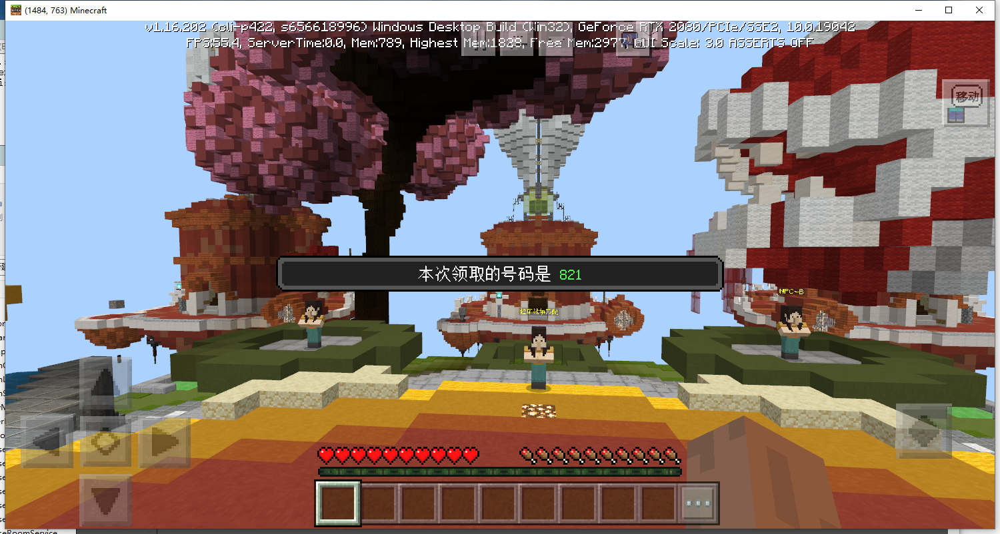
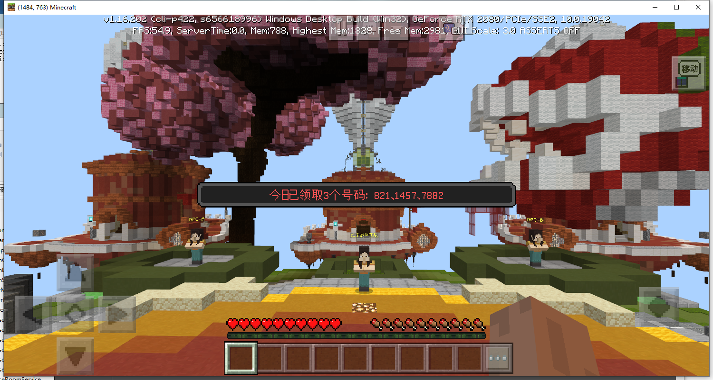
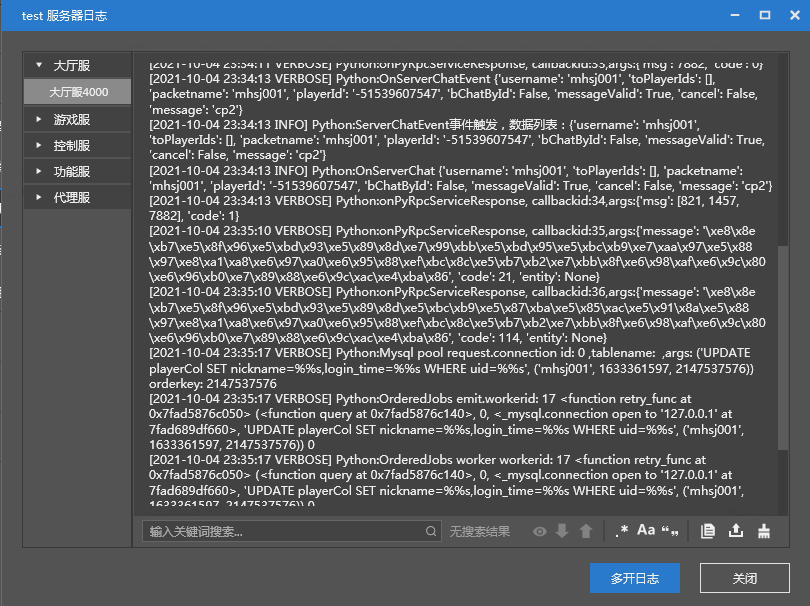
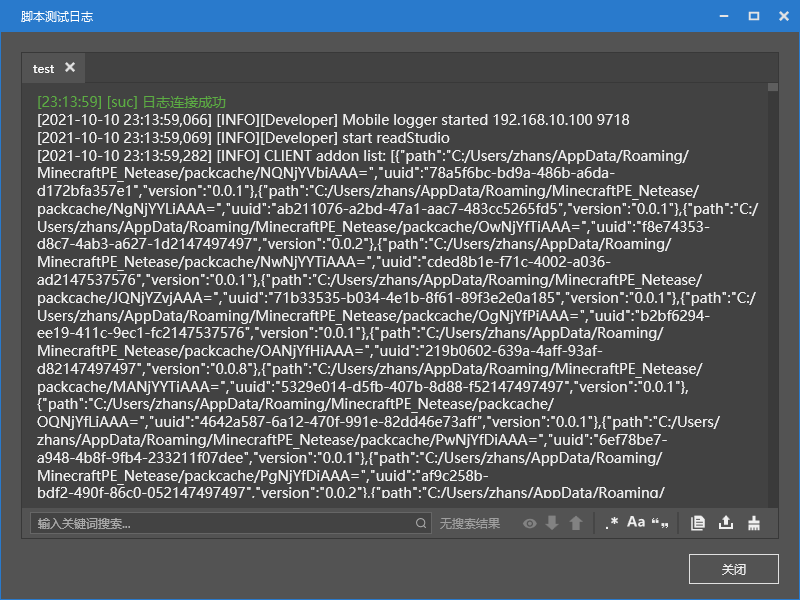
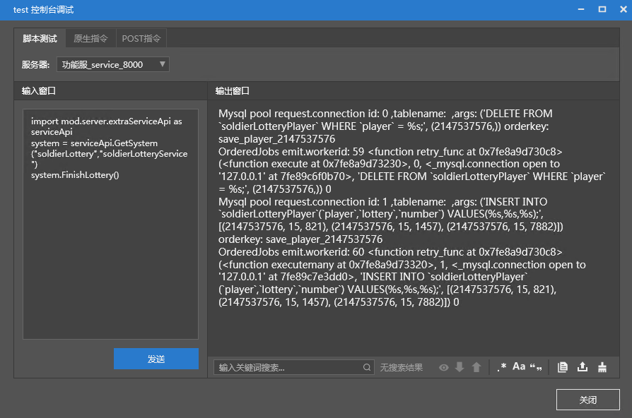
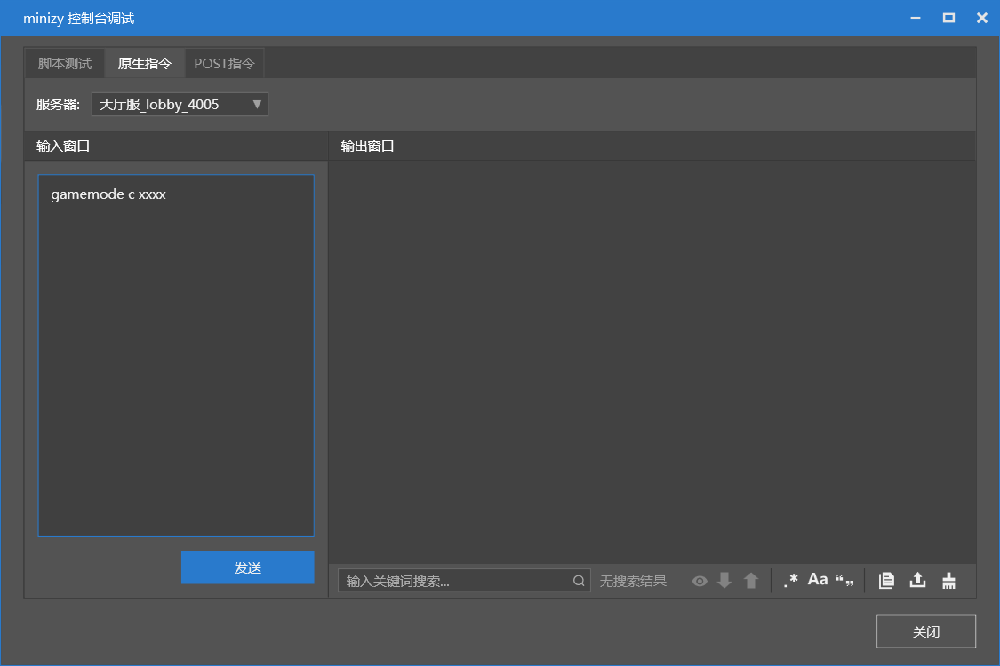

# 插件编写——测试篇

编写完插件，就可以部署并测试了。

利用[插件编写——制作篇(中)](./5-插件编写——制作篇（中）.html#代码下载)和[插件编写——制作篇(下)](./6-插件编写——制作篇（下）.html#代码下载)下载的插件代码，可跟着教程一同部署并测试。


## 部署过程

1. 执行mod.sql
2. 配置项中勾选相关插件
3. 执行部署
4. 启动游戏，查看效果

部署过程在之前已经讲过，忘记了的可以[点我](../2-初识插件/2-应用插件.html)进行回顾。

在勾选相关插件的步骤里，因为我们使用到了多个官方插件，所以勾选时请注意将它们全部勾选上。

下方列出了不同类型的服务器需要勾选的插件。

### Game/Lobby服

- neteaseAlert
- neteaseAnnounce
- soldierLottery

### Master服

- neteaseAnnounceMaster

### Service服

- neteaseAnnounceService
- soldierLotteryService

> 需要注意的是，由于示例插件中，请求到的service服务器类型固定是"service"，所以在配置Service服务器时，在类型处请填写"service"。
>
> 如果需要修改，可以在consts.py中修改ServiceServerType。

设置完成后，点击部署即可进行部署。

随后便可以进入游戏测试效果。

### 效果测试

聊天框输入cp1 领取号码



聊天框输入cp2 查看已领取的号码



## 调试工具与功能展示

### 服务器日志

在开发者工具中，对服务器右键，可以看到查看服务器日志选项。

点击即可查看所有服务器的日志。

在服务器脚本开发中，使用```print "msg"```语句，即可将日志信息打印到其中。



### 脚本日志

脚本日志即客户端日志。在客户端启动后会随之出现。界面如图。

在客户端脚本开发中，使用```print "msg"```语句，即可将日志信息打印到其中。



如果关闭后需要重新打开，可以对服务器右键，点击“查看脚本测试日志”重新打开。

### 控制台调试

控制台调试中分为脚本，原生指令，POST指令三个标签。

#### 脚本

在指定服务器执行python脚本。

例如在本示例插件中，在Service服务器中执行下方代码，即可强制抽奖进行开奖。

```python
import mod.server.extraServiceApi as serviceApi
system = serviceApi.GetSystem("soldierLottery","soldierLotteryService")
system.FinishLottery()
```



#### 原生指令

原生指令即Minecraft自带的指令，可以执行op,gamemode等类似指令。



#### Post指令

Post指令即Master服务器提供的HTTP指令。可以在面板中选择或输入你需要执行的指令，例如查看在线玩家列表。

