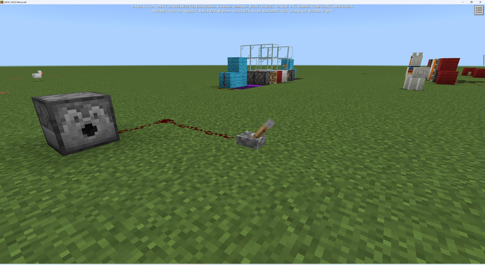
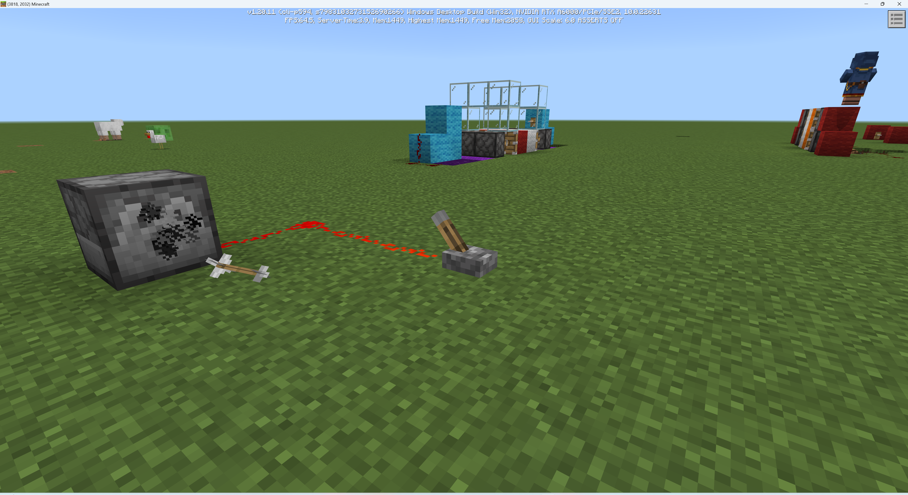
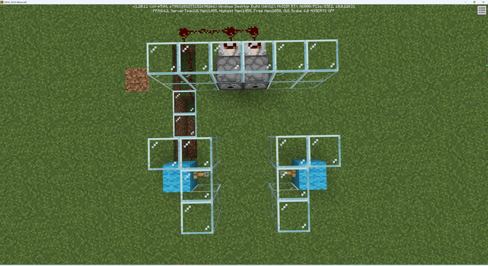
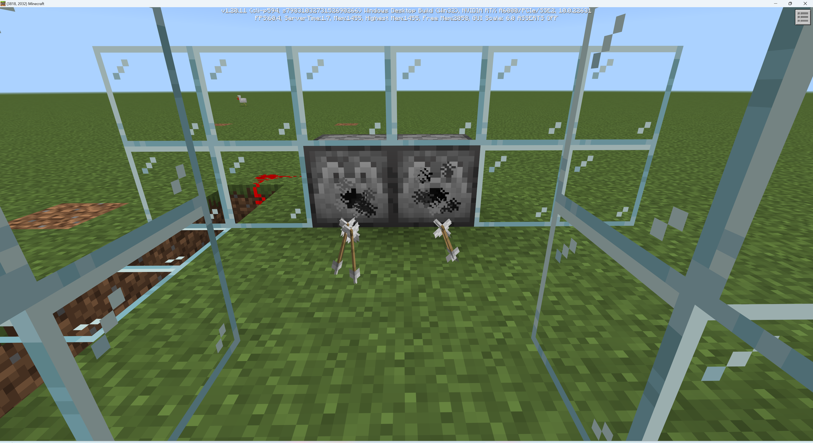

# 射箭机

射箭机也是遗迹中的一种重要且常见的机关。当你触发射箭机时，射箭机就会向你射出多发箭矢，如果躲避不及，就会身中数矢。当你没有穿戴盔甲时这往往也是致命的。

### 发射器

射箭机往往由一个触发装置和一个发射装置组成。触发装置我们自然可以用绊线钩来实现。而原版中的方块发射器则可以用作发射装置。

发射器是一种被激活时能够发射物品的耗能器。发射器“有嘴”的一面是他的正面，物品都会从正面发出，包括箭矢。

## 构建射箭机

如图所示，就是一个非常简单的射箭机。当你走过绊线时，便会从前方射出躲避不及的箭矢。

在实际应用中，你也可以将发射器的位置塞得更靠内一些，以用来隐蔽你的陷阱。下面是在遗迹中实际布置该陷阱的截图。