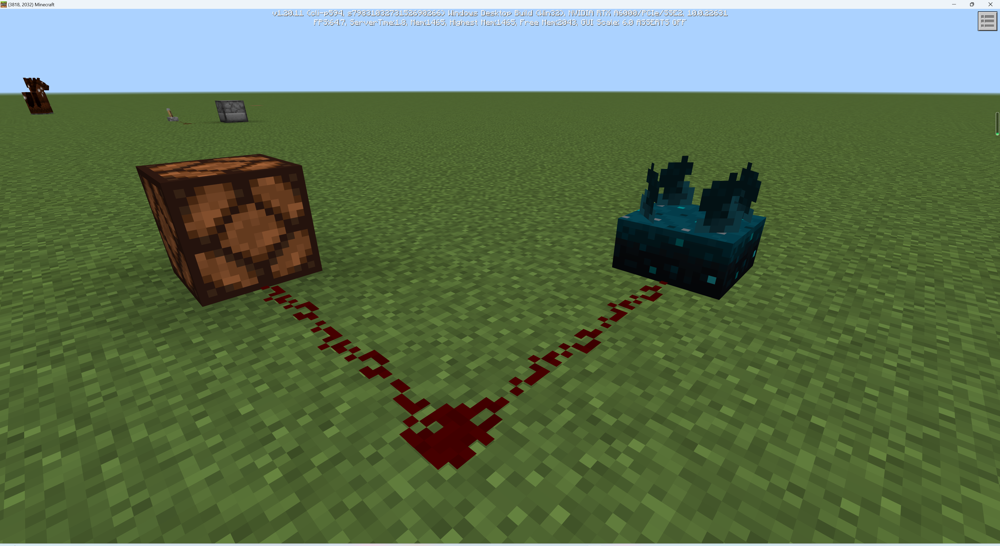
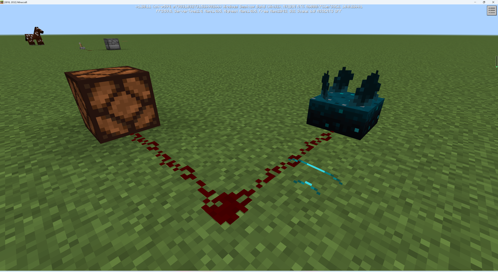
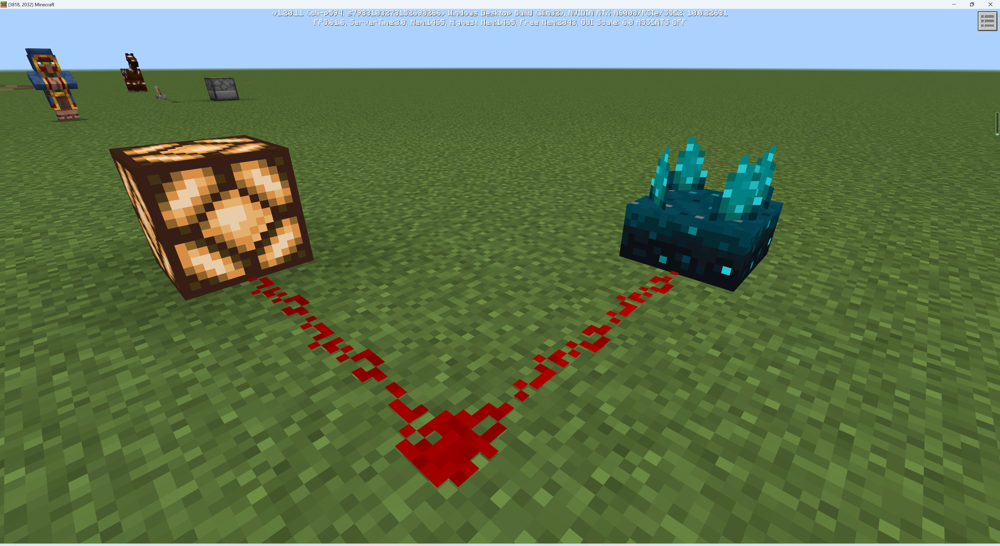
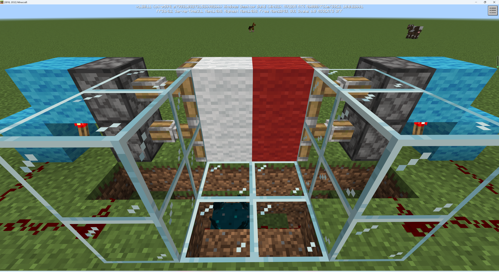
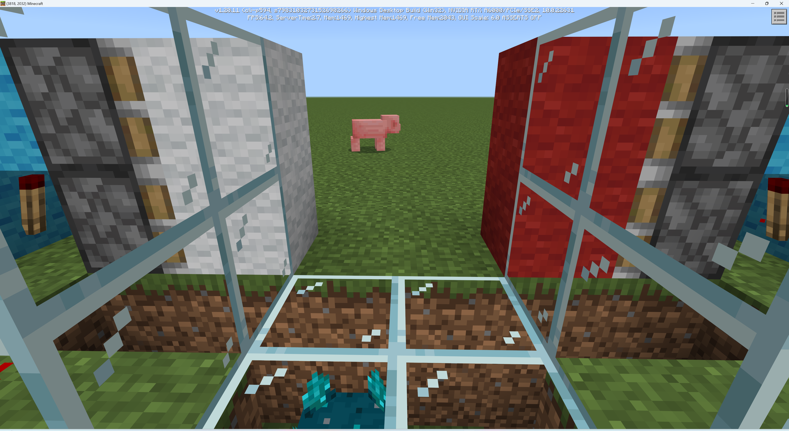

# 自动门

自动门是一种用于模拟现实中声控门的机关。想一想，如果当你接近一个门，门便可以自动打开，这是一件多么酷的事情。

## 幽匿感测体

幽匿感测体是一种可以接收振动从而发出红石信号的产能器。它可以收到你走路时发出的声音，从而营造一种声控的效果。

收到震动后，幽匿感测体会持续提供1.5s的红石信号能量。

## 构建自动门

知道了原理之后，自动门便非常好搭建。如图所示，当有玩家走过时，门便会自动开启。由于声波传导至幽匿感测体有一定延时，你还可以更改幽匿感测体的位置以更好地适配自动门的开启时机。

下面是在遗迹中实际布置该机关的截图。