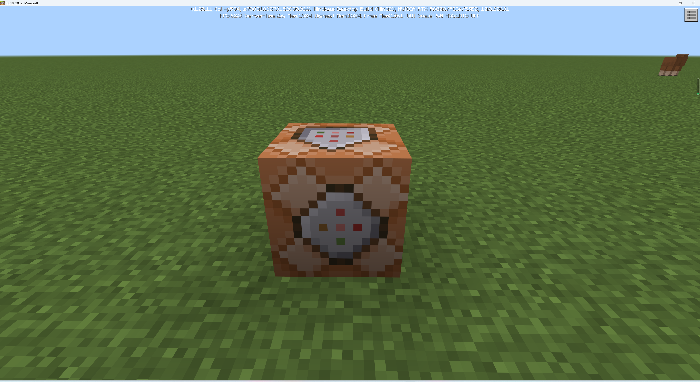
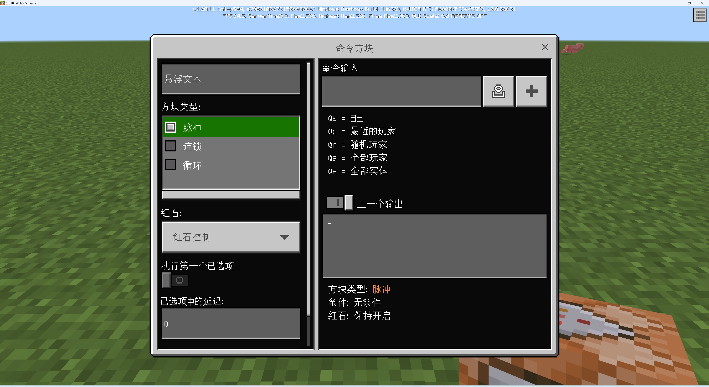
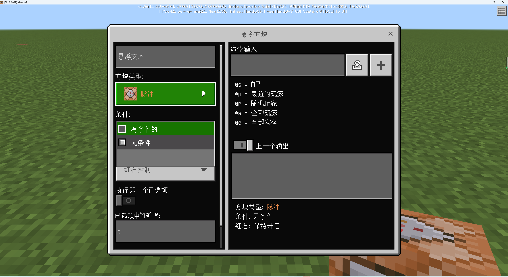
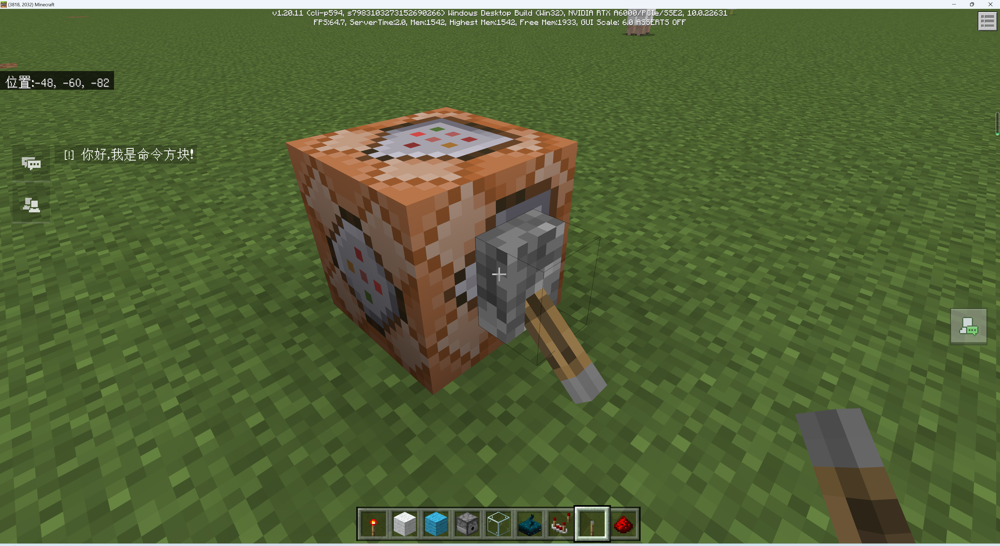
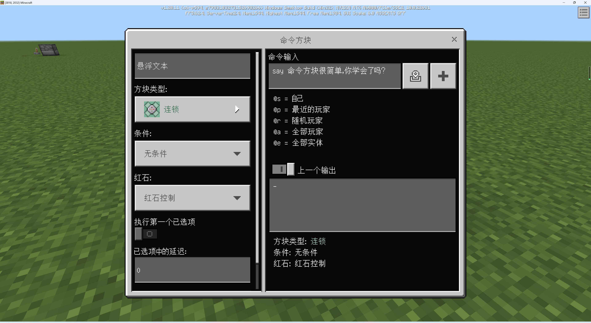
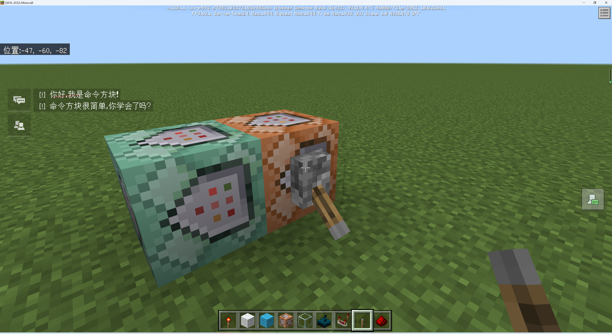
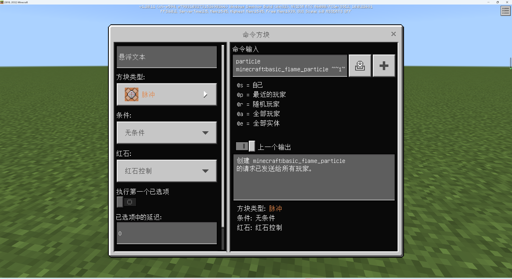

# 使用命令方块增强互动性

红石电路可以做到的事情有很多，但如果想搭建复杂的逻辑，要么需要极大的占地面积，要么依旧会受限于耗能器种类的不足。所幸，有一种耗能器被称为命令方块，他可以用于执行命令，因此，整个命令系统都可以通过命令方块并入红石系统，从而辅助完成更多的事情。

## 命令方块

命令方块无法在创造物品栏中找到，你需要使用命令`/give @p command_block`来给自己获取一个命令方块。

默认的命令方块是**脉冲**型的，表现为**橙色**纹理。脉冲在数字电路中指一次从无到有再到无的电路变化过程。顾名思义，脉冲型命令方块就是经历一次脉冲（一次激活然后回归到未激活）的过程就会执行一次命令的方块。准确的说，在默认情况下，命令方块会在激活的那一刻的后一刻（即延时一刻）执行命令。

命令方块右上角的“命令输入”栏用于输入命令。输入的命令会保存在方块中，直到你手动将其更改成其他命令。右下的方块是上一次执行命令的输出信息文本。

左侧的“方块类型”可以用于更改命令方块的类型。**连锁**型命令方块纹理为**青色**。命令方块是具有朝向的，连锁型命令方块只有在指向其的命令方块执行时才会跟着执行。**循环**型命令方块纹理为**紫色**。顾名思义，这种命令方块在激活状态下会每一**游戏刻**都执行一次命令。

条件下拉菜单用于控制执行是否受条件制约。受条件制约的命令方块只有在其后方（箭头指向的反方向）的命令方块成功执行时，自己才会执行。

红石下拉菜单用于切换是否受红石控制，受红石控制的行为就如同上面所述。如果保持开启，那么循环型将始终执行，脉冲型将只执行一次，连锁型将在适当的时机感应执行。

此外，“执行第一个已选项”开关是一个错误翻译，应译作“首刻执行”，开启后命令方块的执行延时将变为0刻，否则是正常的（至少）1刻。“已选中项的延迟”也是错误翻译，应译作“延时刻数”，决定命令方块在激活后几刻后执行命令，默认为0，但如果首刻执行未开启，会硬编码为至少1刻。同时该值也会被用于循环型命令方块的循环间隔。

## 用命令方块创造简单效果

我们现在尝试用命令方块创造一些简单效果。

### 发送文本信息

在命令方块中输入命令是不需要带前导`/`的，我们现在尝试输入`say 你好，我是命令方块！`。

尝试拉下拉杆后，命令方块被激活，同时可以看到左上的聊天栏内出现了“你好，我是命令方块！”的字样。

我们尝试连锁执行一些命令，在命令方块的前方（箭头指向的方向）再放置一个命令方块，设置为连锁型，并输入`say 命令方块很简单，你学会了吗？`。

拉下拉杆，你将看到前后两条消息接踵而至。通过这种方式，你可以在你的遗迹中在合适的位置设置简单的剧情。

### 创建粒子效果

你也可以用命令方块在合适的位置创建粒子效果。在命令方块中尝试输入`particle minecraft:basic_flame_particle ~~1~`，这条命令的意思是创建`minecraft:basic_flame_particle`粒子，这是原版火把、熔炉等方块使用的粒子。位于当前Y坐标+1，其他坐标取当前坐标的位置。对于命令方块而言，当前坐标就是命令方块所在坐标。

拉下拉杆，你会发现粒子如期而至。

你可以用这种方法为你的场景创造更多的氛围效果，使其沉浸感更强。