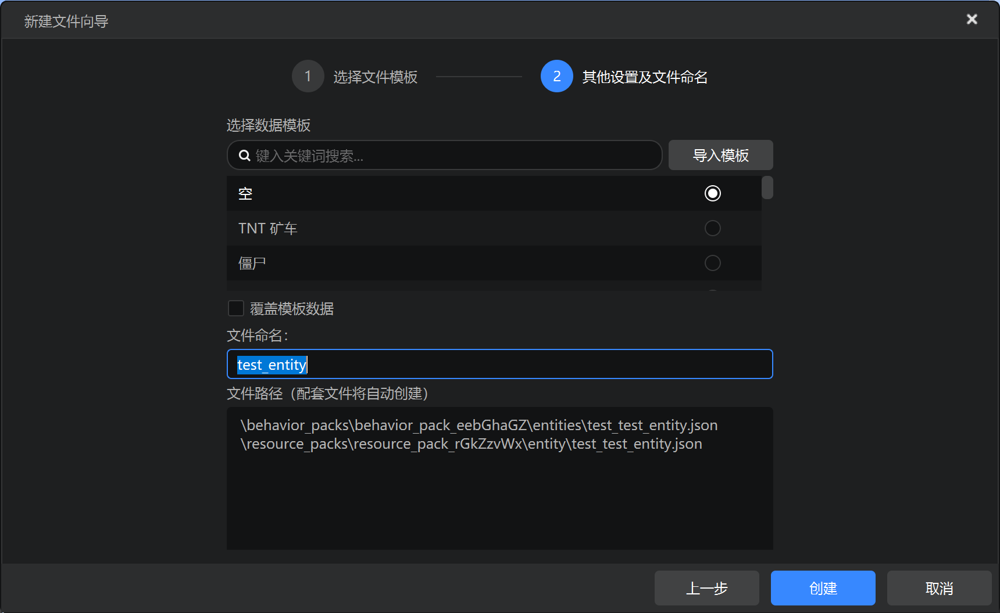
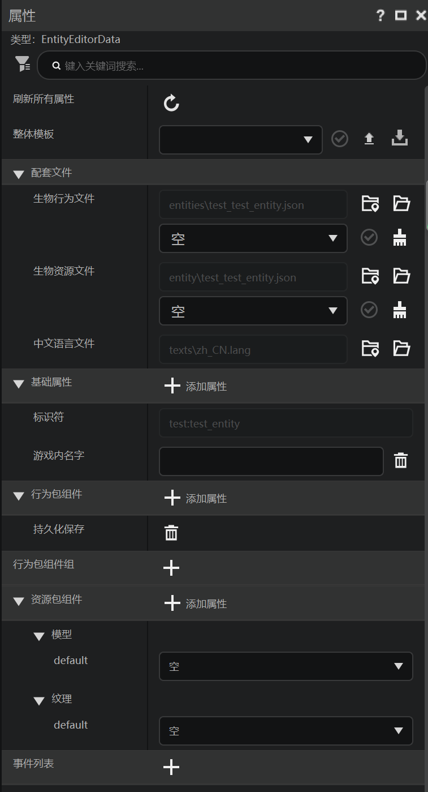

# 基本结构

在下面这几节中我们一起来回顾学习实体相关的自定义JSON文件。和之前一样，我们首先来回顾编辑器中创建的实体。

## 在编辑器中添加



我们在新建文件向导中新建一个实体配置。标识符设置为`test:test_entity`，模板选择空。



可以看到，虽然我们创建了一个空白的实体，但编辑器依旧为我们添加了“持久化保存”的行为包组件，该组件代表着实体在生成之后不会通过自动毁除（despawn）机制毁除，而是会保存至存档中。

资源包组件中也添加了模型和纹理的相关内容。我们很快会看到在实际JSON文件中他们的表现。

## 实际文件

在行为包的`entities`文件夹中，我们可以找到实体的服务端定义文件：

```json
{
    "format_version": "1.12.0",
    "minecraft:entity": {
        "component_groups": {

        },
        "components": {
            "minecraft:persistent": {

            }
        },
        "description": {
            "identifier": "test:test_entity",
            "is_experimental": false
        },
        "events": {

        }
    }
}
```

在资源包的`entity`文件夹中，我们可以找到实体的资源包定义文件：

```json
{
    "format_version": "1.10.0",
    "minecraft:client_entity": {
        "description": {
            "geometry": {
                "default": ""
            },
            "identifier": "test:test_entity",
            "textures": {
                "default": ""
            }
        }
    }
}
```

可以看到，在双端`description`的`identifier`下，定义了相同的实体标识符`test:test_entity`，这可以告诉引擎他们是同一个实体的不同部分。

服务端定义中的`components`是服务端的组件，这里可以看到持久化组件`minecraft:persistent`已经被添加。`component_groups`是实体的组件组，这是用于控制实体在不同状态之间切换的对象，其中可以分组定义成组的组件，然后我们可以在这些分组之间切换，可以参见Minecraft Wiki的[定义](https://zh.minecraft.wiki/w/%E5%AE%9A%E4%B9%89)页面。`events`是实体的事件，我们可以通过事件来增删组件组。

在客户端定义中，我们默认只有`description`对象，和`identifier`并列的`textures`用于控制纹理，`geometry`用于控制模型。此外，还有更多的其他属性，大家可以在编辑器中可视化添加这些属性并返回JSON文件查看。我们也会在后续的章节中对其中一部分进行讲解。
