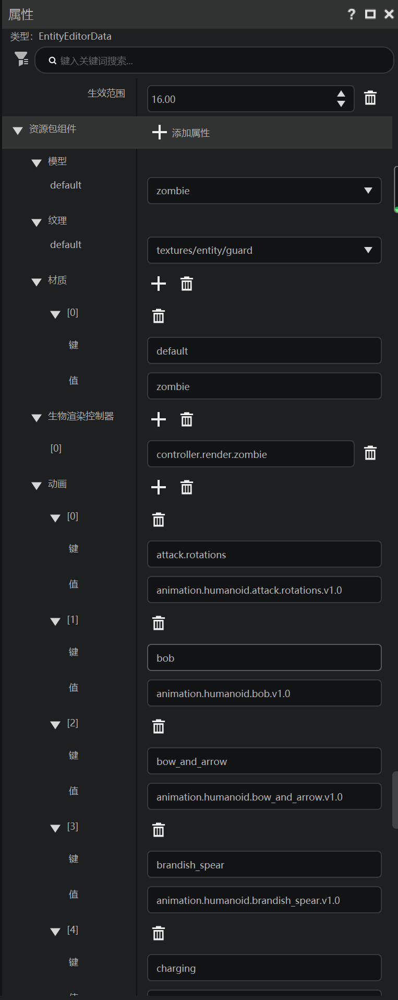
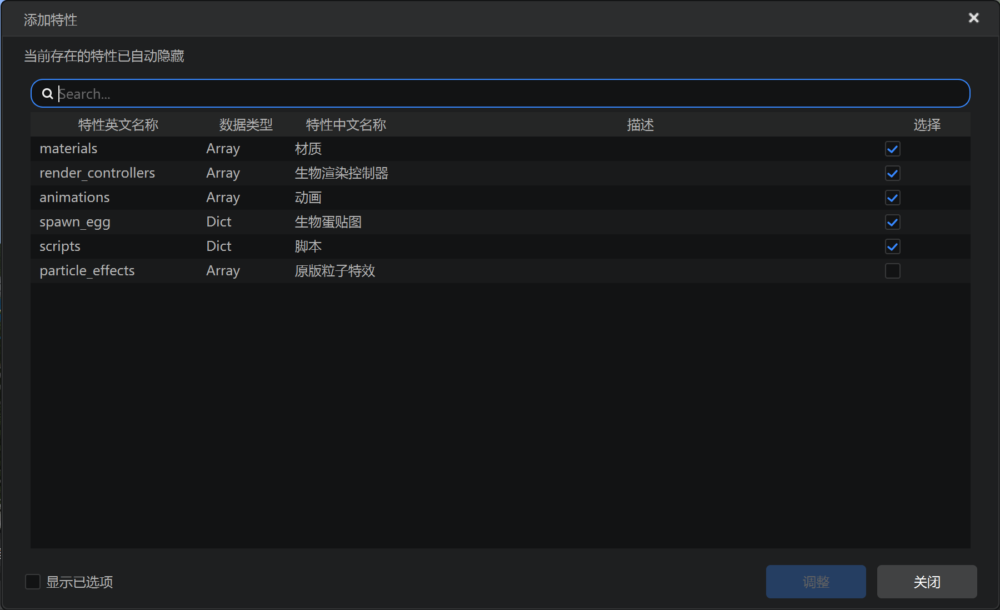

# 外观

在本节中，我们回顾学习实体的外观。

## 在编辑器中添加



我们回到之前添加过的守卫实体。可以看到，资源包组件处具有丰富的属性。我们可以尝试浏览这些属性，和后面JSON实际文件中的表现做出对比。



点击添加属性，我们也可以实际看到编辑器支持添加的属性列表。

## 实际文件

下面，我们一起来看一下守卫实体的资源包中的客户端定义文件：

```json
{
    "format_version": "1.8.0",
    "minecraft:client_entity": {
        "description": {
            "animation_controllers": [
                {
                    "humanoid_baby_big_head": "controller.animation.humanoid.baby_big_head"
                },
                {
                    "humanoid_base_pose": "controller.animation.humanoid.base_pose"
                },
                {
                    "look_at_target": "controller.animation.humanoid.look_at_target"
                },
                {
                    "move": "controller.animation.humanoid.move"
                },
                {
                    "riding": "controller.animation.humanoid.riding"
                },
                {
                    "holding": "controller.animation.humanoid.holding"
                },
                {
                    "brandish_spear": "controller.animation.humanoid.brandish_spear"
                },
                {
                    "charging": "controller.animation.humanoid.charging"
                },
                {
                    "attack": "controller.animation.humanoid.attack"
                },
                {
                    "sneaking": "controller.animation.humanoid.sneaking"
                },
                {
                    "bob": "controller.animation.humanoid.bob"
                },
                {
                    "damage_nearby_mobs": "controller.animation.humanoid.damage_nearby_mobs"
                },
                {
                    "bow_and_arrow": "controller.animation.humanoid.bow_and_arrow"
                },
                {
                    "swimming": "controller.animation.humanoid.swimming"
                },
                {
                    "use_item_progress": "controller.animation.humanoid.use_item_progress"
                },
                {
                    "zombie_attack_bare_hand": "controller.animation.zombie.attack_bare_hand"
                },
                {
                    "zombie_swimming": "controller.animation.zombie.swimming"
                }
            ],
            "animations": {
                "attack.rotations": "animation.humanoid.attack.rotations.v1.0",
                "bob": "animation.humanoid.bob.v1.0",
                "bow_and_arrow": "animation.humanoid.bow_and_arrow.v1.0",
                "brandish_spear": "animation.humanoid.brandish_spear.v1.0",
                "charging": "animation.humanoid.charging.v1.0",
                "damage_nearby_mobs": "animation.humanoid.damage_nearby_mobs.v1.0",
                "holding": "animation.humanoid.holding.v1.0",
                "humanoid_base_pose": "animation.humanoid.base_pose.v1.0",
                "humanoid_big_head": "animation.humanoid.big_head",
                "look_at_target_default": "animation.humanoid.look_at_target.default.v1.0",
                "look_at_target_gliding": "animation.humanoid.look_at_target.gliding.v1.0",
                "look_at_target_swimming": "animation.humanoid.look_at_target.swimming.v1.0",
                "move": "animation.humanoid.move.v1.0",
                "riding.arms": "animation.humanoid.riding.arms.v1.0",
                "riding.legs": "animation.humanoid.riding.legs.v1.0",
                "sneaking": "animation.humanoid.sneaking.v1.0",
                "swimming": "animation.humanoid.swimming.v1.0",
                "use_item_progress": "animation.humanoid.use_item_progress.v1.0",
                "zombie_attack_bare_hand": "animation.zombie.attack_bare_hand",
                "zombie_swimming": "animation.zombie.swimming"
            },
            "enable_attachables": true,
            "geometry": {
                "default": "geometry.zombie"
            },
            "identifier": "test:guard",
            "materials": {
                "default": "zombie"
            },
            "render_controllers": [
                "controller.render.zombie"
            ],
            "scripts": {
                "pre_animation": [
                    "variable.tcos0 = (Math.cos(query.modified_distance_moved * 38.17) * query.modified_move_speed / variable.gliding_speed_value) * 57.3;"
                ]
            },
            "spawn_egg": {
                "texture": "spawn_egg",
                "texture_index": 12
            },
            "textures": {
                "default": "textures/entity/guard"
            }
        }
    }
}
```

可以看到，一个已经定义完成的实体的客户端定义文件比空实体要丰富很多。

曾经，我们通过修改`textures/default`字段修改过守卫实体的纹理，大家现在已经改知道了，这就是修改了JSON中纹理指向的文件路径。

除了材质`materials`、几何模型`geometry`之外，我们还有一个专门的文件用于控制渲染的结果，那便是渲染控制器。渲染控制器位于资源包的`render_controllers`文件夹中，然后继而被实体客户端的`render_controllers`字段引用。在当前的例子中，实体客户端定义文件下的
`render_controllers`引用了原版的`controller.render.zombie`控制器。我们可以打开原版安装文件查看该控制器对应的JSON文件的内容：

```json
{
   "format_version":"1.8.0",
   "render_controllers":{
      "controller.render.zombie":{
         "geometry":"Geometry.default",
         "materials":[
            {
               "*":"Material.default"
            }
         ],
         "textures":[
            "Texture.default"
         ]
      }
   }
}
```

渲染控制器具体各个字段的含义可以在官方文档[自定义生物](https://mc.163.com/dev/mcmanual/mc-dev/mcguide/20-%E7%8E%A9%E6%B3%95%E5%BC%80%E5%8F%91/15-%E8%87%AA%E5%AE%9A%E4%B9%89%E6%B8%B8%E6%88%8F%E5%86%85%E5%AE%B9/3-%E8%87%AA%E5%AE%9A%E4%B9%89%E7%94%9F%E7%89%A9/01-%E8%87%AA%E5%AE%9A%E4%B9%89%E5%9F%BA%E7%A1%80%E7%94%9F%E7%89%A9.html?catalog=1)页面中找到。

此外，实体还有一些动画效果。`animations`字段定义了该实体中可以引用的所有动画，而`animation_controllers`中则定义了该实体使用的动画控制器。实体的动画制作较为繁琐，大家可以在上述自定义生物官方页面中找到具体JSON字段含义，并在官方课程[自定义松鼠实体资源](https://mc.163.com/dev/mcmanual/mc-dev/mconline/100-%E5%8E%86%E5%8F%B2%E5%BD%92%E6%A1%A3%E6%95%99%E7%A8%8B/15-%E7%8E%A9%E6%B3%95%E7%BB%84%E4%BB%B6%E6%95%99%E7%A8%8B%E3%80%90%E6%96%B0%E7%89%88%E3%80%91/11-%E7%B2%BE%E9%80%9A%E8%87%AA%E5%AE%9A%E4%B9%89%E5%A4%8D%E6%9D%82%E7%9A%84%E5%AE%9E%E4%BD%93/4-%E8%87%AA%E5%AE%9A%E4%B9%89%E6%9D%BE%E9%BC%A0%E5%AE%9E%E4%BD%93%E8%B5%84%E6%BA%90.html?catalog=1)中找到相关制作方法。
