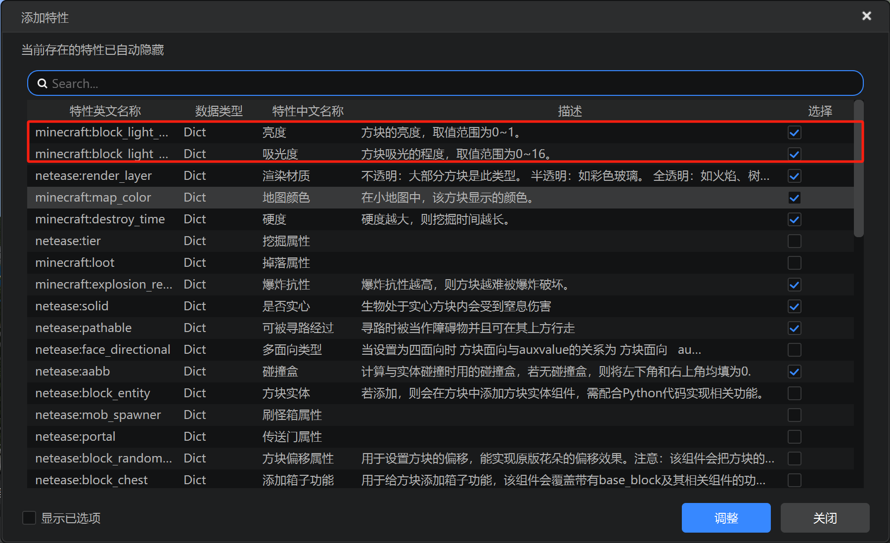
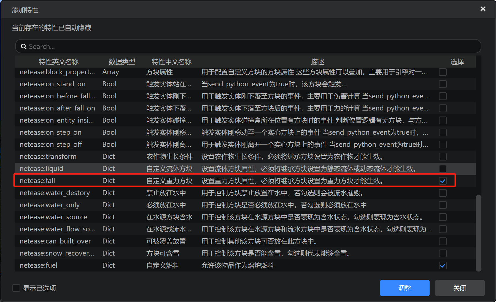
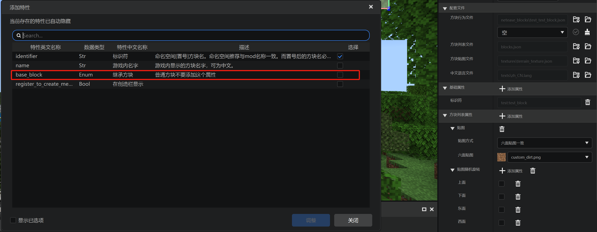
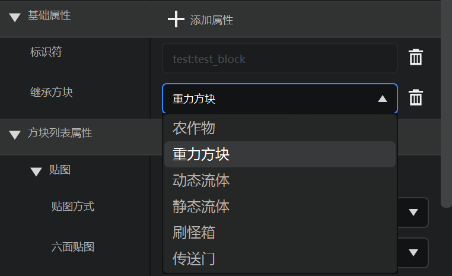
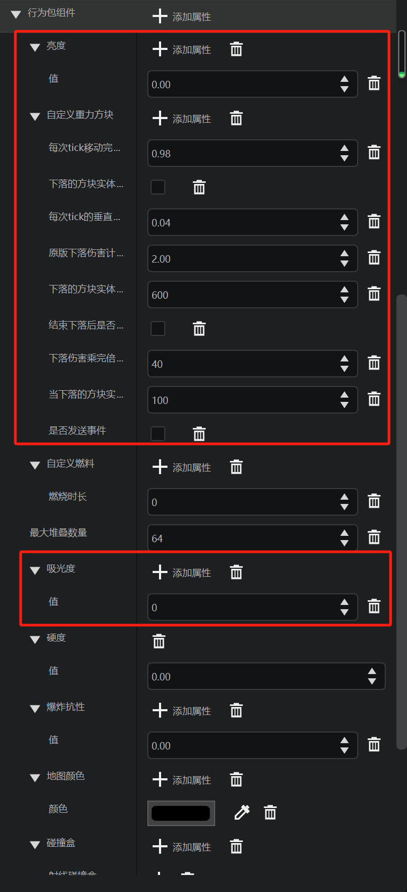

# 物理属性

在本节中，我们回顾学习方块的一些物理属性。

## 在编辑器中添加





我们继续向我们的方块中添加一些属性。



同时，我们在方块基础属性中添加`base_block`。



并将其设置为重力方块。



我们的属性栏中便多出了这些属性。

## 实际文件

接下来我们观察方块服务端定义文件的变化：

```json
{
    "format_version": "1.10.0",
    "minecraft:block": {
        "components": {
            "minecraft:block_light_absorption": {
                "value": 0
            },
            "minecraft:block_light_emission": {
                "emission": 0
            },
            "minecraft:destroy_time": {
                "value": 0.0
            },
            "minecraft:explosion_resistance": {
                "value": 0.0
            },
            "minecraft:map_color": {
                "color": "#000000"
            },
            "minecraft:max_stack_size": {
                "value": 64
            },
            "netease:aabb": {
                "clip": [

                ],
                "collision": [

                ]
            },
            "netease:fall": {
                "adjust_percentage": 0.98,
                "cancel_drop": false,
                "fall_acceleration": 0.04,
                "fall_damage_amount": 2.0,
                "force_break_tick": 600,
                "hurt_entity": false,
                "max_fall_damage": 40,
                "min_height_remove_tick": 100,
                "send_python_event": false
            },
            "netease:fuel": {
                "duration": 0
            },
            "netease:pathable": {
                "value": true
            },
            "netease:render_layer": {
                "value": "opaque"
            },
            "netease:solid": {
                "value": false
            }
        },
        "description": {
            "base_block": "custom_heavy_block",
            "identifier": "test:test_block"
        }
    }
}
```

现在我们的方块便具有了一些更多的物理属性，例如与光线的交互，或者是可以像沙子、铁砧那样下落。

`minecraft:block_light_absorption`用于指定方块的光线吸收度。世界中每个方块都有一个亮度，亮度默认会在向四周传播时如果相隔的是空气，每隔一个方块减少1，如果是一些“固体”方块，则直接减少15级，即不透光。这里我们可以更改这个值，使其阻挡自定义多的光线或者不吸收任何光线。

`minecraft:block_light_emission`则是定义了一个光源，其值代表光源发出多少级亮度的光。

`netease:fall`需要配合`description/base_block`为`custom_heavy_block`来使用，定义一个方块可以受重力下落。具体的下落方块字段属性的含义可以参考官方文档[自定义重力方块](https://mc.163.com/dev/mcmanual/mc-dev/mcguide/20-%E7%8E%A9%E6%B3%95%E5%BC%80%E5%8F%91/15-%E8%87%AA%E5%AE%9A%E4%B9%89%E6%B8%B8%E6%88%8F%E5%86%85%E5%AE%B9/2-%E8%87%AA%E5%AE%9A%E4%B9%89%E6%96%B9%E5%9D%97/3-%E7%89%B9%E6%AE%8A%E6%96%B9%E5%9D%97/6-%E8%87%AA%E5%AE%9A%E4%B9%89%E9%87%8D%E5%8A%9B%E6%96%B9%E5%9D%97.html?catalog=1)页面。