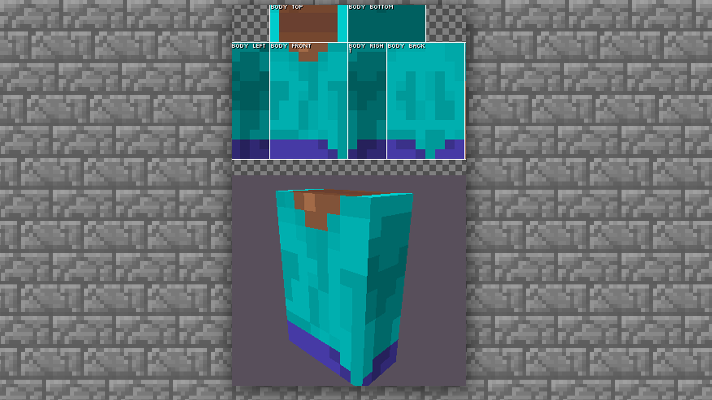
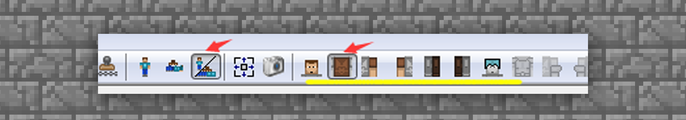
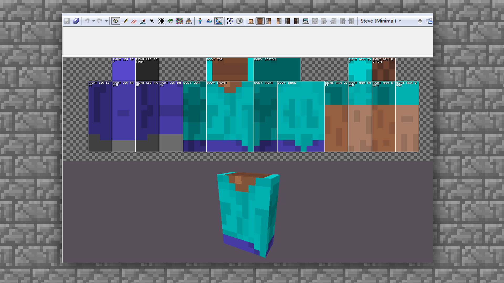
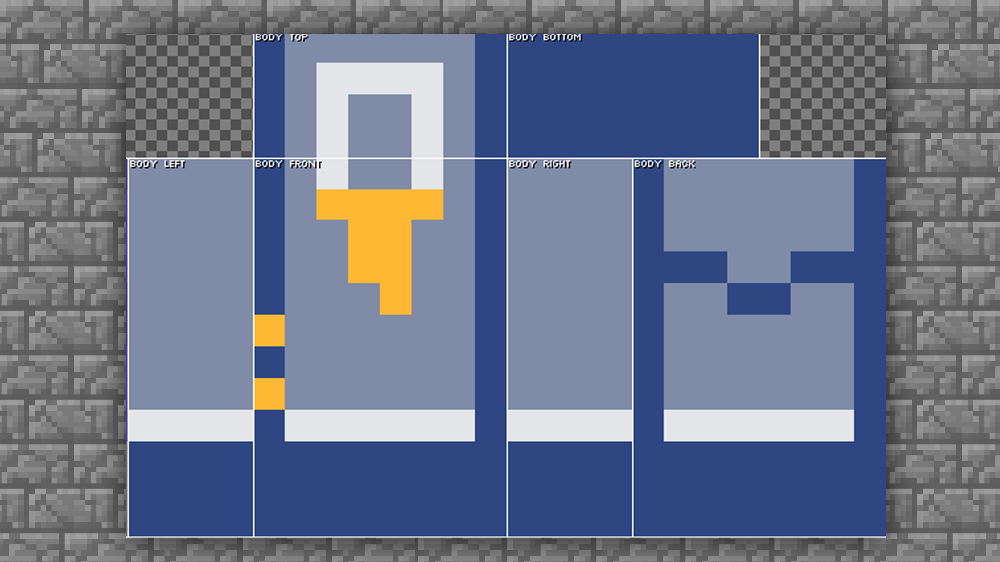
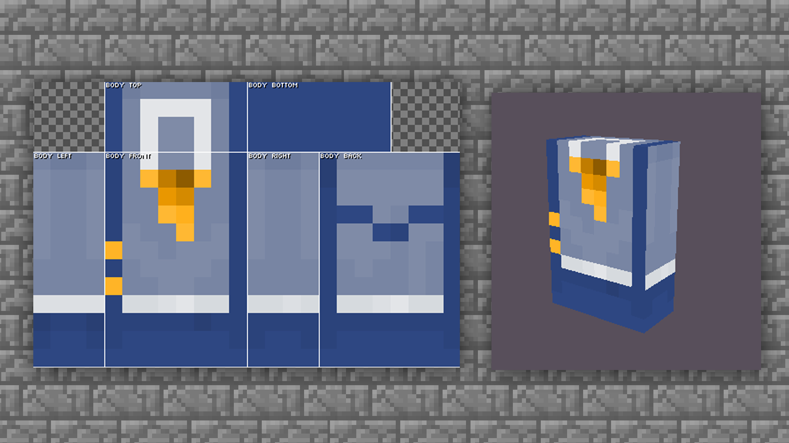
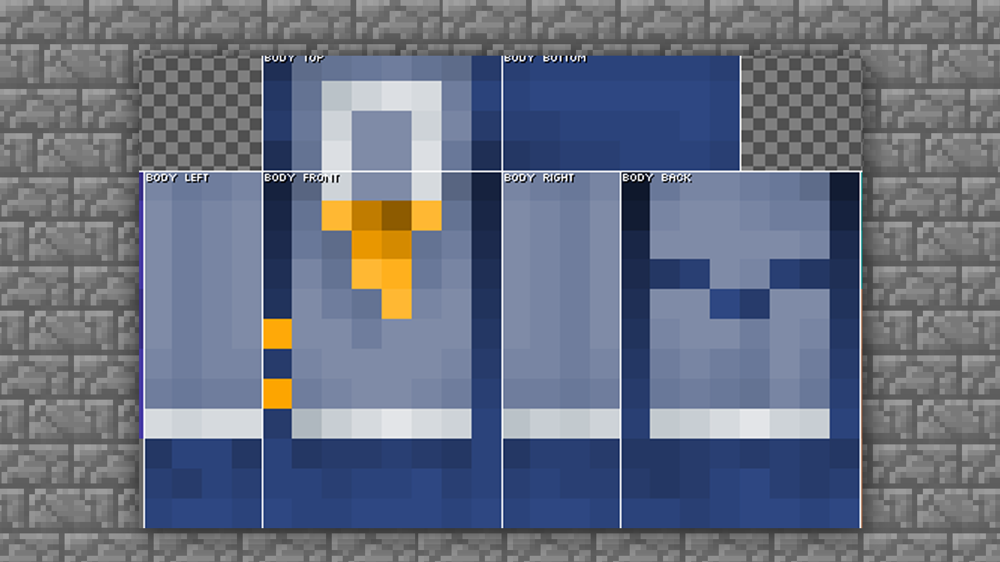
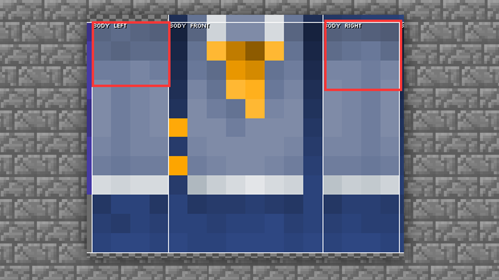
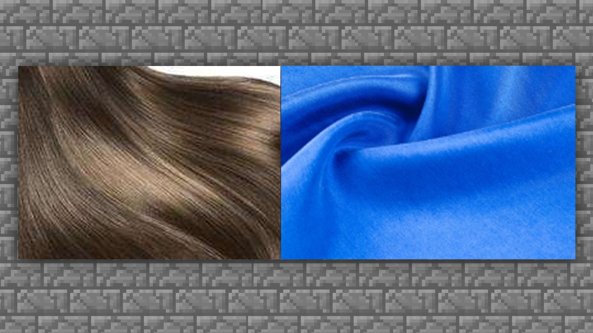
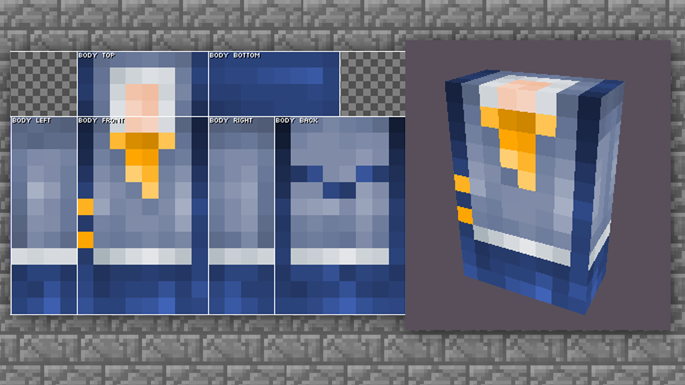

# MCskin3d 绘制皮肤-身体的绘制

#### TAG：皮肤 身体 绘制

#### 作者：上古之石

#### 身体的绘制概述

把头部的绘制反复练习后，接下来，我们就继续开始身体部分的绘制吧。其实了解了对头发的绘制规则后，大家可以很好的摸索出一套顺手的绘画方式。
而身体的部分其实基础操作跟头部一样，着重点就是衣服需要化繁为简。

身体的部分其实面数不多，在单层皮肤中，身体的表现仅为一个长方体，且无法绘制外部装饰。但是双层皮肤则可以增加更多表现，在双层皮肤的后期，大家可以参照头部的教程进行尝试研究。

#### 造型的选择：

如果是进行原创绘制，可以找一些真实服饰搭配进行参考，在配色上可以选择一些平常不会使用的配色进行尝试，这样的混搭组合往往会得到不小的创意收获呢~

并且还可以在真实的服饰案例上进行魔改，也会得到更多的设计思路。

#### 颜色的选择：

颜色的选择上，大家千万不要选择跟头发相近的颜色，这样会导致层次不清晰。一般在颜色的选择上，可以参考中性颜色，不要与头发相近，也不要纯色。

通过上述两点提要的解读，大家是不是就稍微有些明白了，接下来我们就直接进入绘制步骤开始巩固知识吧。

#### 身体的绘制技巧：

首先我们先把界面设置成只显示身体部分。在【工具栏】中间将身体以外的部件全部隐藏。并且将模式依旧设置成为混合模式，如果一直是这个模式就不需要设置啦。

设置好后，可以得到这样一个绘制界面。贴图部分只需要绘制body部分，也就是身体的贴图就OK啦，左右两边是手脚暂时不用绘制。

先把身体的原始部分全部清除。使用【工具栏】→【橡皮擦】

然后使用【工具栏】→【铅笔】先给衣服上个底色。

注：也可以先画出轮廓，这样也可以更好的分区块上色。演示部分我们将以先上底色为例来进行。

随后开始粗略绘制衣领、纽扣之类的部分。案例中预想的是一个背带裤男性形象，那就需要把背带的部分及领结等位置提前预留出来。防止绘制到后期时，发现有很多配饰没有绘制。

底色铺垫好后，就可以开始对光影进行处理。有一点大家需要注意一下：大部分常见的服饰是属于布料类别，明暗关系比较分散，不会有过于强烈的对比关系。所以衣服很多大块面的地方尽量通过中间色来进行过渡就好。

我们使用【工具栏】→【光度刷】进行第一层的细节上色。

接下来，开始针对衣服光暗进行细化，以此来增加服饰的质感。

继续使用【工具栏】→【光度刷】变暗进行叠加

整体的暗度已经加的差不多了，可以针对侧面关节连接处再加深一点，因为贴合关节的布料会出现褶皱，在视觉表现上会偏暗一些，大家可以对着镜子参照看看。

继续使用【工具栏】→【光度刷】变暗进行侧面关节接触部分的叠加.

以上，整体的光影程度基本涂抹完成，接下来就可以开始增加亮度了。需要注意的是，衣服的高光跟头发是不一样的。头发的表现主要是直接的反射，但是衣服是布料是接近毛玻璃的漫反射，也就是我们常说的磨砂光感。

所以我们在上色时也需要注意光感，不要涂抹直接的高光，颜色要缓和并延展过渡出去。

到此程度后，身体的绘制基本完成。我们把之前画的头部取消隐藏，如果觉得整体效果不好还可以进行微调，调整完毕后就可以进入下一步。

