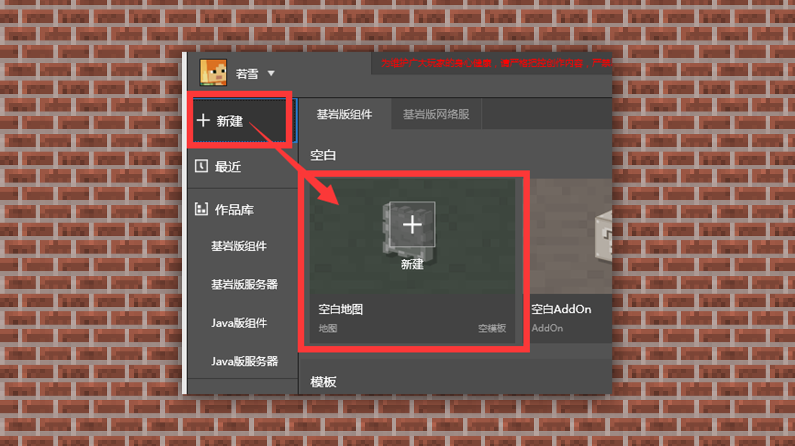
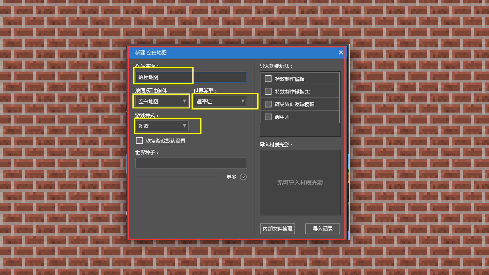
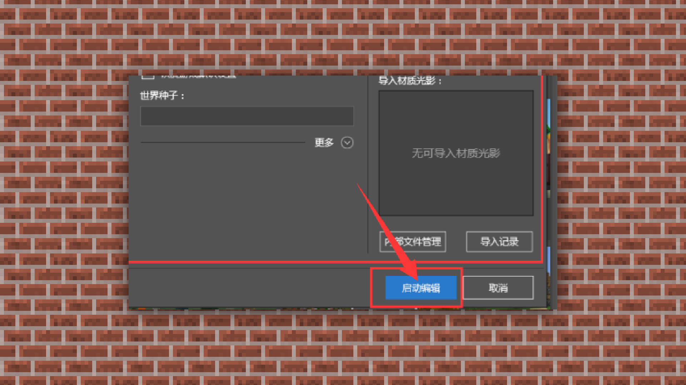
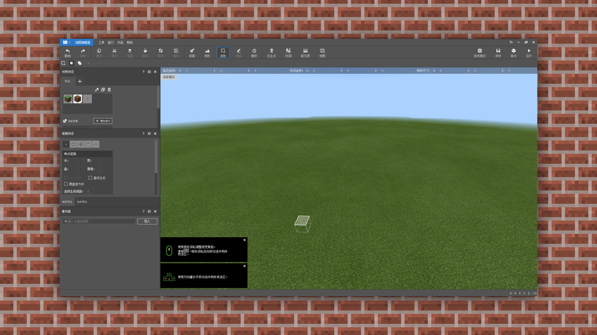
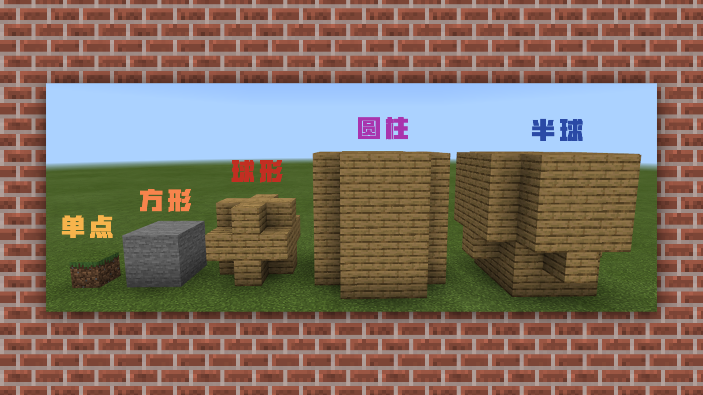
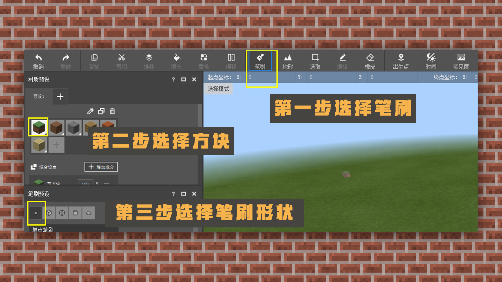

# 使用MCStudio地图编辑器进行简单建筑的搭建①

#### TAG：建筑工具 MCStudio

#### 作者：上古之石

####  使用MCStudio地图编辑器进行简单建筑的搭建①

根据基础流程，接下来我们尝试对小型建筑进行搭建。让大家熟悉和了解这款软件的建造功能。

#### —、 打开MCStudio，点击创建一张新的地图

将作品名称、世界类型、游戏模式都设置好，地图玩法组件按照搭建需求来进行设置和导入。设置好后直接点击启动编辑，就可以加载建造界面了。

1. 选择新建—空白地图

2.设置一下地图格式和模式

3.点击启动编辑开始进入搭建界面。

#### 二、地图新建完毕，设置笔刷参数，同时进行地基规划。

这次我们打算建造一个小型生存房屋，房屋配置得有花园和小水池。在一般的建筑规划中，建议大家使用单数长宽定律，例如1-3-5 或 15-17-19。因为如需要在后期建造尖角的屋顶，这样会更加方便搭建。

笔刷可以设置成不同的形状和大小，目前包含的笔刷种类有：【单点笔刷】【方形笔刷】【球形笔刷】【圆柱笔刷】【半球笔刷】

我们先将笔刷设置成【单点笔刷】，将地基规划按照单数规律进行划分。

在【工具栏】选择【笔刷】，再将材质预设为选择规划的方块。

注意：单数规则不是绝对规则，但在初学过程中，可以根据单数规则来进行划分，这样做更加方便调整和理解。