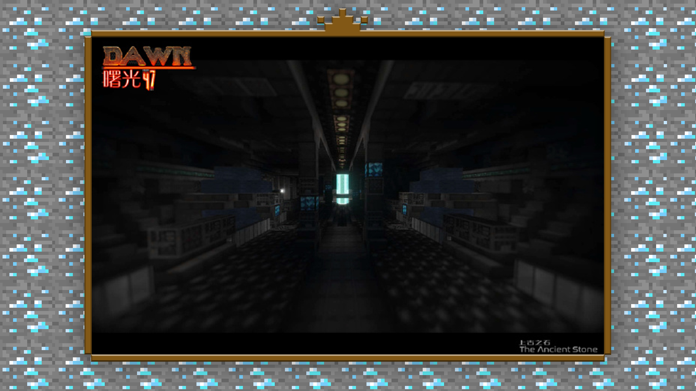
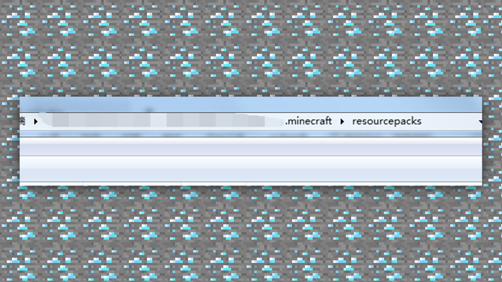
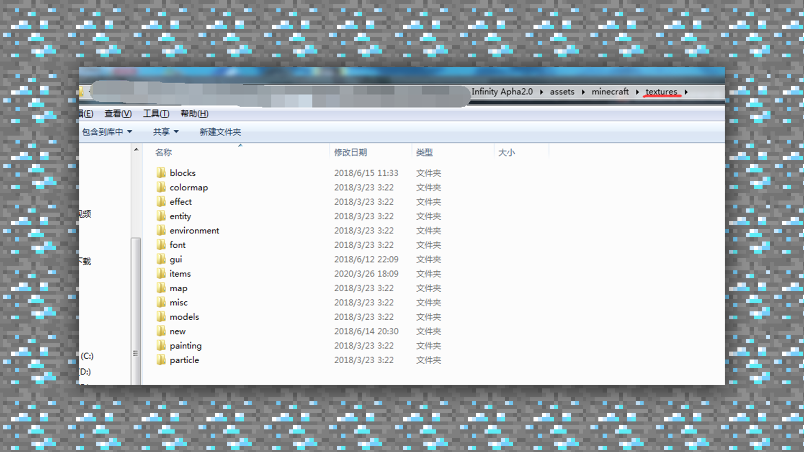
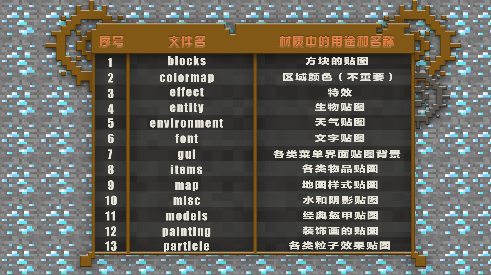

# 1.1入门-材质的基础概念

#### TAG：材质 概念

#### 作者：上古之石

#### 材质的基本概念

材质包(Texture Pack)是《我的世界》中，一个可以更改游戏中方块、物品、生物和界面外表的文件包。让游戏环境氛围达到特定的需求，加入专门定制绘制的材质包是最快，也是直接的辅助实现视觉效果的方法之一。

材质包与皮肤一样，有很多种可以选择的分辨率，通常尺寸选择：16X，32X，64X。因为绘制材质包具有一定的上手难度，一般不建议新手直接绘制高于32X的材质。从【官方常用格式16X】开始尝试，是最好控制材质整体效果的选择。

材质文件夹中包含了游戏内所有的贴图和UI，我们在制作初期很好的分清每个贴图所在的文件位置，会对于后期寻找贴图有所帮助。材质包的默认位置在游戏的.minecraft根目录下的resourcepacks，复制进去就算导入安装成功。

接下来向大家将材质包中每个文件夹的含义进行解读~我们可以随机下载一个原始的材质包进行解压。

首先进入到textures文件夹中，文件路径：材质包/assets/minecraft/textures 这一部分就是我们需要主要去绘制的贴图材质。

对于初步开始尝试的开发者，再确定好想要绘制的风格之后，建议优先从方块文件夹开始绘制。方块的类别最为重要，当方块贴图的绘制完成了60%左右，那么基本上可以为整个材质包进行定性。