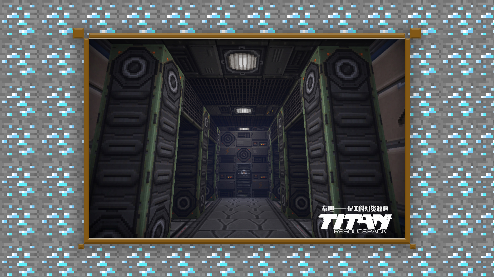

# 1.2入门-材质绘制的思路及基本方法

#### TAG：材质 绘制思路

#### 作者：上古之石

#### 材质绘制的思路及基本方法

准备着手绘制材质包时，需要优先思考三个问题：

第一，选择材质包的风格类型。

不同的风格类型，所对应寻找和参照的素材获取难易度也是不同的。中世纪风格、科幻风格、现代风格、和风风格、皆为比较流行的风格类型。在初上手时，大多数人会选择尝试参考素材较多的现代风格，同时最终绘制结果也很简单简洁，很适合练手作为基础创作。在这里，我们比较推荐除了现代风格外，新手也应多多尝试其他风格类型，对自己的绘制思路、及熟练度的拓展都有极大的帮助。

第二，画面的分辨率定位是在哪里。

在初上手时，我们建议大家使用官方常规分辨率16X。16X的分辨率在绘制的体量上会较容易把控，可以在稍稍熟练后，再进行其他分辨率的尝试。

第三，整体材质的制作周期和难度自身能否承受。

在明确自身要做的风格和分辨率后，就需要开始规划制作周期及制作难度。为自己拟定合理的制作周期，有助于对项目本身的管理，对未来制作大型的项目会非常有帮助。

通过以上三步思考后，材质的制作流程就会更有条理，目标也更加清晰。给自己心理和执行上都做好双重准备后，绘制的过程一定会事半功倍的~

接下来的内容需要对材质绘制具有一定的了解，大家可以随时复习前面的课程。

材质的制作难点是像素画的把控与技巧，通常在像素画中，我们可以增加细节的空间是相对较少的。所以在绘画的时候一定要做好规划，先创建结构，完成打底后，再进行美化修饰。

在常见错误中，经常看到因为想在绘画时急于表现出最终效果，从而导致像素过度杂乱的情况，这是我们需要极力避免的。

从下图中可知，方块是要拼接在一起的，也就是块与块需要相互衔接。此时我们可以参考素描的基本美术原理，由整体到细节，切勿专注于一个细节使劲细化。同理在绘制材质时，我们可以先打结构，结构建立好，后面的绘制就也不会那么繁琐了。

