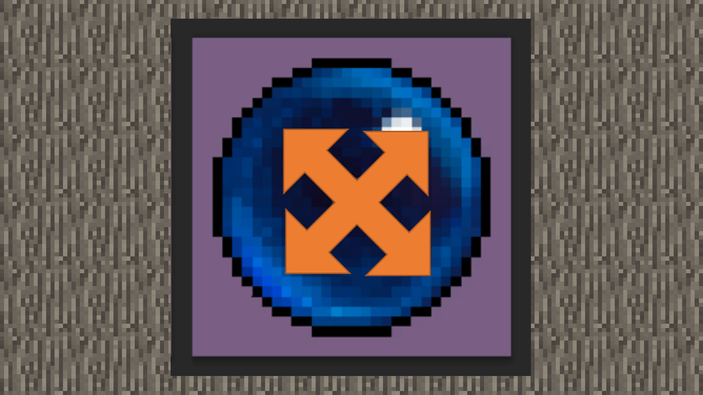

# 1.5进阶-让材质动起来——动态材质制作技巧

#### 作者：上古之石

#### Tag：动态材质 制作 概念

#### 动态材质的基本概念

什么是动态材质，最简单的形容就是动起来的贴图。

前面我们跟随教程绘制了静态贴图，但无论画的多么的活灵活现，静态截图都是不会动的。

所以，为了让材质更加的增光填色，或者是想通过材质来吸引更多的关注的话，动态材质就是必要的进阶修炼，接下来就让我们一起来制作一个动态贴图吧。

#### 动态材质绘制技巧-使用PS来绘制材质的办法

如果大家已经练习过基础材质的绘制办法，那么相信对于材质的起步构思已经很熟悉啦~

动态贴图与静态贴图唯一的区别在于：

动态贴图是由多张贴图组合而成，而静态贴图只需一张即可。那么我们就直接越过基础构图，开始动态贴图的组合构思问题。

此处我们用一个已经绘制好的魔法球来作为例子。

动态循环的关键就是循环无卡顿，让整体动态看上去是自然过渡循环的，而不是卡顿的。

如果要做到自然循环，我们就需要让动态贴图的动态过程更细致。比如案例中的魔法球，希望它有内部光效闪烁的感觉，那么它的延展就是从中心往外再收缩回来。

首先根据大致路径来绘制几个大关键帧的画面。

这样一个闪烁的大致过程就有了，但是帧率会让画面有卡顿的效果。

所以为了达成顺滑的过渡，我们需要进行补帧,简单来说就是补全画面，让画面播放起来更流畅。

这个步骤就需要PS的时间轴进行一个辅助，首先打开PS的时间轴，也就是PS的动画界面。

然后将绘制好的分层按照顺序在时间轴里面进行排序。

然后我们就会发现缺少了很多过渡的帧，接下来就根据缺少的部分进行绘制补帧，让光圈在裂变开前有个过渡。

这样补帧之后，可以尝试进行播放。

如此一来闪烁过渡就完成了，随后就需要将我们制作好的贴图进行排序。

将动态贴图根据游戏内的官方排序方式进行竖行排序。（ps：只有游戏内原设定是动态效果的内容，才可以替换成为动态贴图，比如：火焰）

替换好之后，按照基础材质教程的导入方式进行测试，就可以看到动态的效果啦。