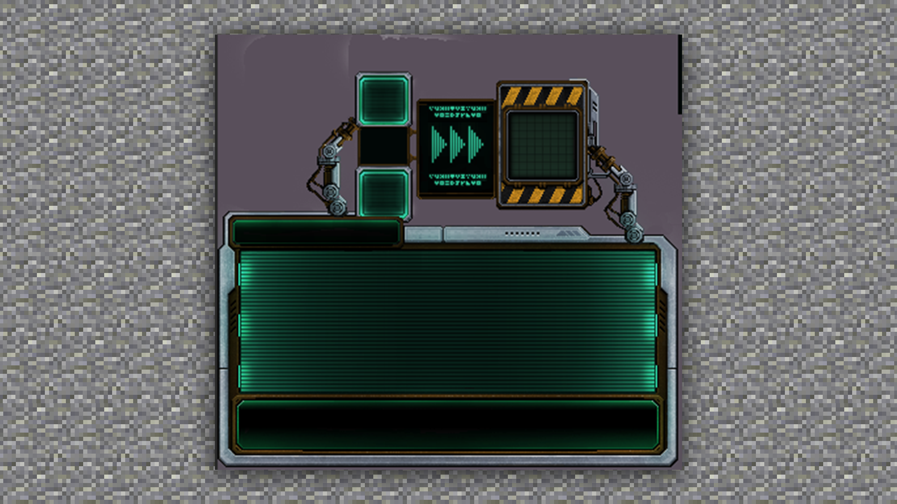

# UI的基本概念

#### TAG：UI 概念

#### 作者：上古之石

#### UI的基本概念

UI设计广义上可以简单理解为对用户界面进行设计，是对软件的人机交互、操作逻辑、界面美观的整体设计。从工作内容上来分，一般分为图形设计、交互设计和用户测试这三分类。

UI设计不仅仅是从事美术绘画，更需要对软件使用者、使用环境和使用方法进行定位，简单来说UI设计就是不断为用户设计视觉效果使之达到满意的过程。

在MC中，UI界面的美观和趣味性可以很好的让玩家有一种浸入式的体验。

