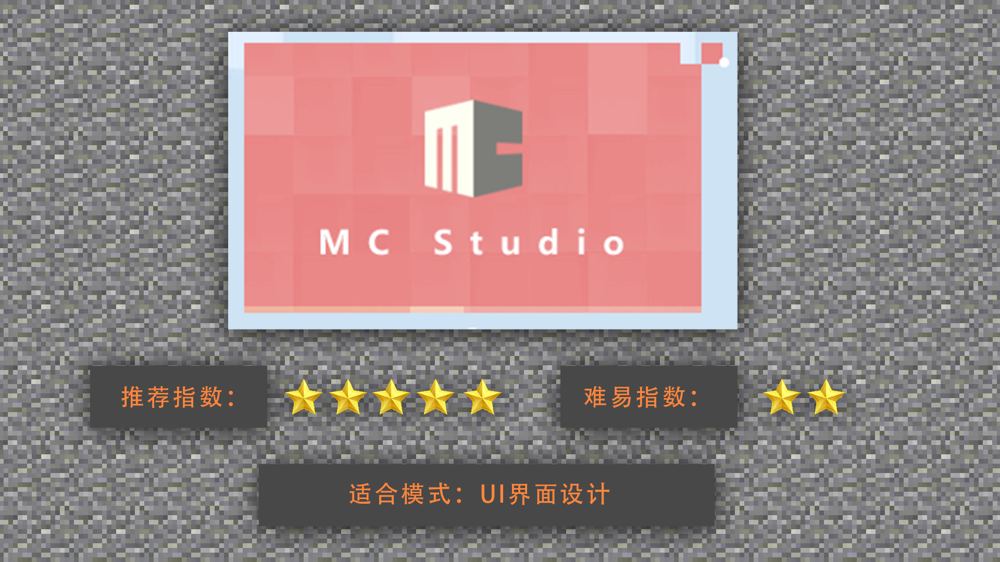
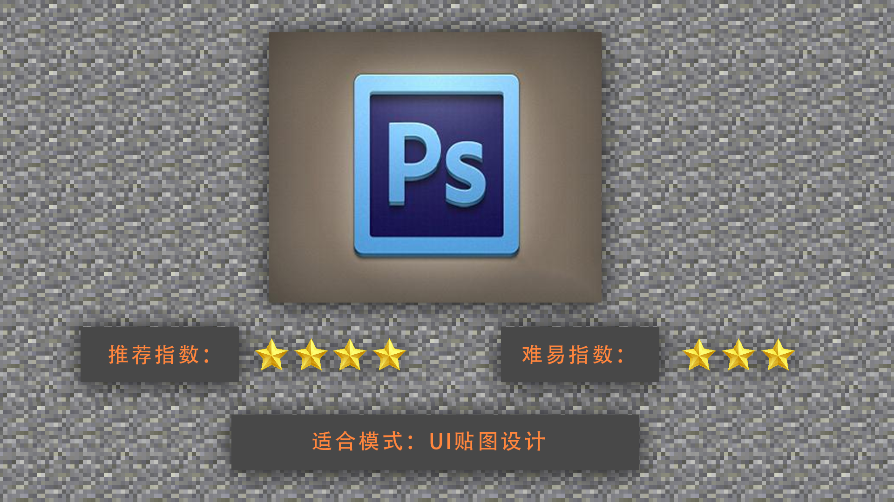

# UI的制作工具介绍及选择

#### TAG：UI 制作工具

#### 作者：上古之石

#### UI的制作工具介绍及选择

了解基本概念后，我们开始认识一下目前最常见的Minecraft UI 界面设计软件。

MCStudio界面编辑器：是我的世界中国版单独研发，专门针对游戏内UI制作的便捷开发软件。MCStudio不仅仅包含了UI界面设计，还包括直接导入MC后游戏内的预览测试等等。可以很好的实机测试和修改，十分适合新手上手使用。

PS：Photoshop常用于各类专业设计。针对于UI界面的平面贴图设计也是能有很大帮助的，但是PS无法直接制作UI软件，所以只能作为辅助贴图。