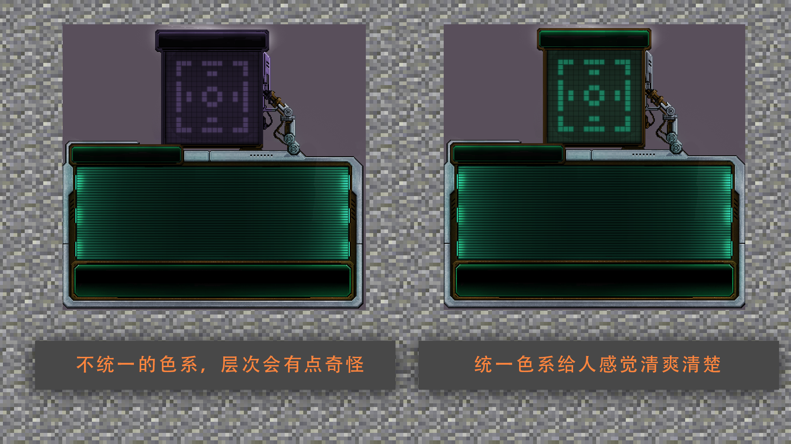
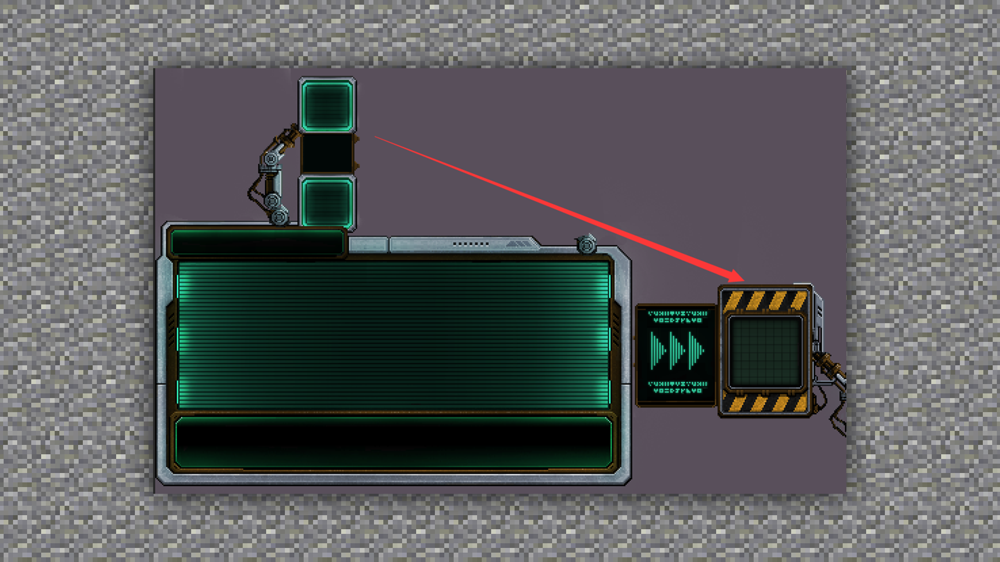
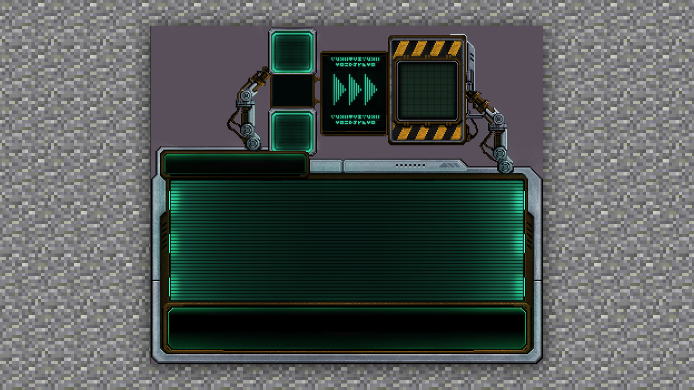

# UI制作的规划及基本方法

#### TAG：UI 制作规划

#### 作者：上古之石

#### UI制作的规划及基本方法

接下来我们一起来看看UI设计应该注意的3大规划和注意事项：

#### 一：设计要保持一致性

在实际的UI设计过程中，需要对人机交互具有一定的理解。那么我们要以玩家体验为中心，在界面设计时，应该简洁、直观，让玩家在接触玩法后，对界面上所对应的功能一目了然，让操作简单明了是最好的。

#### 二、设计准确性

在设计界面时应该尽量使用搭配一致的标记、颜色等，并且显示信息的含义应该非常明确。

#### 三、设计布局合理化

合理的布局会给玩家带来便利，玩家在玩游戏或者是浏览页面时，基本都是遵循自上而下、从左至右的习惯。所以我们在设计界面的时候，要避免功能按键排列过于分散，造成玩家鼠标或虚拟摇杆移动距离过远过长的弊端。要多做“减法”运算，将不常用的按键功能区隐藏，保持界面的简洁。

这样的排版距离过远，容易分散视觉焦点，看得人晕头转向。

这样根据人体习惯来排版，对视角就能达到很好的交互效果。

所以游戏UI界面设计很需要认真的思考和构思。