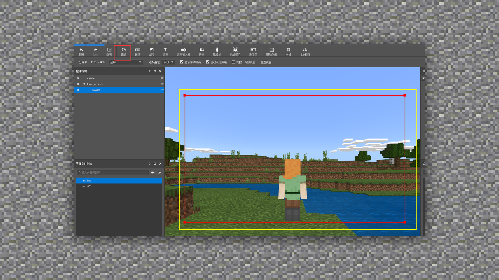
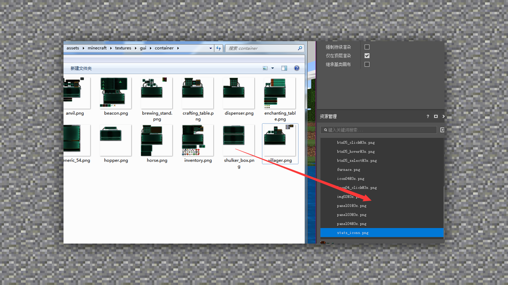
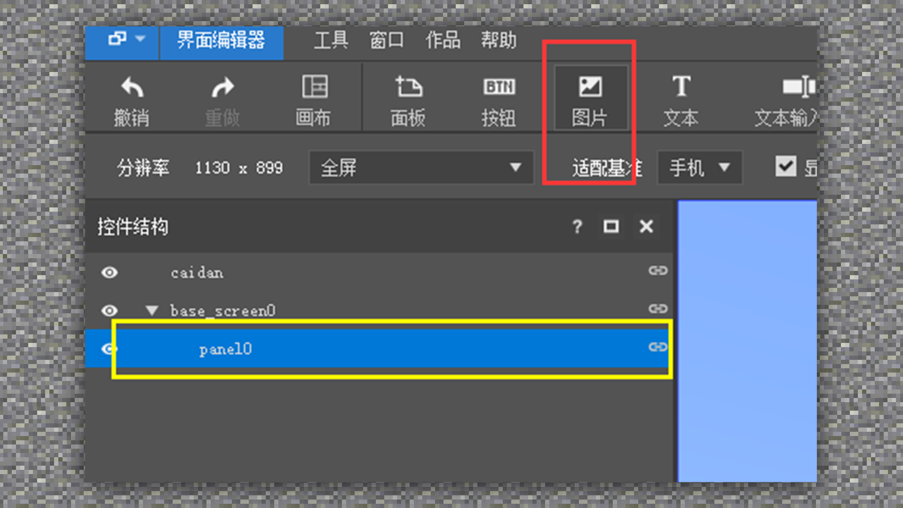
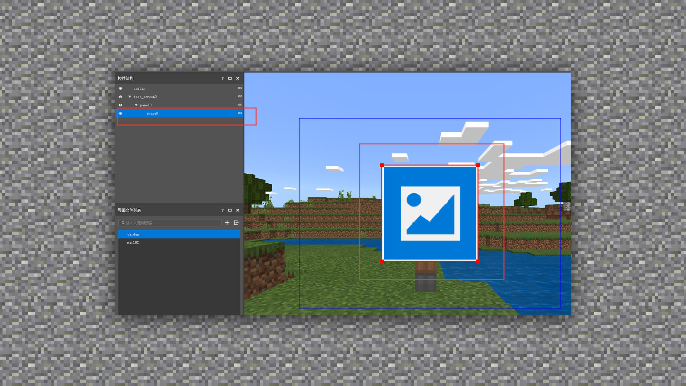
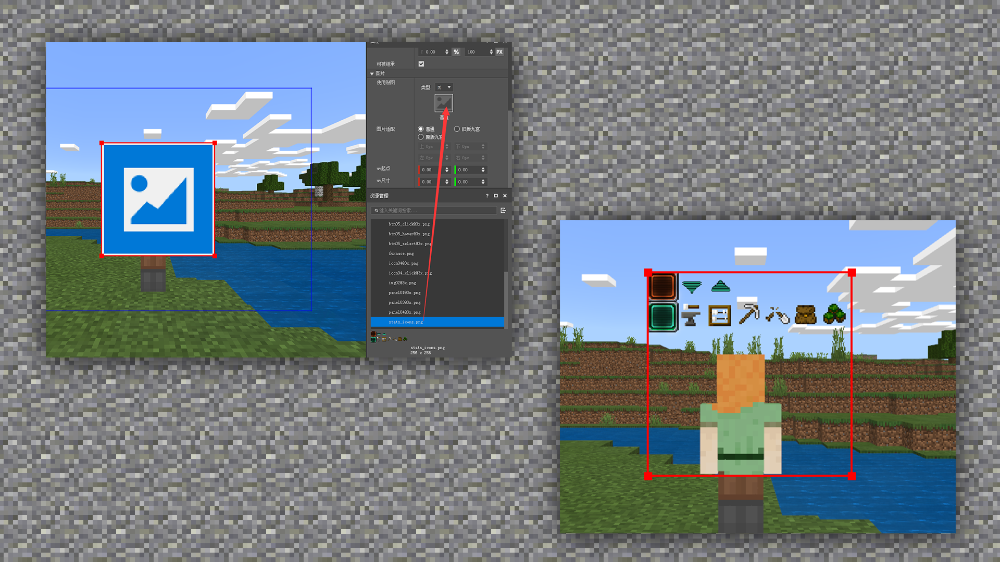

# 图标制作方法及规范、游戏内运用

#### TAG：UI 制作方法 游戏运用

#### 作者：上古之石

#### 图标制作方法及规范、游戏内运用

然后将绘制好的贴图导入到界面编辑的资源管理界面。

接下来需要新建一个背景图片作为面板底部。Ps：一定要先选中上一级的图层再点击添加图片噢。

可以看到我们获得了一个没有图片的图片图层。

接下来只需要把导入的图标贴图直接拖到图片层替换即可。

这样就可以直接看到游戏内图标的效果了，是不是很厉害。所以图标制作好后，我们一定要多做测试，从尺寸开始规范化，这样后期修改的次数会大大减少，提高效率。