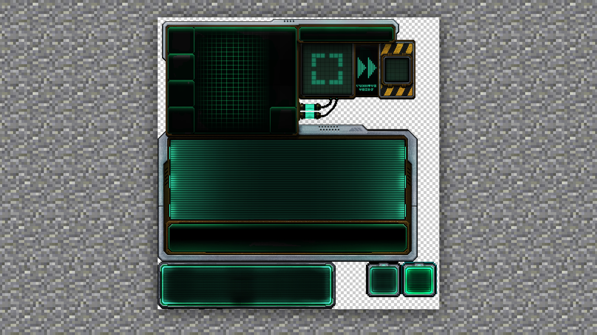

# UI界面的制作方法及规范、游戏内运用

#### TAG：界面 制作方法 游戏运用

#### 作者：上古之石

#### UI界面的制作方法及规范、游戏内运用

那么将上述图标和文字的基本规范和运用都理解了之后，接下来我们来看重点的界面排版设计。UI界面是整体布局的重中之重，这和玩家的实际游戏时长息息相关。

所以在制作UI界面时，一定要跟材质包制作时一样，先给它定型风格，再来定制颜色基调。确定好了之后，再开始绘制时一定不会大范围的选错颜色了。

对于UI界面的排版规格，我们可以参考字体的排版方式。

首先，千万不要跳跃式排版。

例如如果输入框和发送键距离过于远，那会有很不人性化的交互感觉。正常状态下比较推荐放在距离比较近的位置。

我们可以在MCStudio中直接设置一下按钮按下前后的效果，这样就会给人真实的点击感觉。

所以一个合理的UI界面是需要结合图标文字、以及实体交互一起才能完成。比如这个药水的合成台。

它优化了原版的不足，将药水界面设计变得合理化。能明确的看出药品放置和输出的材料位置。

通过它的主题也能让大家很好的理解该玩法是属于科幻类的界面设计

并且也抛弃了原本的分割，改成了条纹的文字线排序，这样的设计干净也简洁，主次关系清晰。

通过以上学习，我们可以看到好的UI界面是需要好的构思和布局的，只要我们多多练习和理解，一定也能排列出属于我们自己的UI界面~