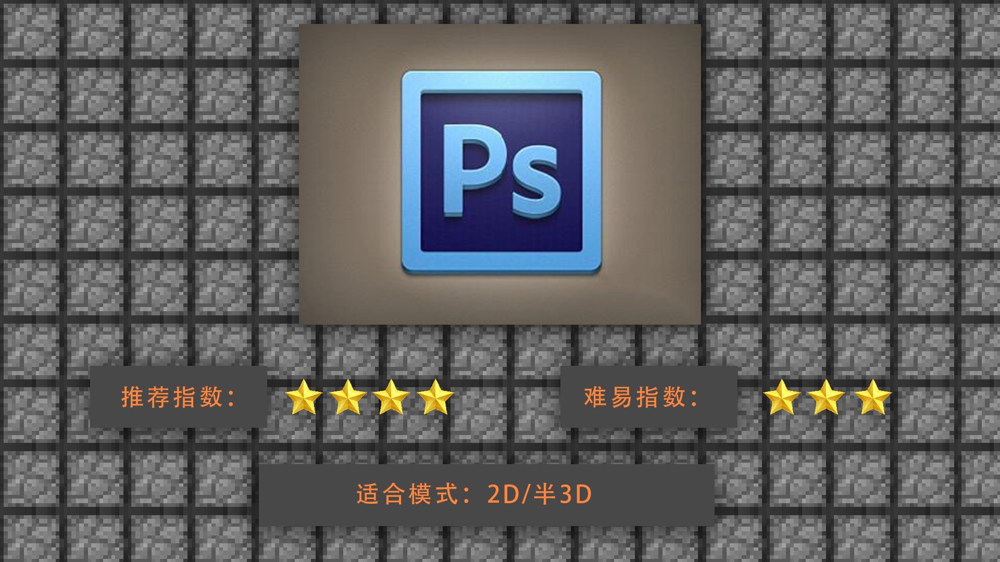
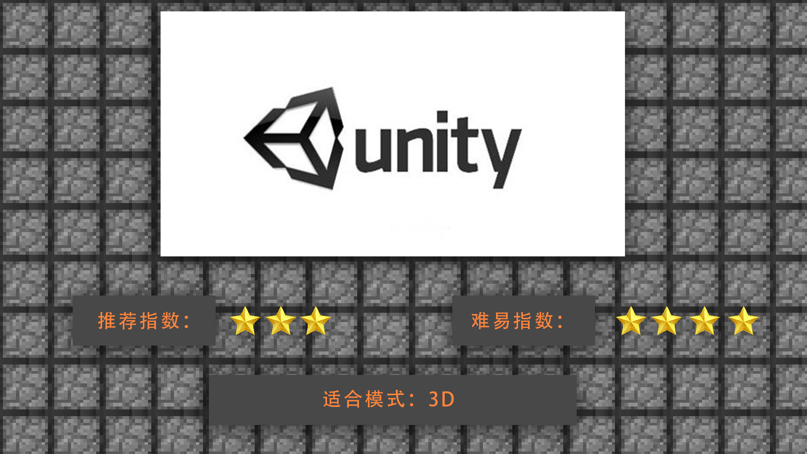

# 1.2制作工具介绍及工具选择、优劣

#### TAG：特效 制作工具

#### 作者：上古之石

#### 制作工具介绍及工具选择、优劣

了解基本概念后，我们开始认识现在市面上制作特效的工具分类。

MCStudio特效编辑器：是我的世界中国版单独研发，专门针对游戏内特效制作的便捷开发的综合型软件。MCStudio不仅仅包含了特效，还包括直接导入MC后游戏内的阅览等等。可以很好的实机测试和修改，十分适合新手上手使用。

PS：Photoshop常用于完成2D特效的手绘和拼图步骤。Photoshop因为本身自带动画帧率制作，所以可以进行平面2D特效制作，同时也可以进行3D辅助贴图制作。所以十分适合想要手绘风格或者是对于编辑器控制不是很熟练的新手小伙伴们，可以使用PS进行练习和制作。

U3D：全称 Universal 3D ，简称U3D，U3D也是一个通用3D图形格式标准。U3D引擎是可以制作3D立体特效的软件，通过U3D的制作可以让平面2D变成立体像素。在目前的游戏市场中是很常用的软件之一。但是U3D无法导出JAVA格式，只能适用于U3D或者引擎开发的游戏使用。