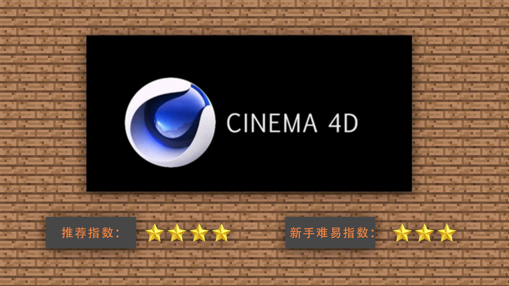

# 1.2模型制作工具介绍及工具选择、优劣

#### TAG：模型 动作 工具选择

#### 作者：上古之石

#### 模型制作工具介绍及工具选择、优劣

了解基本概念后，我们开始认识现在市面上制作模型工具的分类。

现在市面上最广为人知的模型制作软件有：C4D，3DMAX，MAYA，BLOCKBENCH

CINEMA 4D是一款由德国MAXON公司出品的三维软件，拥有强大的建模动画功能和较强的扩展性，且操作相对简单。随着功能的的不断加强和更新，CINEMA 4D的应用范围越来越广，涉及影视制作，平面设计，创意图形和游戏开发等多个行业。在MC的动画制作中，也属于常用软件。

3D Studio Max，常简称为3ds Max或MAX，是Discreet公司开发的（后被Autodesk公司合并）基于PC系统的三维动画渲染和制作软件。运用在电脑游戏中的动画制作，后更进一步开始参与影视片的特效制作，例如X战警II，最后的武士等。在Discreet 3Ds max 7后，正式更名为Autodesk 3ds Max，最新版本是3ds max 2020。是现在市面上最常用的建模软件之一。

Maya，即Autodesk Maya是美国Autodesk公司出品的世界顶级的三维动画软件，应用对象是专业的影视广告，角色动画，电影特技等。Maya功能完善，工作灵活，易学易用，制作效率极高，渲染真实感极强，是电影级别的高端制作软件。在市面上进阶型开发者和设计师学习都会选择的一款软件。

Blockbench是一款简便易用的模型设计软件，软件界面美观大方，功能强劲实用，可以帮助您在设计模型的时候得到更加轻松的操作，该软件虽然只有30多MB，与其他建模软件相比体积是非常小的，但是在设计一些简单的三维模型上有着友好的难易程度，也可以设计一些零部件模型，并且软件还提供了渲染功能，可以设置的渲染数据也是非常多的，例如可以自动UV等等。十分适合新手上手的建模动画基础学习软件。

通过上述软件的介绍，可以大致发现软件建模的学习同理与其他模块学习流程，基本还是划分为新手到进阶，那么我们最优先选择Blockbench来进行基础的新手练习和制作。