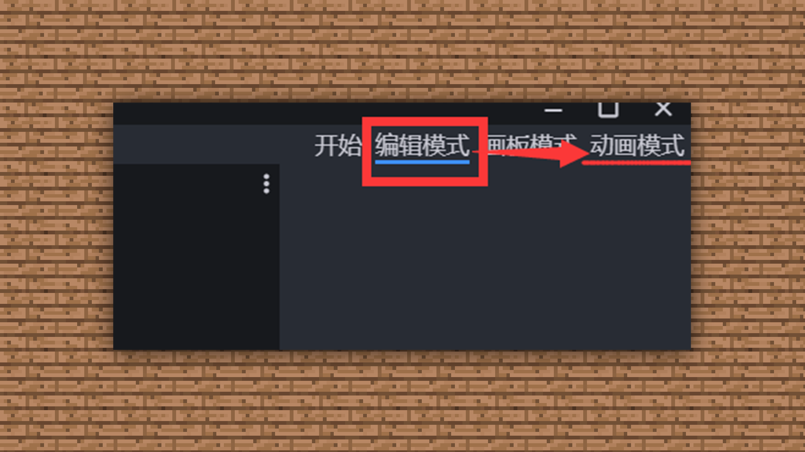
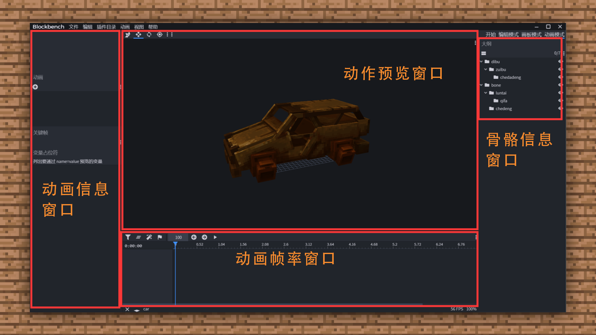
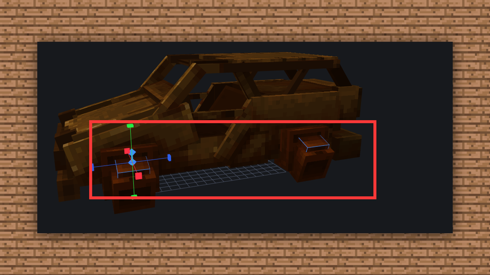
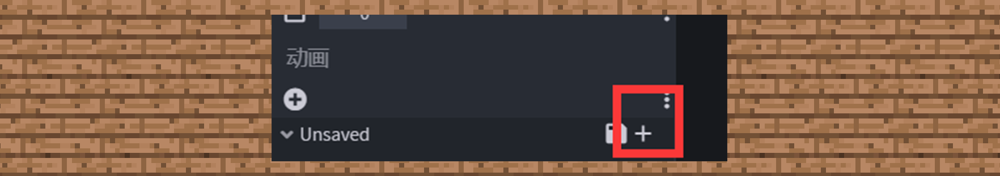
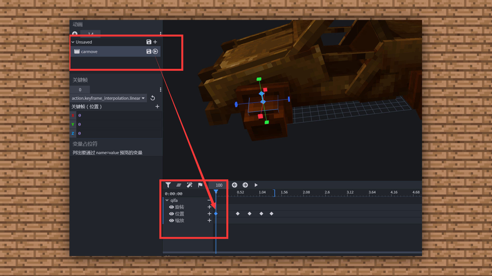
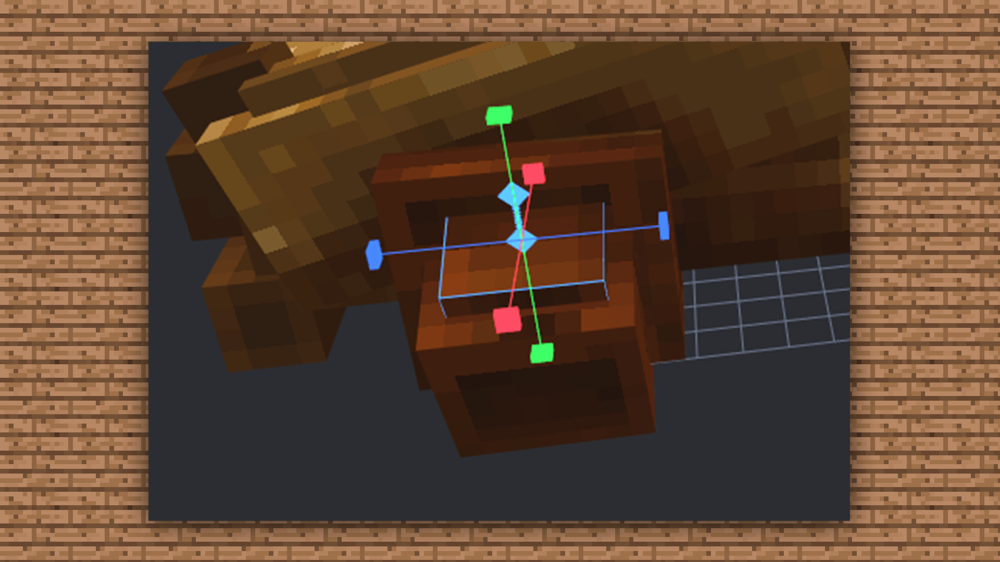
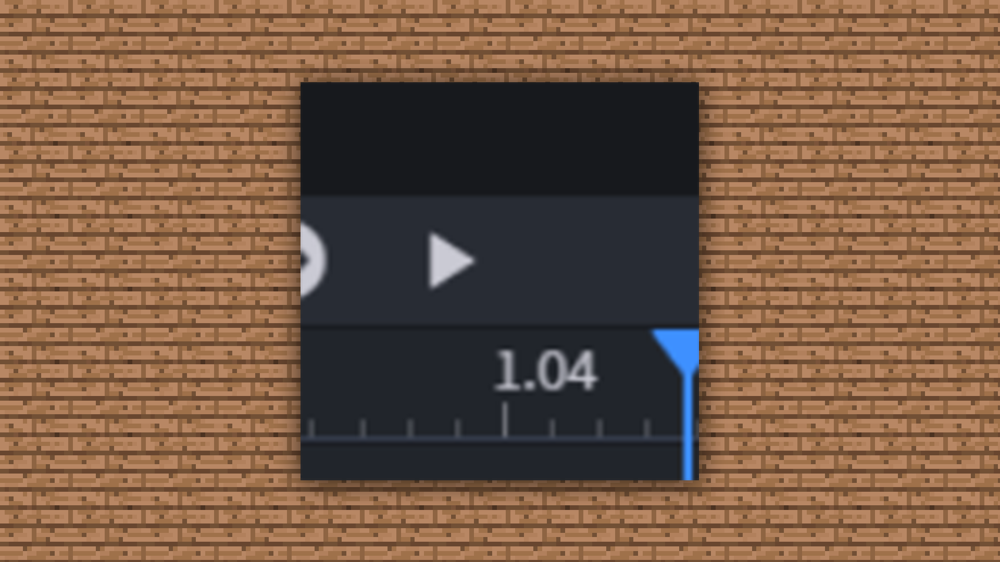
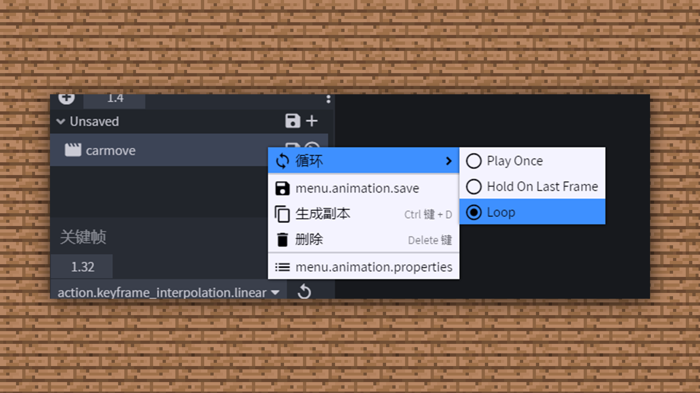
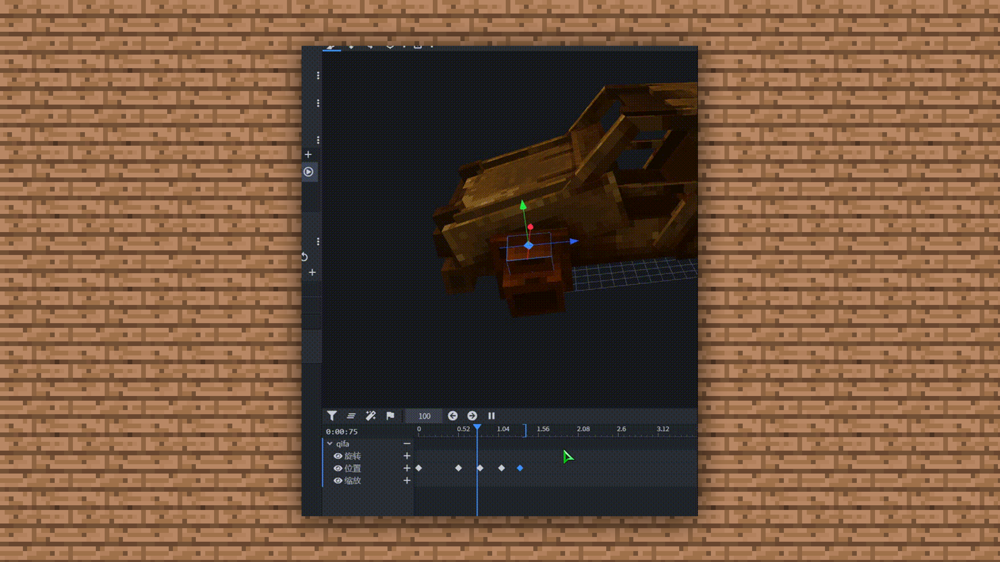
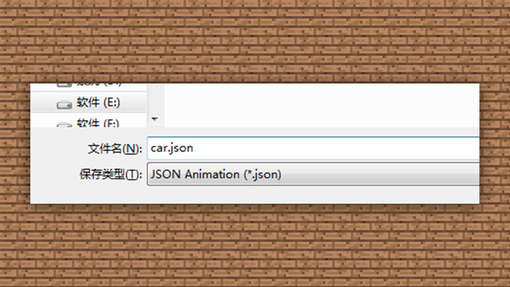

# 1.5-BLOCKBENCH教学-模型的动作制作

#### TAG：模型动作 BLOCKBENCH 案例

#### 作者：上古之石

#### 开源软件：BLOCKBENCH的使用教学-模型的动作制作

为了让模型拥有灵魂，动作是必不可少的辅助添加剂之一。接着我们就来给小车增加一点动态效果吧。
首先我们先从编辑模式切换到动画模式。

动画模式后，界面如下：

接下来，我们选中想要运动的活塞方块。

然后在动画面板新建一个动画存储文件。Ps：只有新建这个才能开始制作动画哦！

给动作设置一个名字， 其余部分暂时不需要设置。

新建好之后，部件的动画制作就在动画帧下方出现啦。

然后我们就可以根据自己想要的动画动态效果进行设置帧，因为小车的活塞运动是起伏的，即会有收缩的过程，所以我们将第零和一帧设置为原本的状态，第二帧设置为升起，第三帧设置为回缩，第四帧回归原点即可。

第零和一帧

第二帧

第三帧

第四帧

调整完毕后，我们按一下上面的播放按钮

再设置一下循环播放就可以看到活塞运动起来啦，是不是很简单~

制作好动作后的模型，直接保存为json格式即可。

这样模型既有了炫酷的外观又有了有趣的灵魂。因为BB是以模型作为骨骼绑定，所以我们不需要考虑骨骼绑定的问题，十分的方便和快捷。大家可以多去尝试调整模型就可以得到不一样的模型动作效果噢~