# 宣传视频：制作的流程与方法

#### 作者：上古之石

#### Tag：视频 制作 流程

#### 宣传视频：制作的流程与方法

既然我们已经有了合适的元素，那么就可以开始录制视频素材了。在录制游戏内效果的时候，我们可以选择很多种不同的内录软件，包括一些软件自带的录制系统都是可以的。

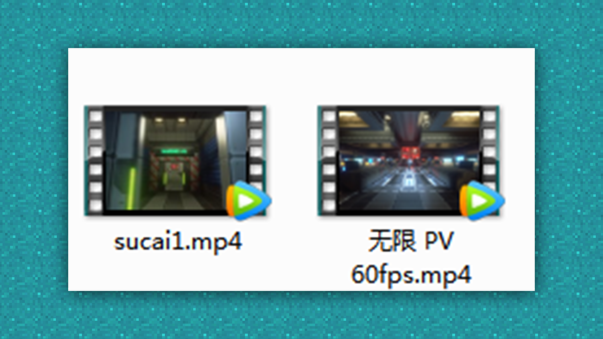

#### 内录方法：

这里我们举例使用OBS来内录视频。

首先我们先在OBS官网下载OBS的安装软件。根据自己的电脑系统来选择下载相对应的格式。

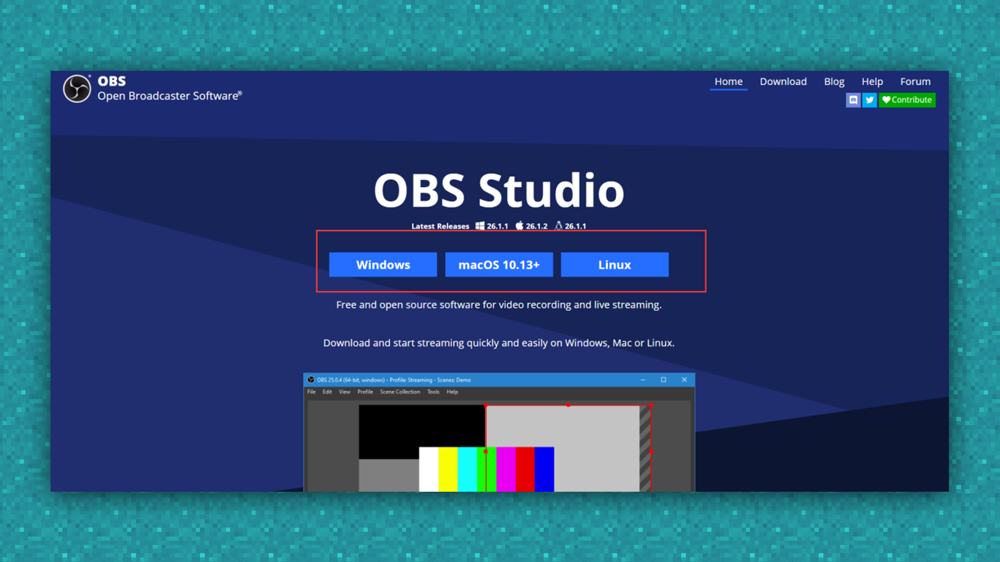

然后运行软件根据软件步骤进行安装即可。安装好之后桌面就会多出OBS的图标啦。

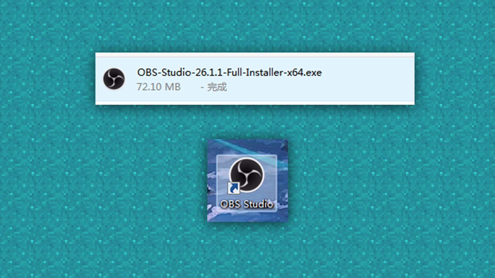

双击打开软件。

然后将我们需要内录的游戏界面也打开。

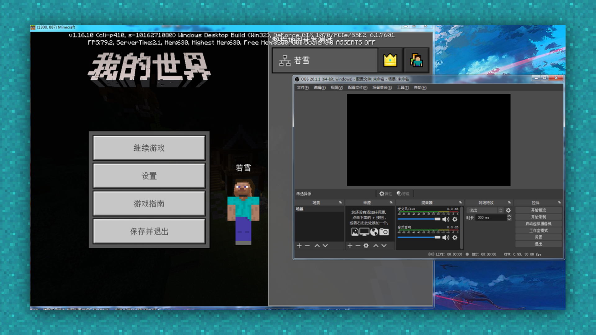

使用OBS的场景部分添加一个场景，名字可以根据个人需求进行输入。

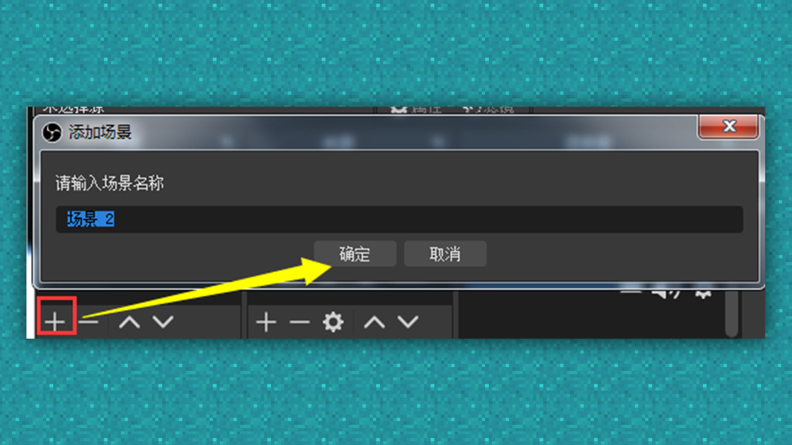

添加了场景之后，我们就可以将想要录制的窗口添加和编辑了。

我们在场景旁边的来源进行游戏窗口的添加。

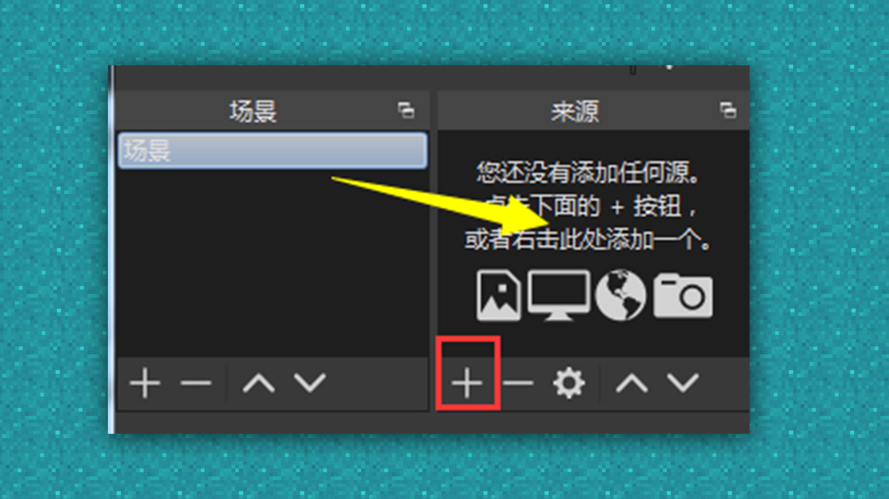

使用来源下的 “+” 按钮然后选择游戏采集进行游戏窗口的添加。

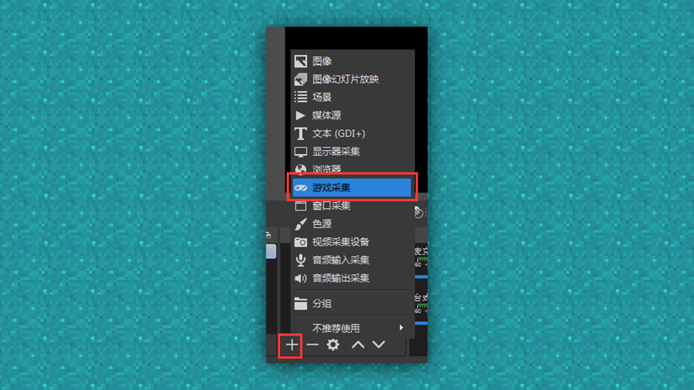

新建一个源，设定一个新的名称。

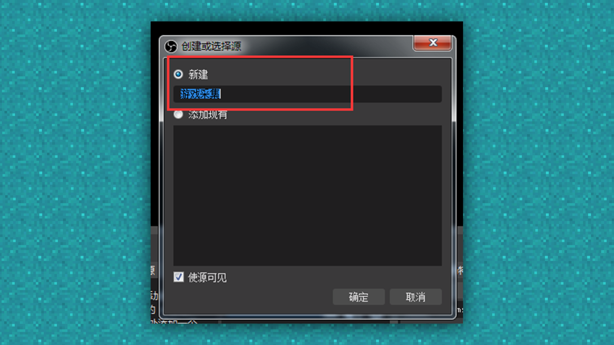

通过窗口采集选择我的世界游戏窗口，点击好后阅览界面出现阅览画面后，点击确认。

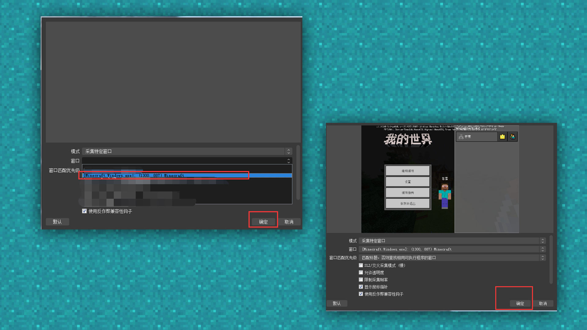

然后我们点击开始录制，就可以开始进行游戏框内的游戏内录啦。

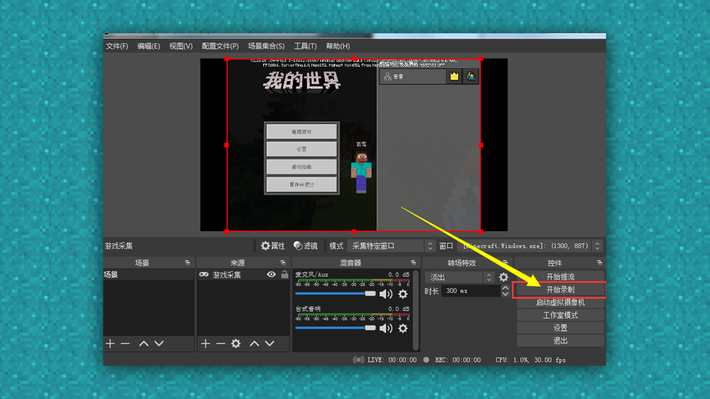

拍摄内容录制完成后，选择停止录制。

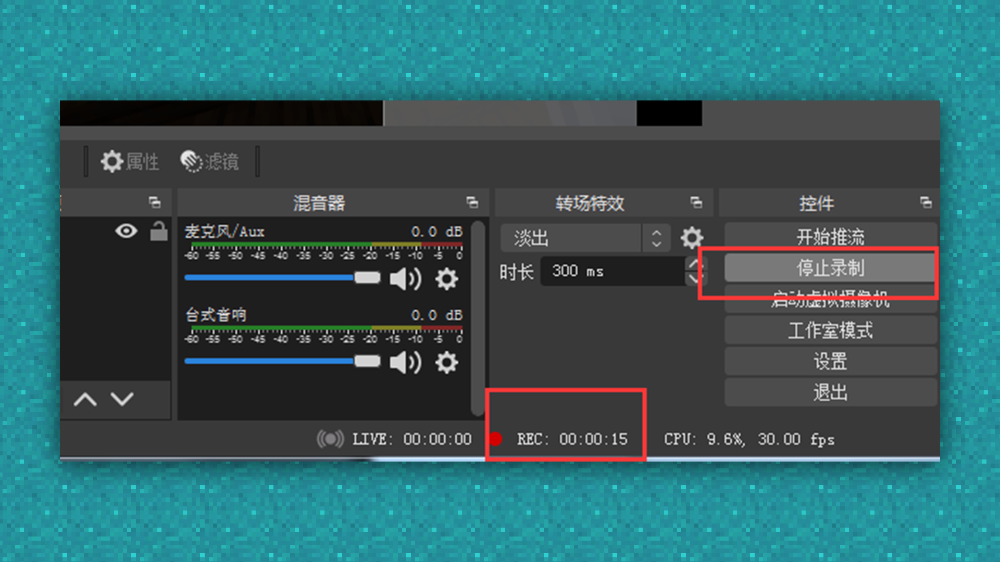

在文件下的显示录像内找到录制好的游戏内录视频素材即可。

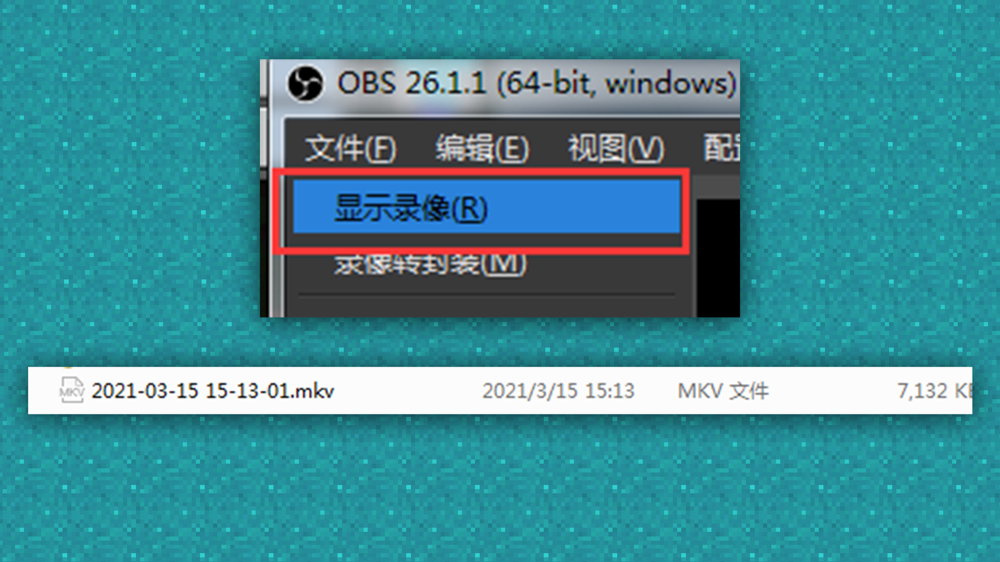

内录完成后我们就要把录制好的素材进行整理，并且放入各类视频制作软件进行制作。

如需要更加专业的软件帮助，可以选择AE（Adobe After Effects）等软件

首先打开选择的剪辑软件，此处以AE为例。

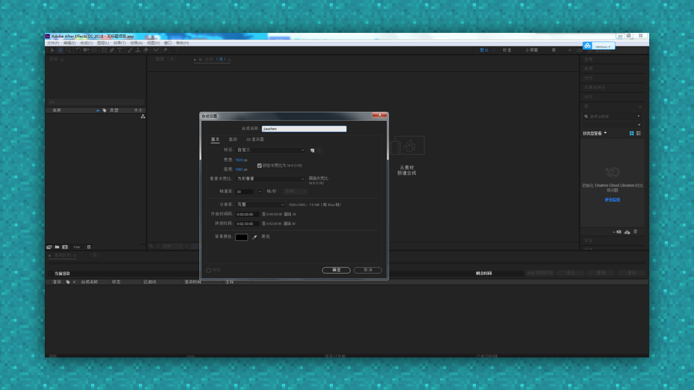

影片规格就根据我们想要剪辑的尺寸来设置，这边选择了默认1080的PC通用尺寸来设置。

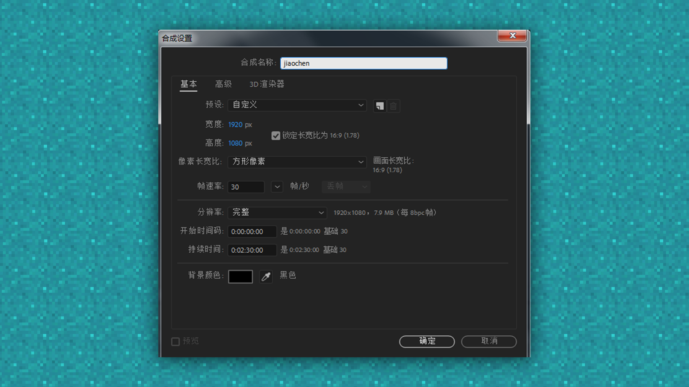

新建好之后，将整理的素材导入进去。

导入之后，将视频拉入到时间模块内进行剪辑和排版。

具体如图所示，展示的顺序排版可以按照个人喜好进行排序哦。

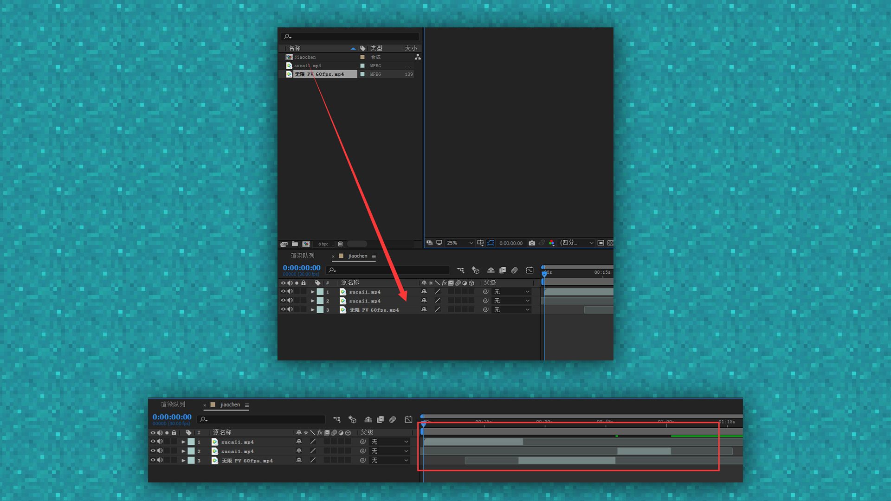

大致编辑已经完成，就可以开始放置音乐啦~

将事先选择好并已经购买好版权的音乐放进资源管理器，然后直接拖拽到时间条之后就可以根据具体节点来进行针对音乐的剪切啦。

跟视频一样我们直接将音乐拖入到时间条上。

如果音乐过长，就需要将音乐的后半段给剪切掉，并且要根据视频的内容来选择最适合的部分进行放置。

使用Ctrl+shift+D直接剪切头尾用高潮的部分就OK了。

制作完成后，需要反复多次自己审视一下视频，如果没有大致的问题，就可以直接导出啦。

每一个视频剪辑的导出方式不同，此处直接选择【文件】—【导出】—【添加到渲染队列】就可以了。

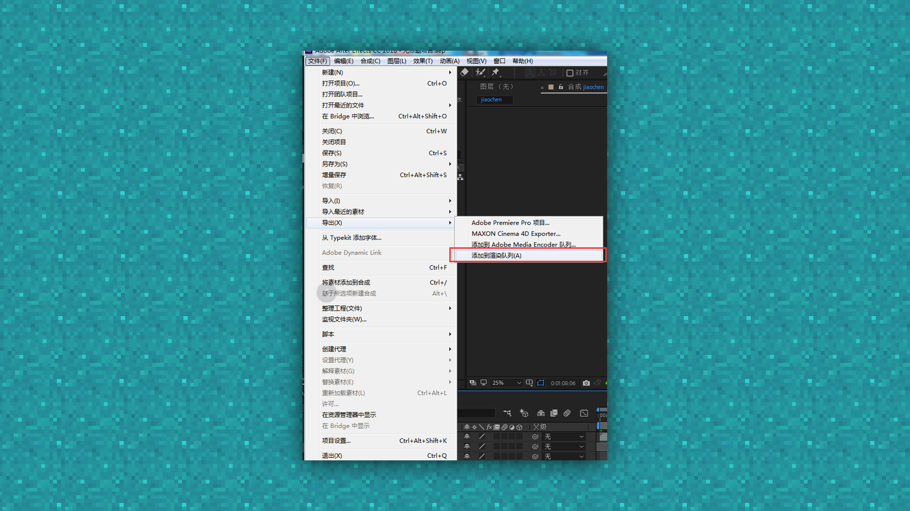

导出后需要修改一下文件名，随后点击渲染，视频导出进度条就会开始运动了。

等进度条好了之后我们的视频也就好啦。

最后将视频上传至开发者平台即可。

