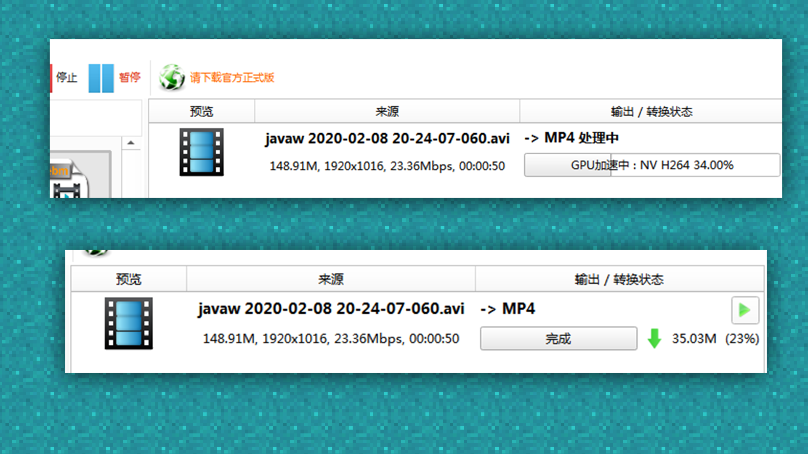

# 宣传视频：导出规范及格式转换

#### 作者：上古之石

#### Tag：视频 导出 规范

#### 宣传视频：导出规范及格式转换

关于视频导出，很多时候会因为不明白视频本身的格式问题，从而导致开发者无从下手。

因为不同剪辑软件的剪辑方式和导出的方式都是不同的，所以如何导出正确的格式和如何转换格式就成为大家头疼的地方。

其实常规上传的格式都为MP4或者AVI，这两个是最常见的格式。

但AVI导出的视频十分大，对于开发者平台的视频上传大小的限制来说，是无法符合要求的。所以此时就会选择转换格式来进行压缩视频的大小，但切记不能压缩视频的质量。

此处我们运用的软件为格式工厂：

将导出的AVI视频直接拖入进转换格式的软件，进行视频格式的转换。比如现在需要把AVI转换成MP4，我们可以选择MP4然后将需要转换的视频拖进去，点击确定。

点击确定后即可

等待转换完成，我们就可以得到一个MP4格式的视频啦~

