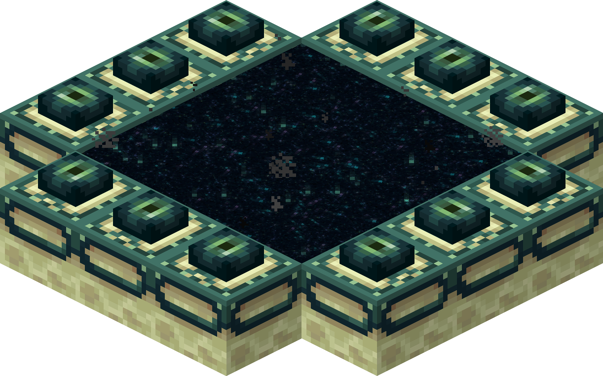

# 游戏流程与目标（后）

本节中，我们继续学习和理解《我的世界》的整体游玩流程。

## 中期

到这里，你应该已经来到了下界，并且获得了各种下界资源了。现在，我们需要去往末路之地，简称末地，来完成游戏安排的终局挑战。

末地传送门的框架并不像下界传送门那样易得，你只能在主世界寻找现成的框架来使用。通常，末地传送门框架生成在主世界的要塞里。要塞是一种可以用末影之眼定位的地下结构，你需要抛出末影之眼，然后末影之眼便会朝着最近的要塞的方向飞去，并留下一个轨迹。在此期间，你或许需要抛出多个末影之眼才能确定要塞的准确位置。所以你需要准备一些末影之眼。

末影之眼由末影珍珠和烈焰粉合成。末影珍珠来自于主世界便有的怪物末影人，杀掉末影人会概率掉落一颗末影珍珠。烈焰粉来自于下界的怪物烈焰人。烈焰人会在下界要塞生成。下界要塞是下界最常见的一种大型结构，里面由迷宫一般的回廊，当然也有怪物和宝藏。在下界要塞杀死一些烈焰人获取烈焰棒。并将烈焰棒拆成烈焰粉。这样你便获得了末影之眼。

末地传送门框架也需要末影之眼来激活，一个框架需要至多12只眼，将眼放在框架上，当填满之后便会在中心生成末地传送门，跳进去，你便可以来到末地。注意，末地传送门并不会在末地生成返回的门。当你准备好之后再进入末地！

## 击杀末影龙

末影龙是游戏为你准备的终局Boss，当你准备好一切后，就跳入末地传送门吧。当然，或许你未必能一次击杀末影龙。死亡之后你会在你主世界的床边复生，当然你也会损失你身上的全部物品和经验。做好准备再出发。

当你击杀末影龙后，你会得到超大量的经验，并且会在末地中心生成一个返回的传送门。跳入传送门后你将看到官方特地为你准备的终末之诗和职员名单。下图是末影龙的死亡画面。

## 后期

末影龙每被击败一次便会在末地主岛边缘生成一个末地折跃门，通过折跃门你可以去往末地外岛，那里有更多的末地结构和末地特产。

向折跃门内投掷末影珍珠可以进入折跃门，别担心，折跃门是可以返回的，当然，也需要消耗你一个末影珍珠。你可以在末地外岛的结构内找到鞘翅，这是一种能让你飞行的翅膀。

在后期，你已经征服了原版所有的维度，你也可以干你想干的任何事情了。你可以做一些大型刷怪农场、做一些红石结构、或者打一打另一个隐藏Boss——凋灵。凋灵的掉落物下界之星可以用来合成信标，这是一种可以给你的基底提供大量状态效果增幅以及指路的超赞的方块！

## 结论

以上是《我的世界》官方所设置的整体流程，理解上述流程有助于你在你的模组中也可以设计出类似的有趣且不失复杂性的出色的游玩流程。