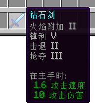
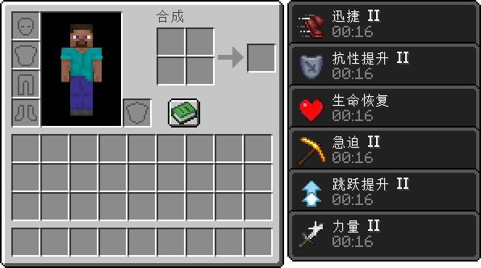

# 高级机制

在本节中，我们将进一步介绍一些《我的世界》中的高级机制。

## 附魔

 **附魔** 是《我的世界》中非常重要的一种可以增加玩家战斗力的机制。一般玩家需要等到中后期才能较为自如地利用附魔机制合理安排自己武器和盔甲的魔咒。

附魔利用附魔台向一个工具或盔甲添加 **魔咒** 。原版的魔咒涵盖了从增加攻击伤害到减免受到伤害，以及在某些情况下快速行走或呼吸等一系列或实用性或功能性魔咒。不过我们依旧可以添加自定义的魔咒来让游戏的体验更加丰富。

魔咒也分“容易附魔”和“难以附魔”等困难级别，这由魔咒的权重决定。同时，不同的工具材质也有不同的附魔能力，这决定着该种工具是否更容易附上更高级的魔咒。

妥善添加魔咒和控制附魔，可以更好地管理你的模组的平衡性和可玩性。

参考资料：

- [附魔](https://zh.minecraft.wiki/w/%E9%99%84%E9%AD%94%EF%BC%88%E7%89%A9%E5%93%81%E4%BF%AE%E9%A5%B0%EF%BC%89)
- [魔咒](https://zh.minecraft.wiki/w/魔咒)
- [铁砧机制](https://zh.minecraft.wiki/w/铁砧机制)
- [自定义附魔](https://mc.163.com/dev/mcmanual/mc-dev/mcguide/20-%E7%8E%A9%E6%B3%95%E5%BC%80%E5%8F%91/15-%E8%87%AA%E5%AE%9A%E4%B9%89%E6%B8%B8%E6%88%8F%E5%86%85%E5%AE%B9/11-%E8%87%AA%E5%AE%9A%E4%B9%89%E9%99%84%E9%AD%94%E6%96%87%E6%A1%A3.html)

## 状态效果

 **状态效果** 又名 **生物效果** ，通常由一些食物、药水或特殊的实体事件获得。状态效果分为正面效果和负面效果。和魔咒类似，状态效果也可以为玩家提供一些列增益（和减益），只不过状态效果是“附”在玩家的身上，而不是工具上。此外，相比于魔咒的一次一生效的性质，状态效果往往具有持续性，可以一直为玩家或其他实体提供各类加成。

自定义一些状态效果有助于让玩家拥有更多选择，让游戏的丰富度更上层楼，也可以更好更精准地控制游戏的平衡。你也可以添加更多种类的获取状态效果的方式，除了可以添加新的药水、食物外，你也可以让一些实体或者方块具备给予状态效果的能力，或是添加一些游戏特殊事件，给予玩家功能性的状态效果，例如原版的袭击事件。

参考资料：

- [状态效果](https://zh.minecraft.wiki/w/%E7%8A%B6%E6%80%81%E6%95%88%E6%9E%9C)
- [药水效果](https://zh.minecraft.wiki/w/药水效果)
- [自定义状态效果](https://mc.163.com/dev/mcmanual/mc-dev/mcguide/20-%E7%8E%A9%E6%B3%95%E5%BC%80%E5%8F%91/15-%E8%87%AA%E5%AE%9A%E4%B9%89%E6%B8%B8%E6%88%8F%E5%86%85%E5%AE%B9/7-%E8%87%AA%E5%AE%9A%E4%B9%89%E7%8A%B6%E6%80%81%E6%95%88%E6%9E%9C.html)

## 总结

本节中我们一起认识了一些《我的世界》中的高级机制。善于利用这些机制将有助于你的模组更加平衡且更加丰富多彩。
