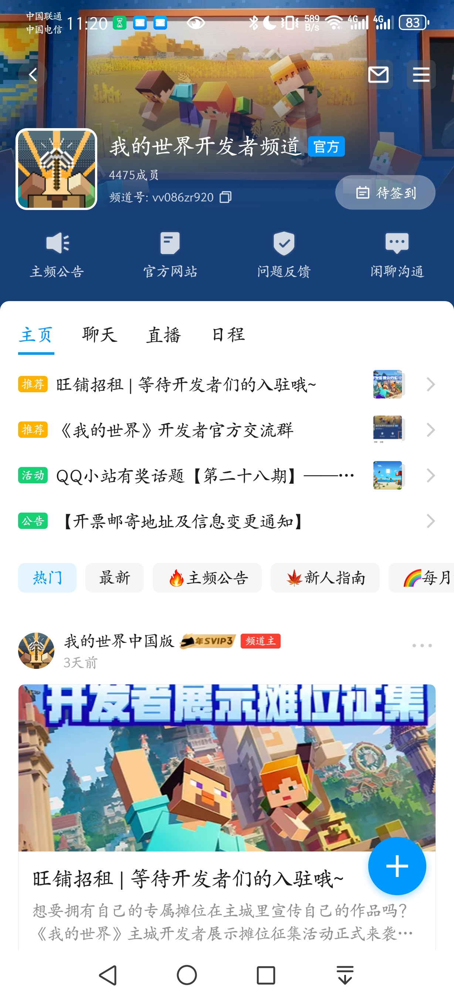

# 游戏背景与社区

《我的世界》拥有庞大的社区，及时了解游戏背景和社区将有助于你更好的与社区互动，开拓技术眼界，从而制作出更受欢迎的作品。

## 官方网站

《我的世界》中国版官方网站是你必须要谨记的网站。以下是官方网站的网址：

- 我的世界官网：https://mc.163.com/
- 我的世界开发者官网：https://mc.163.com/dev/

## QQ频道

《我的世界》官方在QQ频道建立了开发者社区，包括帖子和聊天结合一体。在这里你能接触到其他的同行开发者，互相交流经验心得。

- 加入链接：https://pd.qq.com/s/fallcqo5q

## 其他官方社区

B站和微信公众号也开设了开发者的官方交流账号，你可以通过下述链接或二维码关注：

- B站：https://b23.tv/2GA2gnW

- 微信公众号：

## 百科查询

善于利用百科网站查询《我的世界》开发知识是你必须要掌握的技能。下面列出了一些《我的世界》基岩版开发相关的百科：

- 基岩版开发Wiki：https://wiki.mcbe-dev.net/

  

- 国际版官方附加包文档的第三方托管：https://bedrock.dev/en

- Bedrock Wiki（英文）：https://wiki.bedrock.dev/

  

## 社区分享

我们是社会人，因此成为社区的一部分并获得反馈可以帮助我们保持动力。每次练习后，你可以展示结果并分享你学到的东西。你可以把它作为日常生活的一部分，并用它来强化你的学习习惯。这样，你就会得到对你练习的反馈，这也有助于坚持下去。