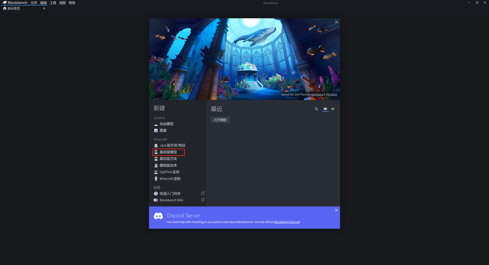
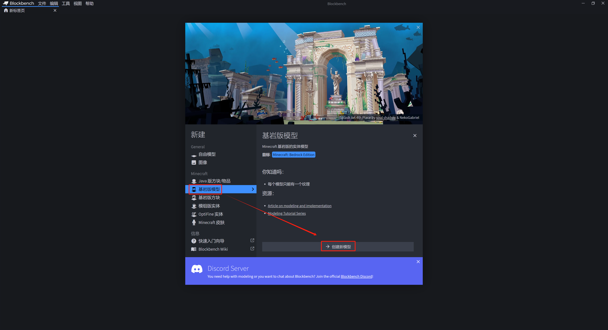
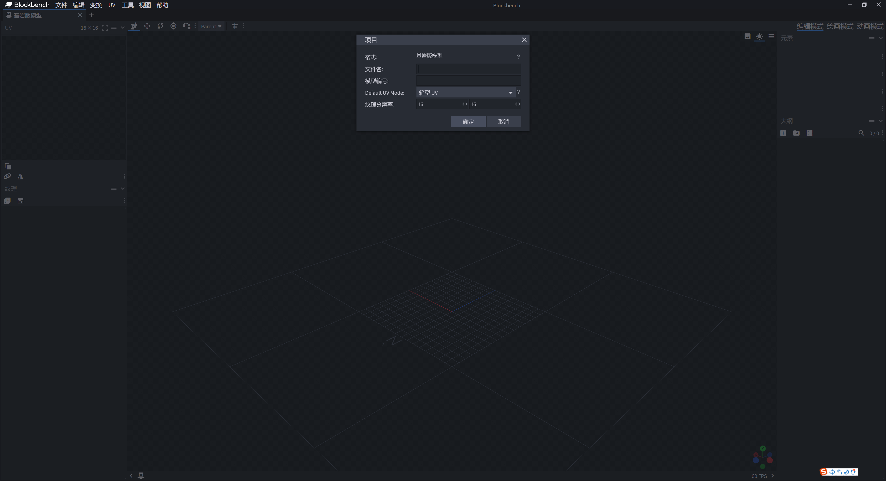
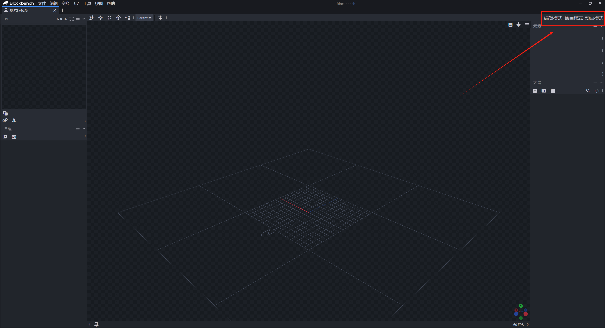
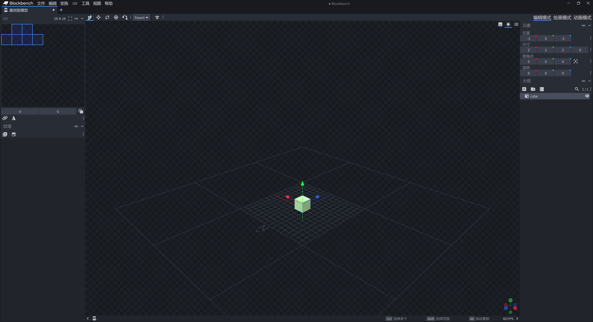
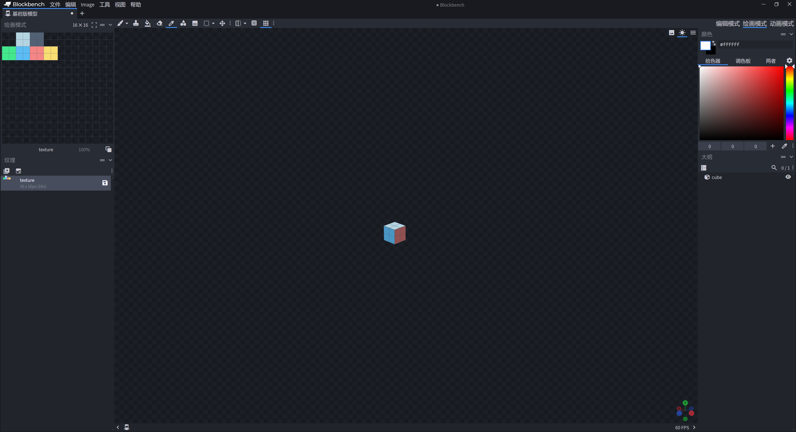
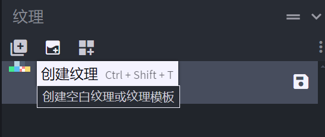
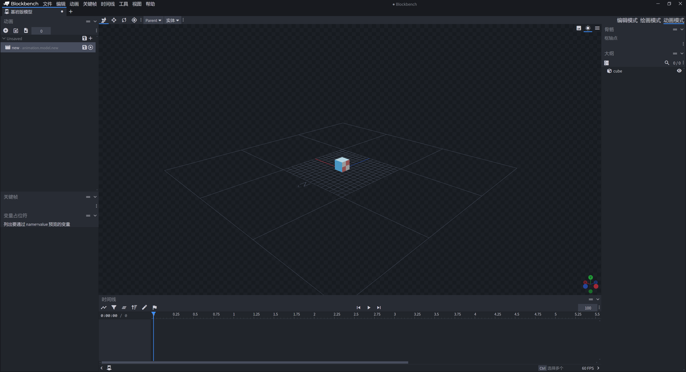

# Blockbench功能简介

一般而言，我们通常用Blockbench制作实体或方块的模型。以实体的模型为例，在本课中，我们一起来浏览Blockbench都有哪些基本功能。

## 新建项目

点击“基岩版模型”，我们便可以新建一个基岩版实体模型。

在成功新建项目之前，我们要为模型取一个名字：

## 基本功能

Blockbench中有三种模式，这三种模式的切换位于界面右上角，分别是：

- 编辑模式：编辑一个模型的基本结构，包括模型的立方体的位置、缩放、旋转和立方体之间的包含关系。
- 绘画模式：绘制该模型所有面的纹理，这里有许多基本和高级的绘制功能。
- 动画模式：制作该模型的动画。模型动画即是模型在游戏内动态变化的方式。

在 **编辑模式** 中，左上是该模型当前使用纹理贴图的UV，目前我们创建了一个新立方体，该立方体使用的纹理尚未绘制，因此表现为透明。左下是纹理贴图的文件列表。当你保存纹理后你会在次看到你的纹理贴图文件，你也可以在此导入外部的纹理。

右上是当前选定元素的位置、缩放、旋转、枢轴点的具体数值情况，你可以在此更改，也可以在图中直接拉动对应坐标轴更改。右下是当前模型的立方体、定位器锚点和其他模型元素之间的包含关系和结构关系，被称为大纲。如图，我们已经在大纲中创建了一个立方体：

鼠标右键拖动中央视图的空白处可以移动你的视图相机位置，左键拖动则是围绕当前视角旋转你的视图相机。鼠标滚轮滚动会缩放当前的视图相机，表现为相机远离或靠近你的模型。

进入 **绘画模式** 后，你依旧可以用上述方式调整视图，但此外，你使用鼠标左键点击立方体的某一面上的某一个像素时，你可以将当前屏幕右上“颜色”栏显示的前景色绘制在该像素上。你可以使用这种方式来绘制你的纹理！此外，顶部还有一系列工具，你可以自行尝试，学习这些工具的功能，并多加利用。

为了绘制纹理，我们至少得有一个纹理文件。如果你是新模型，记得通过创建纹理按钮创建一个新纹理贴图文件。

在 **动画模式** 内，我们在右侧依旧可以看到立方体元素之间的结构，但左侧的窗格变成了新的样式。左上是当前模型全部的动画的列表，左下是当前定位到关键帧的各项参数值，可以修改，只有当你选定了一个关键帧时这里才会显示信息。下方是动画时间轴，你可以你在这里添加和管理关键帧，预览播放整个动画。你也可以在这里添加额外的音效和粒子特效。善用下方的时间轴管理动画，你可以为你的模型添加精妙绝伦的动态效果！

以上是Blockbench的基本功能。Blockbench作为一款成熟的模型软件，其拥有的功能不胜其数。如果你有兴趣，你可以自行钻研探索，也可以参考下面提供的一些参考资料进一步学习，把自己打造成一名出色的建模师。

参考资料：

- [玩法组件教程-自定义实体](../../../15-玩法组件教程/7-自定义实体/0-摘要.md)：中国版官方提供教程中的自定义实体，你可以详细查看前两节。
- [玩法组件教程-精通自定义复杂的实体](../../../15-玩法组件教程/11-精通自定义复杂的实体/4-自定义松鼠实体资源.md)：上面教程的继续，你可以仔细查看第四到六节中涉及到Blockbench的部分。
- [美术教程-Blockbench教学-产出模型案例](https://mc.163.com/dev/mcmanual/mc-dev/mconline/40-%E7%BE%8E%E6%9C%AF%E6%95%99%E7%A8%8B/6.%E6%A8%A1%E5%9E%8B%E5%92%8C%E6%A8%A1%E5%9E%8B%E5%8A%A8%E4%BD%9C/04.BLOCKBENCH%E6%95%99%E5%AD%A6.%E4%BA%A7%E5%87%BA%E6%A8%A1%E5%9E%8B%E6%A1%88%E4%BE%8B.html?catalog=1)：中国版官方美术教程的Blockbench案例。
- [美术教程-Blockbench教学-模型的动作制作](https://mc.163.com/dev/mcmanual/mc-dev/mconline/40-%E7%BE%8E%E6%9C%AF%E6%95%99%E7%A8%8B/6.%E6%A8%A1%E5%9E%8B%E5%92%8C%E6%A8%A1%E5%9E%8B%E5%8A%A8%E4%BD%9C/05.BLOCKBENCH%E6%95%99%E5%AD%A6.%E6%A8%A1%E5%9E%8B%E7%9A%84%E5%8A%A8%E4%BD%9C%E5%88%B6%E4%BD%9C.html?catalog=1)：上面教程的兄弟教程，Blockbench模型动画教程
- [Blockbench Wiki](https://www.blockbench.net/wiki)：Blockbench官方教程（英文）。

