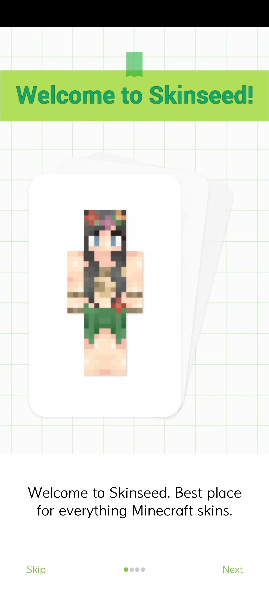
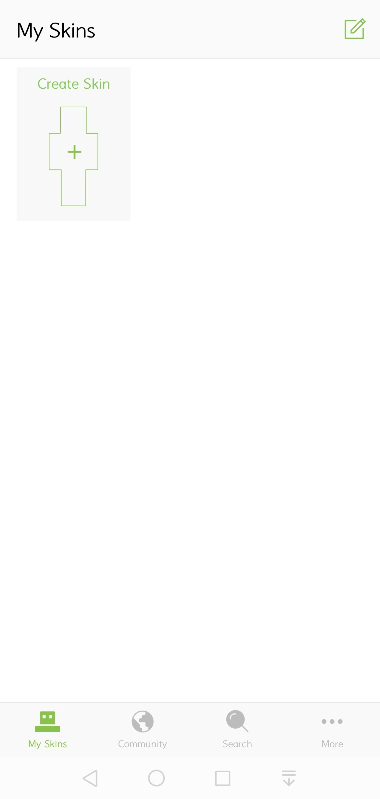
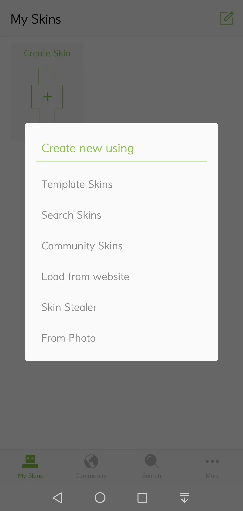
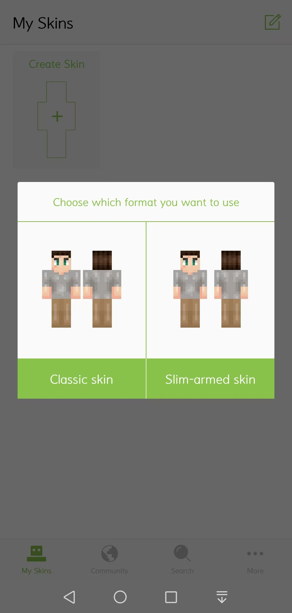
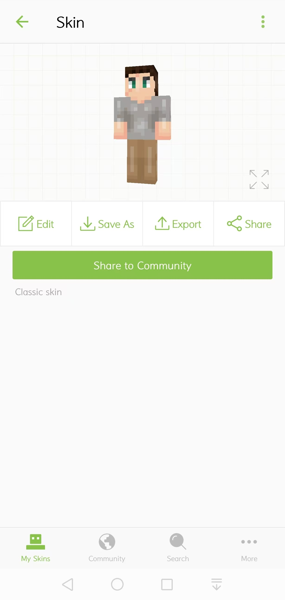
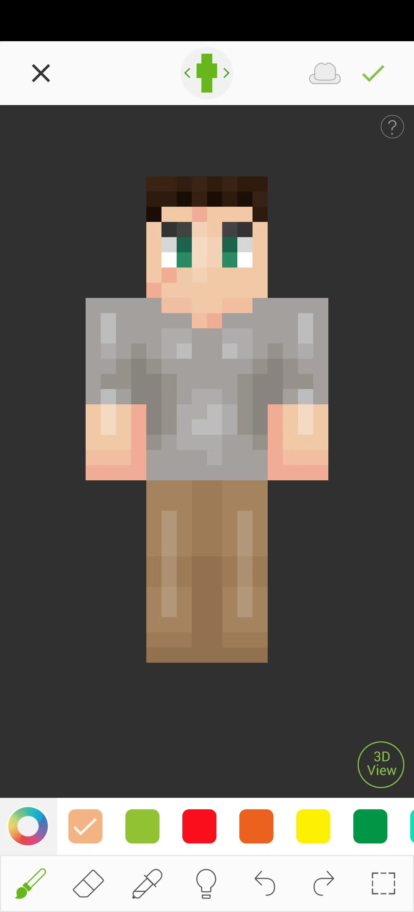
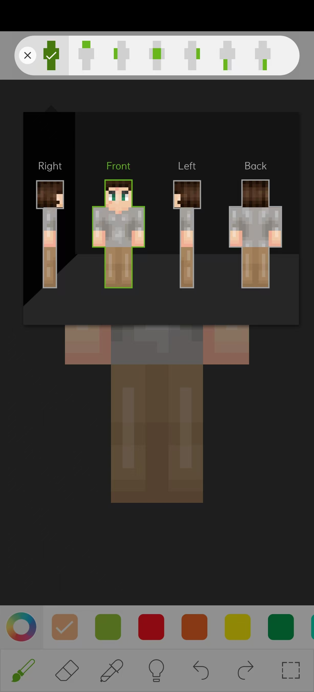
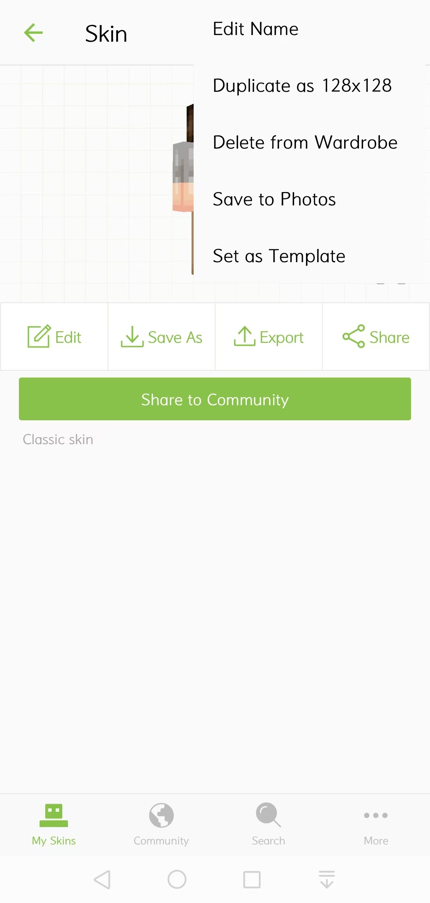
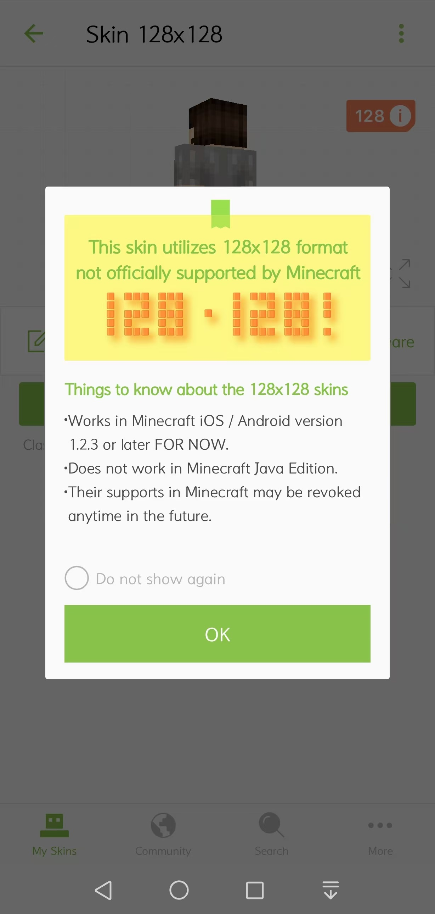
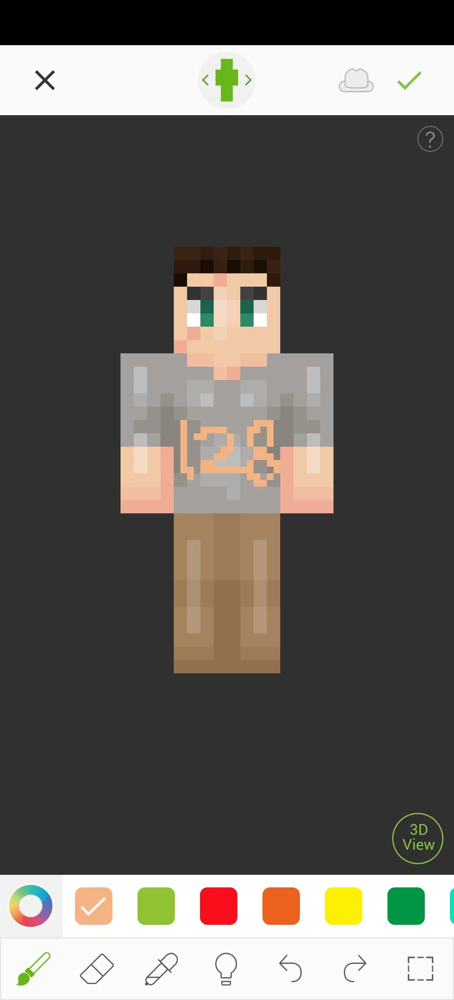

# 简介Skinseed

Skinseed是一款可以在移动设备上绘制皮肤的应用，并且功能全面，广为人们所认可。而且，我们可以在Skinseed中绘制更高分辨率的高清皮肤！我们将在这一课中一起在我们的手机上下载安装Skinseed，并做简单了解。

## 安装

如果你是iOS设备，你可以在苹果官方的App Store中找到Skinseed的免费版本：https://apps.apple.com/cn/app/skinseed-for-minecraft-skins/id675628523 。

如果你愿意，你也可以购买付费版本：https://apps.apple.com/cn/app/skinseed-pro-for-minecraft/id668857320 ，这将花费8元人民币。

如果你是安卓设备，请在手机的应用商店中自行寻找Skinseed。

## 基本功能

首次进入Skinseed后，你可以看到一个介绍页，你可以点击“Next”进入介绍，也可以点击“Skip”跳过。

在看完应用自带的介绍之后，你将进入主屏幕。这里是你已经创建过的所有皮肤。在第一次进入时，这里是空白的，点击“ **Create Skin（创建皮肤）** ”创建你的第一个皮肤！

你可以通过许多种方式创建皮肤：

- Template Skin（模板皮肤）：从自带的两个模板（宽版和窄版）中选择一个开始。
- Search Skins（搜索皮肤）：从Skinseed的服务器上搜索现有的皮肤，并以此开始。
- Community Skins（社区皮肤）：从Skinseed社区人们分享的皮肤开始。
- Load From Website（从网站加载）：可以从The Skindex、Planet Minecraft Community、MinecraftSkins.net、MinecraftXL四个网站中下载人们分享在上面的皮肤，并以此开始。
- Skin Stealer（皮肤窃取器）：国际版Java版每个人的皮肤都是可以公开访问的，输入一个人的用户名并“拿来”Ta的皮肤。
- From Photo（来自图像）：从本地相册选取一个皮肤文件并开始。

作为示例，我们选择第一个选项，从模板皮肤开始：

- Classic Skin（经典皮肤）：宽版皮肤。
- Slim-armed Skin（瘦手臂皮肤）：窄版皮肤。

作为示例，我们选择宽版皮肤：

我们点击“Edit（编辑）”进入皮肤的编辑界面：

最上方的纸娃娃圆圈按钮可以控制目前的视角和显示人体的哪些部分：

下方是工具栏，有以下工具可以使用：

- 画笔：绘制像素。
- 橡皮擦：擦除像素。
- 吸管：选取颜色。
- 亮度：调整亮度。
- 撤销。
- 重做。
- 选区：选取一个区域进行下一步操作，可以复制区域、调整区域亮度、模糊区域等。

点击右上方的“对号”按钮即可完成绘制！

### 高清皮肤

常规我们的皮肤是64x分辨率的。Skinseed还支持绘制更高清的128x分辨率的皮肤。

在选定的皮肤的预览界面点击右上角的三点按钮：

选择“Duplicate as 128x128（以128x128复制）”，即可在原先的基础上额外创建一个图案相同但是分辨率增加到原来的两倍的新皮肤项目，同时会展示“只支持基岩版1.2.3及之后的版本，不支持Java版”的相关提示，点击“OK（确定）”关闭即可：

之后，进入该128x的皮肤的编辑，你便可以绘制更加高清的皮肤了！下方示例以128x高清的方式手绘了一个“128”字样：

