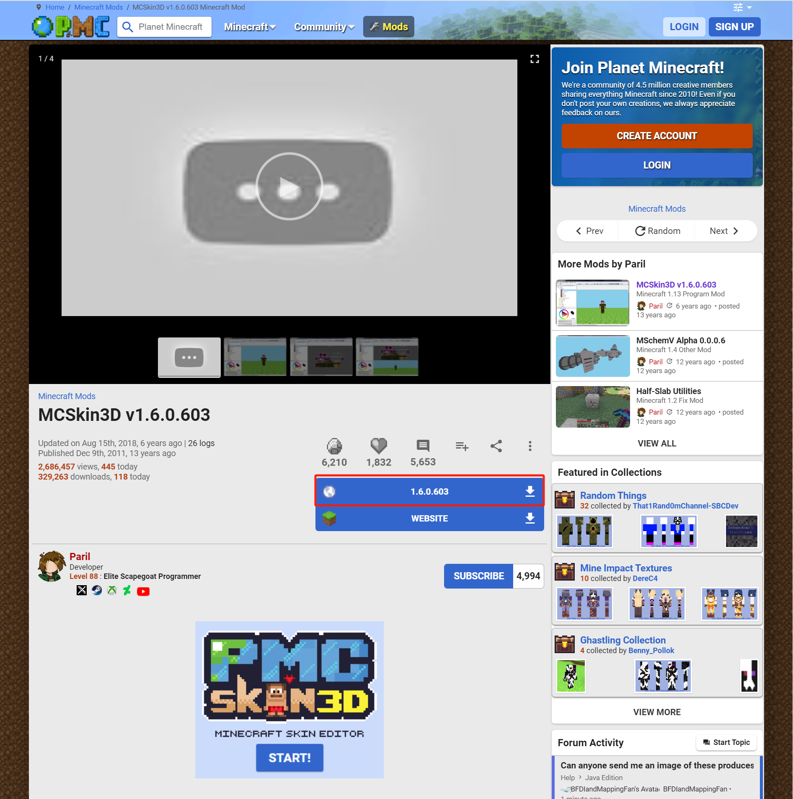

# 安装MCSkin3D

Skinseed只能在移动设备上运行，要想在桌面平台上绘制皮肤，你可以用MCSkin3D。MCSkin3D是《我的世界》发展史上较为出名的经典皮肤工具之一，至今依旧可以使用。遗憾的是，MCSkin3D并不支持绘制高清皮肤，并且只能在Windows上使用。在本节课程中，我们来一起安装MCSkin3D。

## 下载

MCSkin3D的作者[Paril](https://www.planetminecraft.com/member/paril/)将MCSkin3D软件发布在了国际《我的世界》资源论坛Planet Minecraft Community（简称PMC）中，请点击如下链接进入PMC中该软件的下载页：https://www.planetminecraft.com/mod/mcskin3d/ 。

在页面中，点击最新版本号1.6.0.603以下载最新版本的MCSkin3D软件。

## 安装

下载完成之后，你将发现一个压缩包。MCSkin3D是免安装的，但要想正常使用必须将其解压。选择一个你认为合适的存放该软件的空文件夹，将整个压缩包解压到该空文件夹中。至此便完成了安装。

你可以双击`MCSkin3D.exe`可执行程序以打开MCSkin3D。