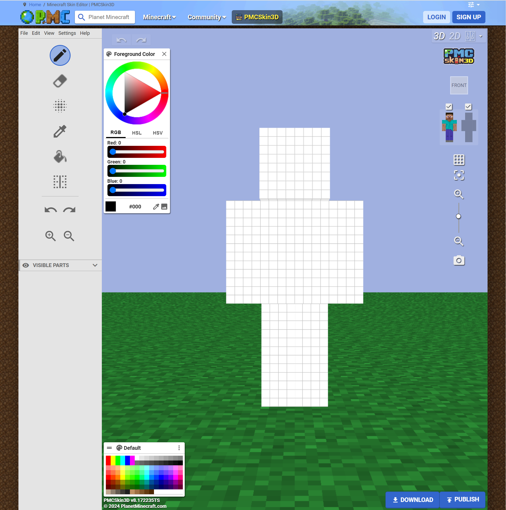
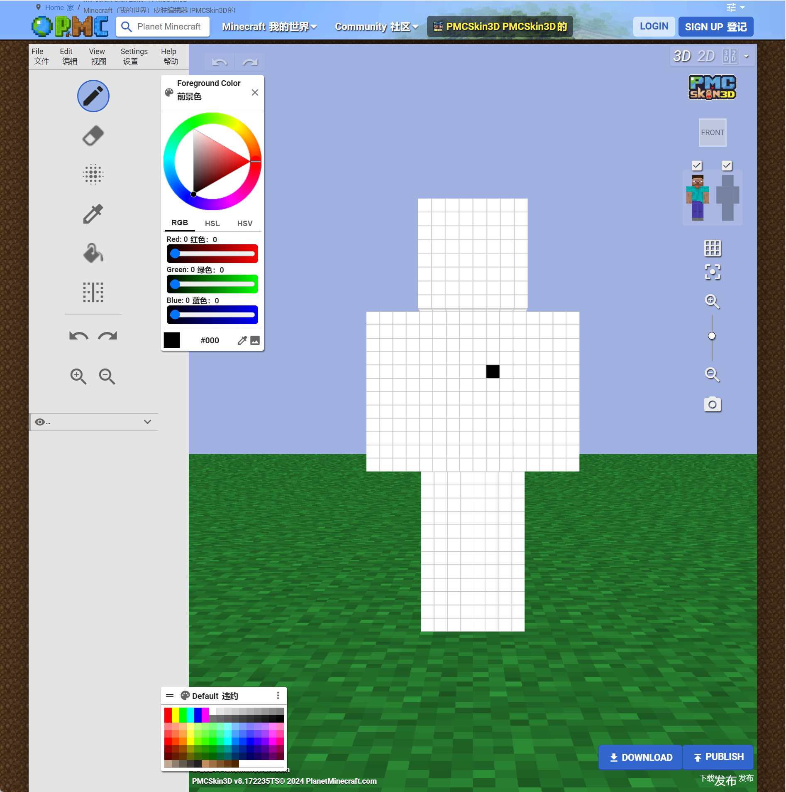
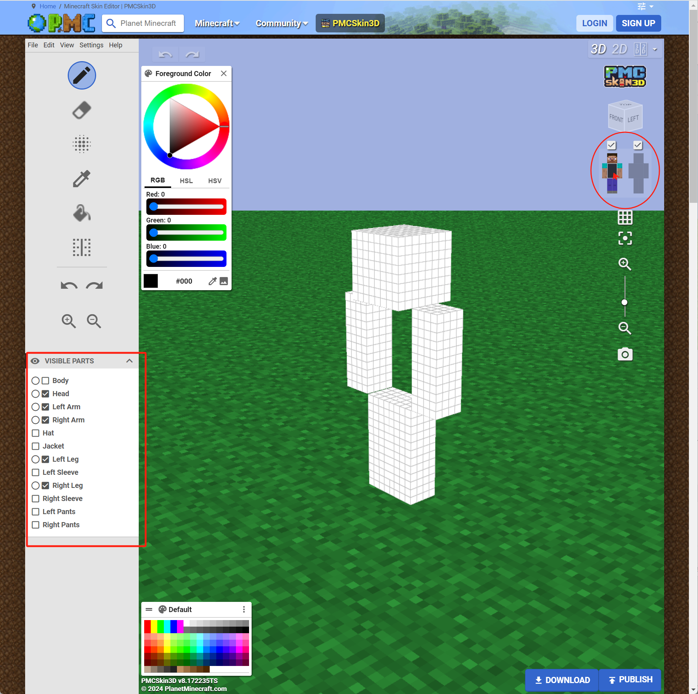
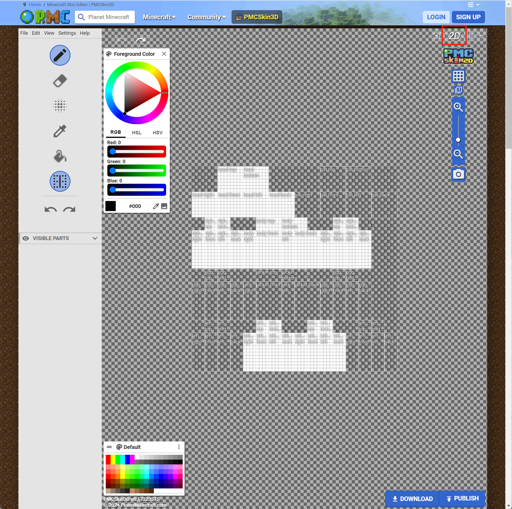
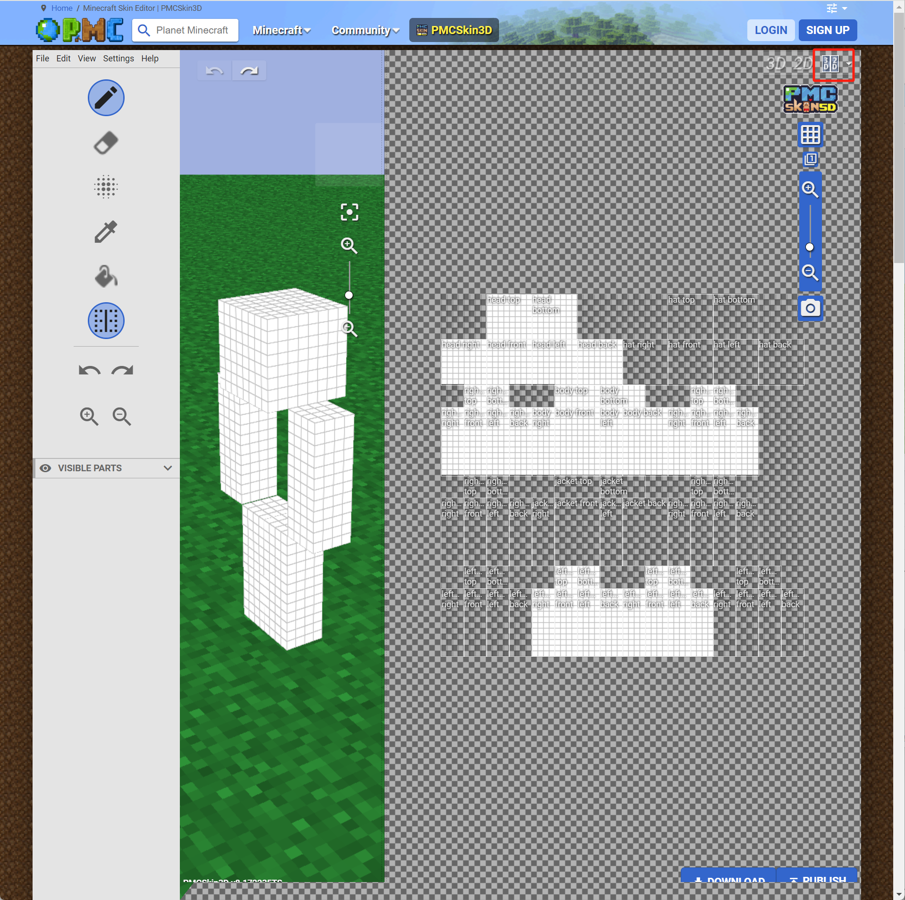

# PMCSkin3D简介

虽然MCSkin3D有着出色的皮肤编辑能力，但其也有一个缺点，那便是只能在Windows设备上使用。该软件的作者为了解决这一问题，特别重置这款软件，将其移植到了浏览器上，变为了一个WebApp。该WebApp目前托管在PMC资源论坛的服务器上，因此被命名为PMCSkin3D。接下来我们就一起来了解PCMSkin3D。

## 访问

访问如下网址，便可以进入PMCSkin3D的网页：https://www.planetminecraft.com/skin-editor/ 。你可以在任何可以使用浏览器的设备上访问并使用该软件。

比较可惜的是，由于该软件目前是浏览器内的WebApp，我们无法手动为其添加中文语言支持。但你或许可以使用一些网页翻译的浏览器扩展进行页面内翻译。例如下图，使用了一种翻译扩展进行翻译。请不要尽信翻译扩展的结果，翻译结果可能会有误。

## 基本功能

与MCSkin3D类似，在3D视图下，鼠标左键按住移动是旋转视图，滚轮是放大缩小视图。但不同的是，右键的作用和左键一致而非和滚轮一致。

点击右上角的角色正面图的部位可以切换该部位的显示与隐藏。左下的“Visual Parts”展开之后也可以进行切换。

直接用鼠标在皮肤上左键点击或按住移动可以绘制一个或一串像素点。目前只能绘制前景色。

右上方的3D、2D按钮可以切换3D视图、2D视图和混合视图。

左侧的竖列代表目前能用的所有工具。从上到下分别是“绘制模式”、“橡皮擦模式”、“噪点模式”、“取色工具”、“油漆桶工具”、“镜像”。

这里的工具种类在MCSkin3D中也均存在。如果你已经掌握了MCSkin3D的使用方法，那么掌握这里的工具将不在话下。PMCSkin3D这款WebApp存在的意义便是支持任何能够上网的设备使用。但功能性上依旧没有MCSkin3D全面。如果你在使用Windows，并且希望更加全面的皮肤工具，还请使用上一课中所介绍的MCSkin3D。