# Visual Studio Code简介

如果你在安装过程中添加了桌面快捷方式，那么你可以在桌面上轻松找到并打开VSCode，如果没有，你也可以在开始菜单中找到。我们双击打开VSCode。

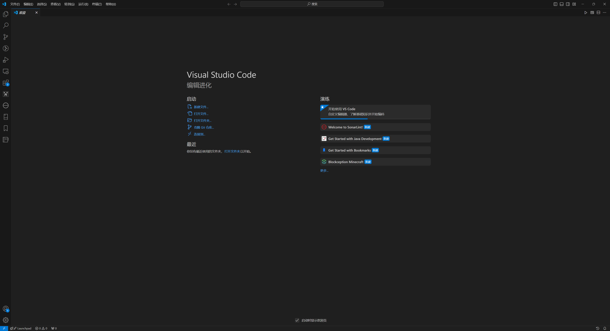

## 汉化

你可能会发现，你的VSCode并不像上图中显示的那样为中文语言。稍安勿躁，这是你没有安装中文语言的支持扩展。

在左侧的功能栏中找到该图标并点击：

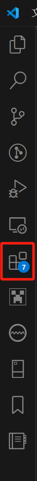

你会看到一个类似这样的边栏出现：

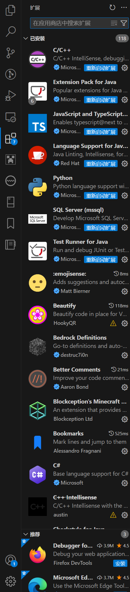

在最上方的搜索框中搜索“中文”，你一定可以找到这样一个扩展：

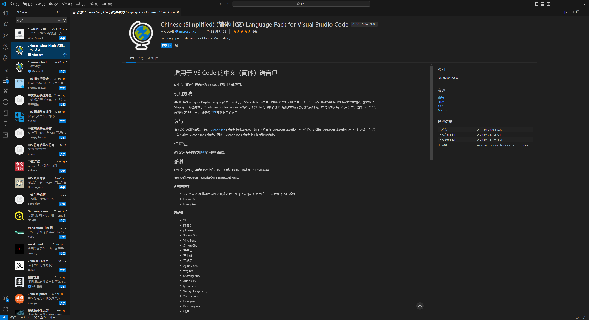

点击并安装（Install）该扩展，在VSCode重启后，你的界面将显示为中文！

## 基本功能

通常，我们会通过点击“文件(F)”->“打开文件夹”来打开我们的工作文件夹。在《我的世界》基岩版模组开发中，便是我们的附加包根目录。

在《我的世界》开发启动器内，我们可以这样定位到我们希望工作的附加包的根目录：

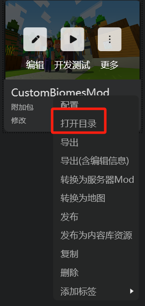

在打开的文件夹的地址栏内复制你的目录的路径，并拷贝至VSCode的打开文件夹的窗口内：

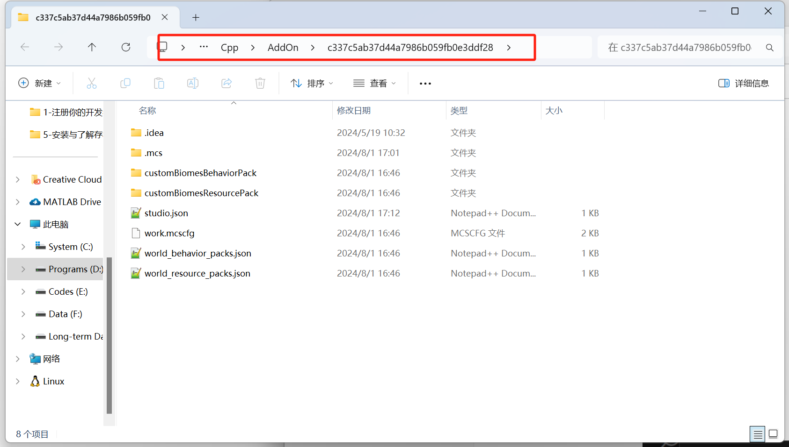

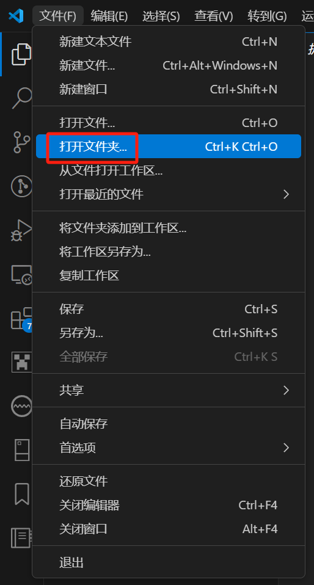

点击“我信任此作者”以开始完整的编辑功能：

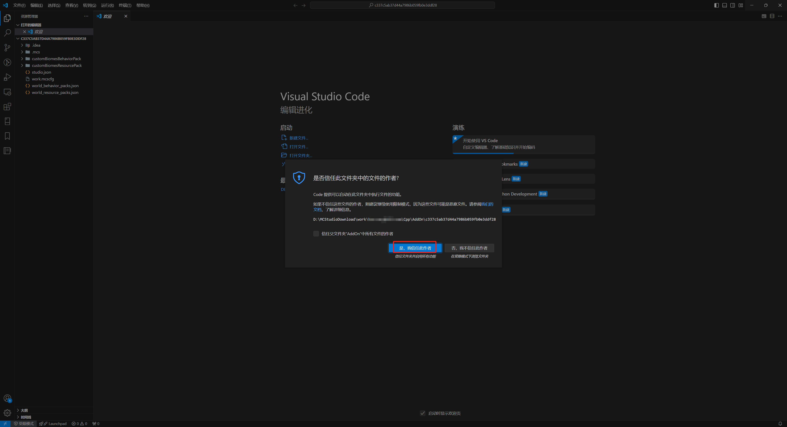

然后我们在左侧目录树窗口内就可以看到该文件夹的目录了：

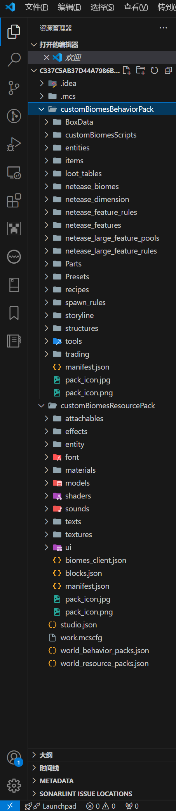

定位到你希望编辑的文件，便可以开始模组的撰写啦！

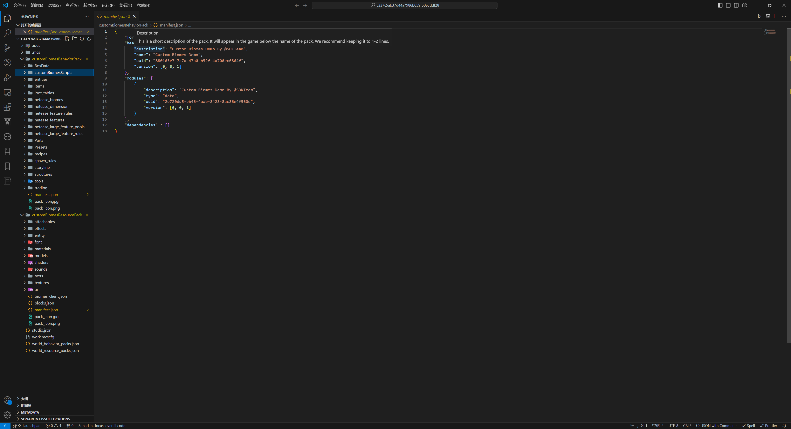

此外，当你打开一个Python文件时，VSCode右下角会显示解析器的使用情况。请务必选择解析器为 **Python2.7** ，否则你的错误提示功能可能会遇到错误。

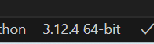

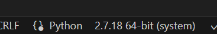

以上是VSCode的基本编辑功能。更多的功能请参考[VSCode的官方文档（英文）](https://code.visualstudio.com/learn)和互联网上其他的VSCode教程！你也可以自己探索新功能，锻炼自己的学习和理解能力！