# 安装PyCharm

PyCharm是JetBrains旗下的一款Python环境编辑器，非常适合我们开发《我的世界》基岩版基于模组SDK的玩法组件。PyCharm有收费的专业版和免费的社区版两个版本，免费版本功能较少。

## 订阅

如果你仍在高校修学，你可以尝试申请教育许可证。教育许可证包含了JetBrains旗下近乎所有产品的使用权限。如果你资金充足，也可以订阅JetBrains的产品。

打开官网：https://www.jetbrains.com.cn/ 。根据你的情况选择订阅。

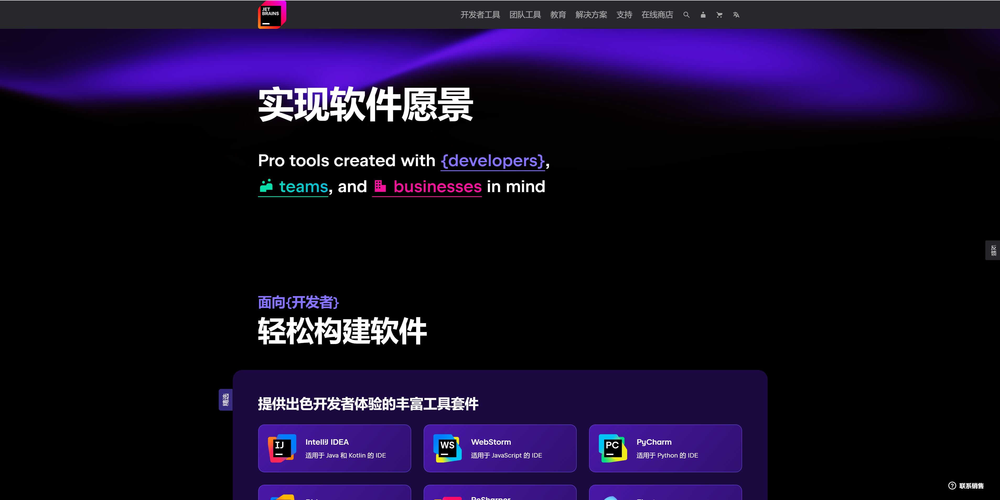

### 教育许可证

点击“ **教育** ”，点击面向学生和教师的免费许可证。

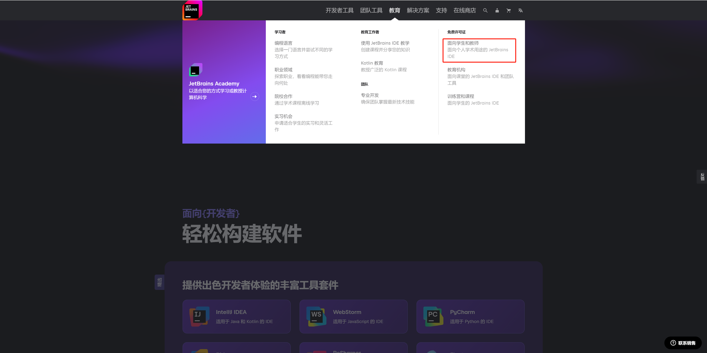

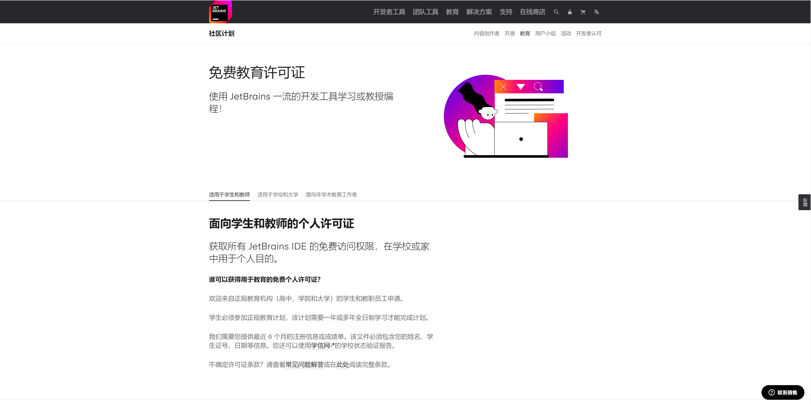

拉到下方，点击“ **立即申请** ”。

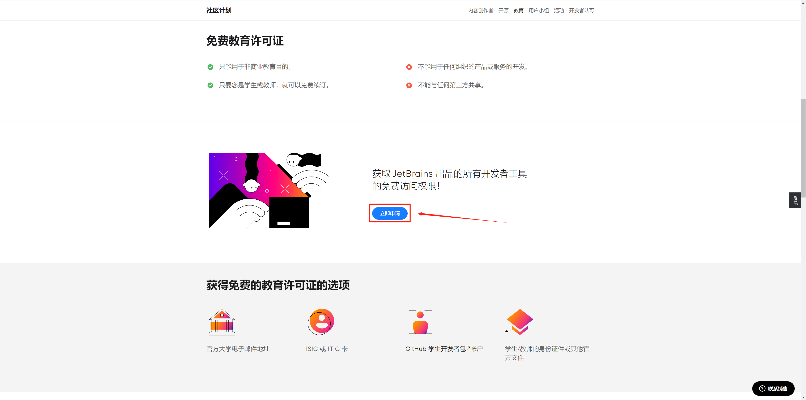

通常情况，你的高校会购买JetBrains的产品许可证。如果确实购买了，你在当天或几个工作日后便可以拿到JetBrains许可证，然后你便可以访问JetBrains系列的各类产品，这包括PyCharm。如果没有，你可能只能采取其他方法订阅或者使用免费版。

### 付费订阅

点击“PyCharm”按钮。

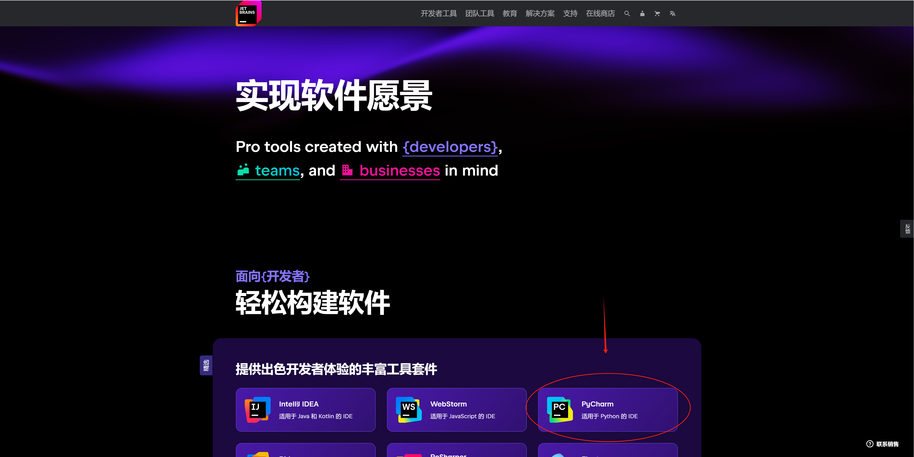

在新页面中点击上方的“ **定价** ”。

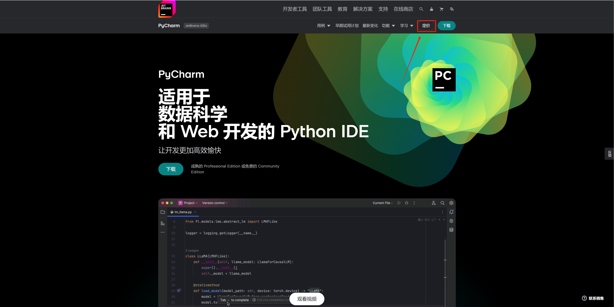

按照你的需要进行购买：

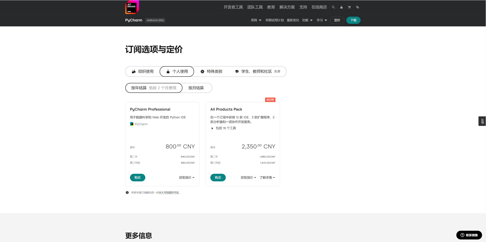

你可以只订阅“PyCharm Professional（PyCharm专业版）”，或订阅“All Products Pack（全产品包）”来访问JetBrains系列的所有产品。

你在这里可以接触到 **更多的其他免费项目** ，例如面向活跃开发者的奖励。如果你在开发领域有所建树且足够活跃，你可以申请这样的免费许可证。或面向开源项目的免费许可证。如果你有符合要求的开源项目，你也可以获得免费许可证：

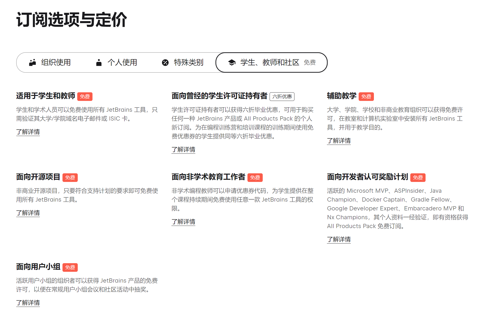

### 免费订阅社区版

社区版无需订阅，你可以直接下载得到并正常使用。

## 下载

在PyCharm页面中点击下载即可访问下载页面。

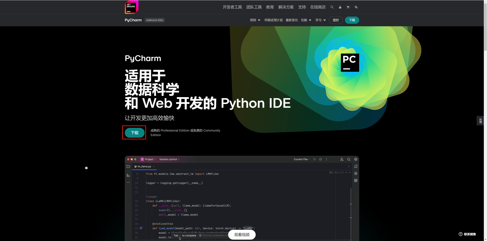

如果你已经订阅专业版，你可以下载上面的版本，如果你想使用免费的社区版，你需要下载下面的版本：

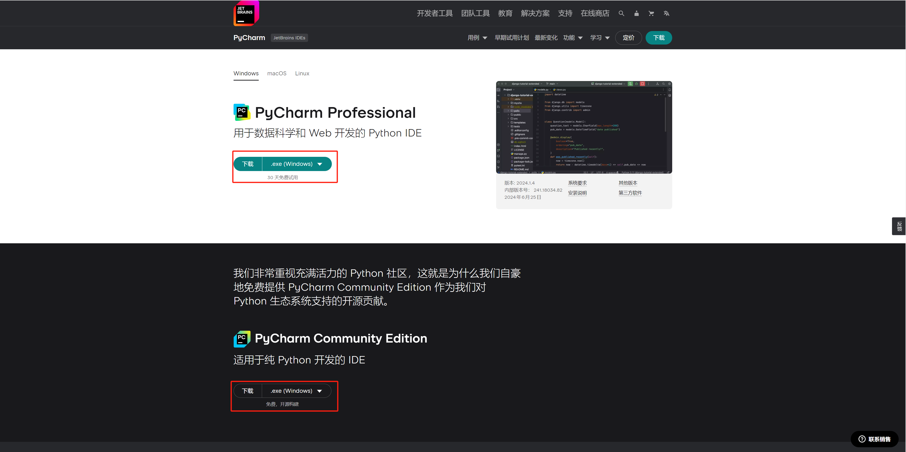

## 安装

假设你已经具有专业版的许可证，下面的安装以专业版为例，社区版大同小异。

1. 双击打开下载的安装包。

   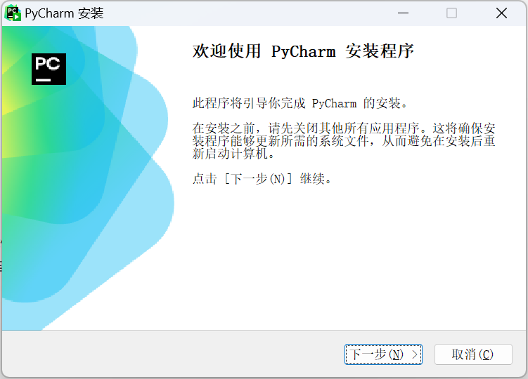

2. 点击“下一步”，你可以根据自己的喜好选择安装路径：

   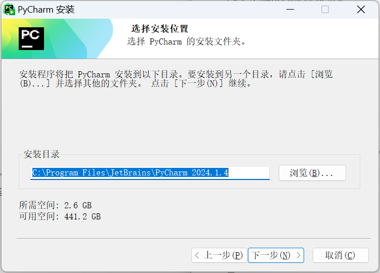

3. 点击“下一步”，你可以选择创建桌面快捷方式，在右键菜单中添加快捷打开，创建文件关联，添加环境变量。你可以自行选择是否进行这些操作：

   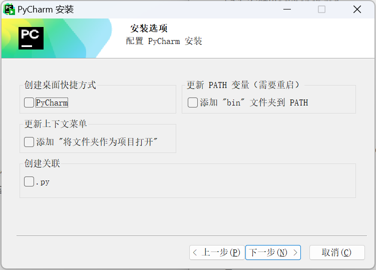

4. 点击“下一步”，选择开始菜单中JetBrains的位置：

   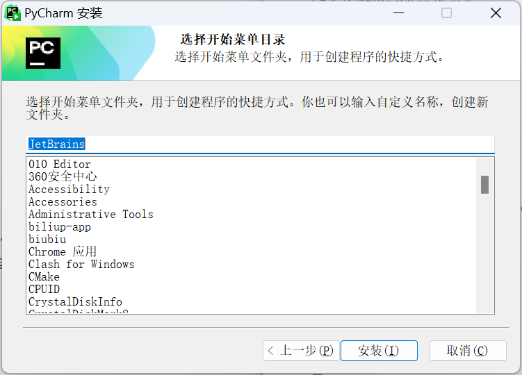

5. 然后点击“安装”，等待安装结束即可。

这样，我们便安装了PyCharm！在下一课中，我们将学习PyCharm的基本功能。