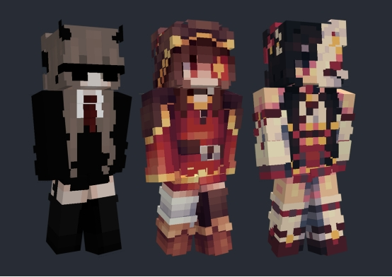
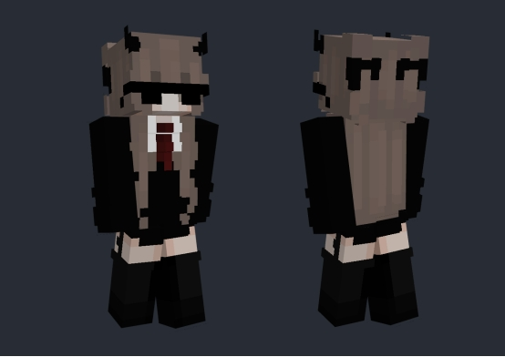
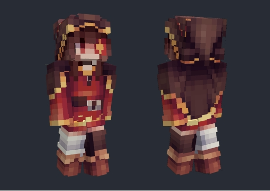
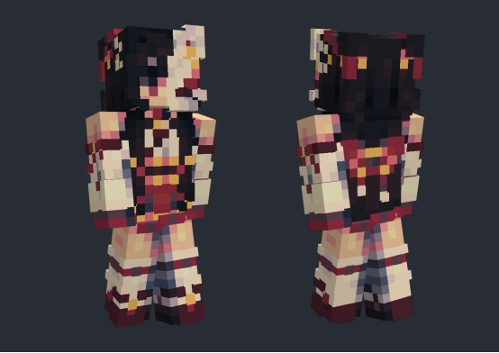
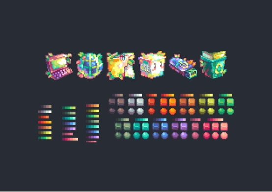

# **分析优秀作品**

## **分析国内外优秀的皮肤**

我在编写教程时，选择了三款在国外网络上比较热门且具有代表性的皮肤作为优秀参考案例进行分析。皮肤设计并无绝对的优劣之分，最重要的是你喜欢它并适合你。

- 第一种采用低对比度的明暗处理，使得整体外观更为平滑统一，虽然没有强烈的光影效果，但通过巧妙地利用双层皮肤技术，营造出简约而不简单的风格。

- 第二种风格强调皮肤的明暗结构对比，色彩对比比第一种更为鲜明，但仍保持了一定的克制，整体给人一种平衡和谐的感觉。

- 第三种则是具有强烈个人风格的作品，色彩运用大胆而自信，尽管颜色丰富多样，却能保持有序不乱。这种风格适合那些在像素艺术和色彩搭配方面有着高超技巧的创作者尝试。

##

## **了解不同的皮肤画法**

现在我们已经了解了这三种不同风格皮肤的特点，接下来我们将分别探讨如何绘制这些类型的皮肤。

**明暗关系低对比度风格的皮肤**

l 使用低饱和度的颜色，避免过于鲜艳。
l 保持明暗对比度较低，使整体看起来更加柔和。
l 利用皮肤的层次感，通过内外层之间的错位来增加视觉深度和细节。

**强调整体明暗关系的皮肤**

- 选择中间色调的颜色，既不太灰暗也不过于鲜艳。

- 通过明显的明暗对比来营造立体感。

- 外层皮肤的设计可以用来突出某些细节部分。

**明暗关系对比度极高的皮肤**

- 先熟练掌握第二种（强调明暗关系）皮肤的绘制技巧。

- 减少从亮部到暗部的过渡细节，不刻意强调局部的明暗变化。

- 使用中间色调的颜色，避免过于灰暗或过于鲜艳。

- 尝试不同的配色方案以找到最佳组合。

## **学习优秀的思路**

**多观察**

不仅仅是观察皮肤，还可以扩展到欣赏各种类型的像素艺术作品，甚至是非像素的艺术形式。寻找那些色彩搭配独特或角色设计有趣的作品，将其牢记心中，从中汲取灵感。此外，也可以参考其他像素游戏中如何用有限的像素来表现丰富的道具细节。

**多收藏**

这里所说的“多收藏”不仅仅局限于皮肤本身，而是指收集所有与像素艺术相关的素材。特别推荐大家保存一些好看的色彩到绘图软件中，方便日后创作时直接使用。

**多临摹**

临摹他人的皮肤风格是一种很好的学习方法，但并不是要复制别人的具体作品。通过模仿不同风格的皮肤，可以帮助你理解不同的设计思路和技术手法，从而提升自己的技能。