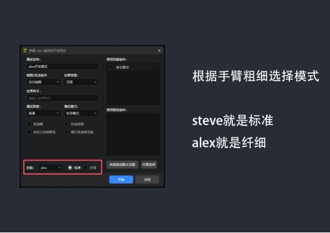

# **导入与测试**

## **在游戏中预览我们的皮肤**

1. 首先，在Blockbench中导出皮肤图片，并记住该贴图的位置；或者可以直接将它导出到桌面上。

2. 接下来，打开MCStudio，依次点击**“导入” > “作品分类” > “皮肤”**，将刚刚导出的皮肤PNG文件导入到软件中。

   

   

   

## **进行测试调整**

根据上面我们的操作，就可以进行皮肤的整体预览测试了

**主要观察内容：**

- **皮肤的整体协调性**。

- **检查是否存在空白或未绘制的区域**，特别是以下几个常见易漏画的部分：
  - 头部下方
  - 手臂和脚的内侧
  - 身体、头部与脚部的连接处