# **上传并发布**

## **将自己制作的皮肤上传至客户端**
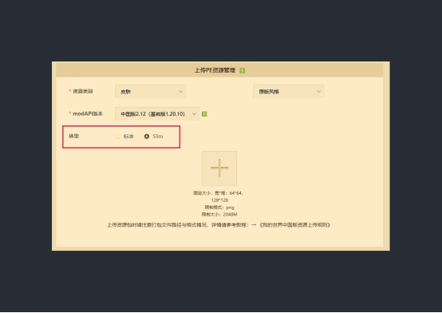

上传至平台时，需要注意的关键点是选择正确的体型。具体来说：

- **标准体型**:对应的是四格宽的手臂。

- **Slim体型**:则适用于三格宽的手臂。

确保在上传时正确选择了对应的体型选项。

## **制作一些简单美观的后期图片。**

1. 首先，使用`Blockbench`获取一张角色的透明背景图。
2. 不要让角色只是站着，选择一个有趣的姿势让角色更加生动。
3. 选择一个合适的角度，导出角色的图像。可以通过点击**“视图”>“截图模型”**，或者直接使用快捷键`Ctrl+P`来进行截图。

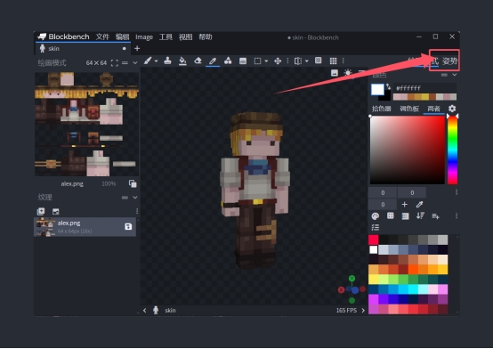

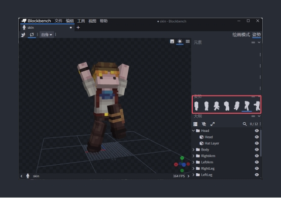

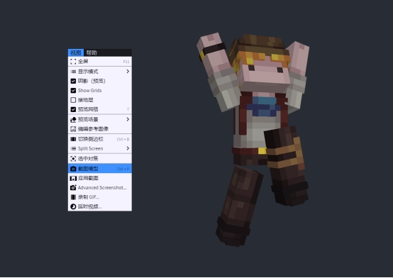

使用后期处理软件，这里我使用的是**Photoshop**，准备三种不同尺寸的皮肤图片：

- **Icon**：1000×1000像素

- **Pos机**：900×580像素

- **轮播推广图**：940×450像素

其中，Icon是最能吸引他人注意力的，因此我将以Icon为例介绍一些后期处理的思路。

**背景**

- 建议不要使用过于花哨的背景，因为手机图标显示的空间有限，过于复杂的背景会让皮肤本身不易被立即注意到。推荐使用渐变背景，渐变的颜色可以统一使用同一组配色方案，这样有助于提高品牌的识别度。

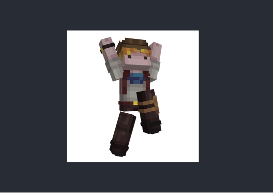

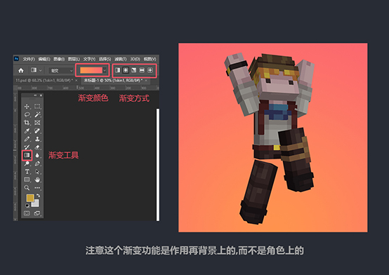

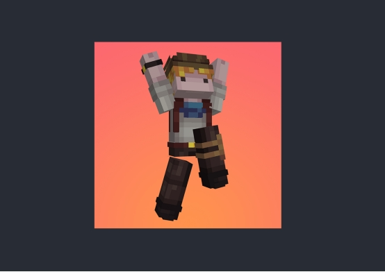

**角色**

- 从Blockbench截取的角色图片在后期处理时可能会显得有些暗淡和灰暗，可以通过提高图片的对比度来让角色更加突出。另外，可以给角色添加描边和阴影效果，以进一步突出角色。

**“图像”>“调整”>“亮度对比度”**

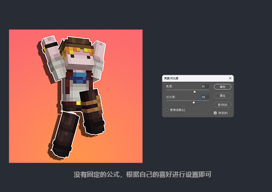

**找到想要修改的图层>右键*图层名称*>“混合选项”**

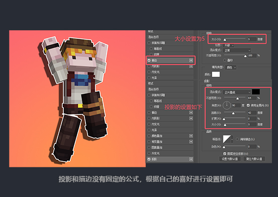

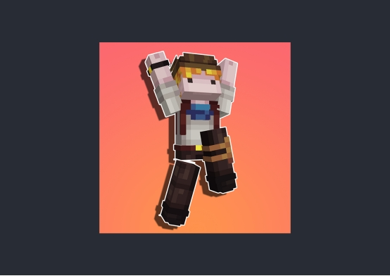

**其他修饰内容**

- 可以为背景添加一些简单的图案，为图片添加外边框，或者加入一些文字元素，类似于时尚杂志的做法。这些额外的装饰可以增强整体的视觉效果。

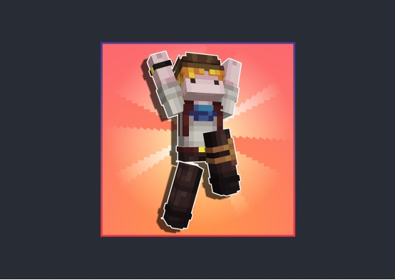
