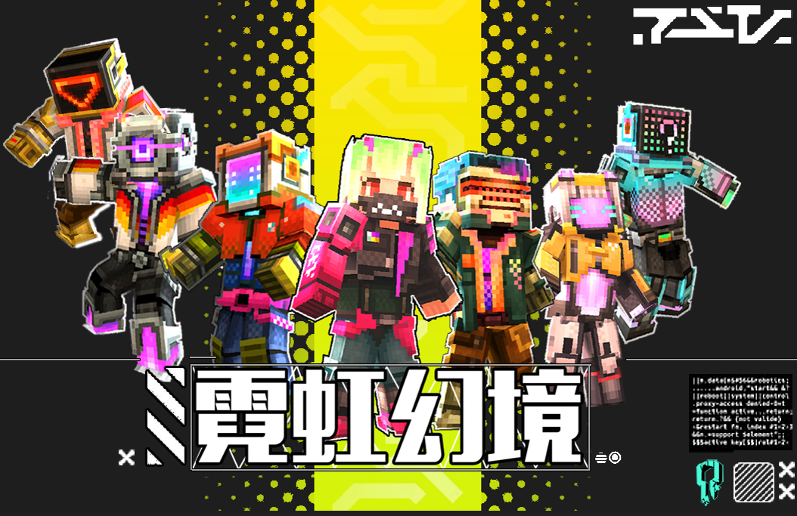
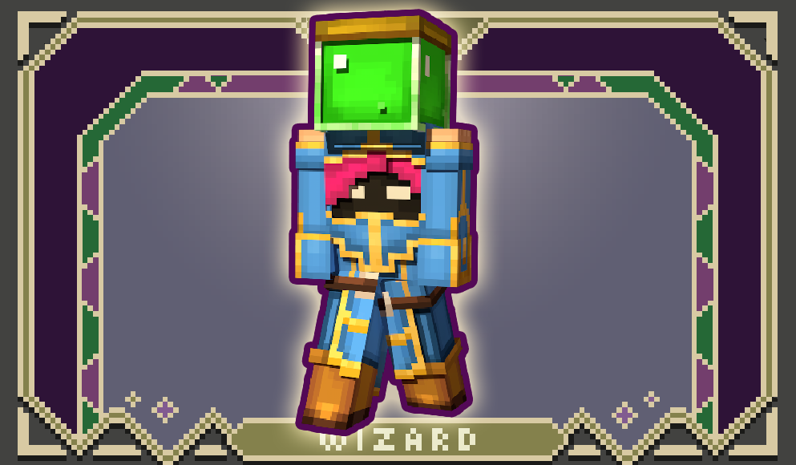
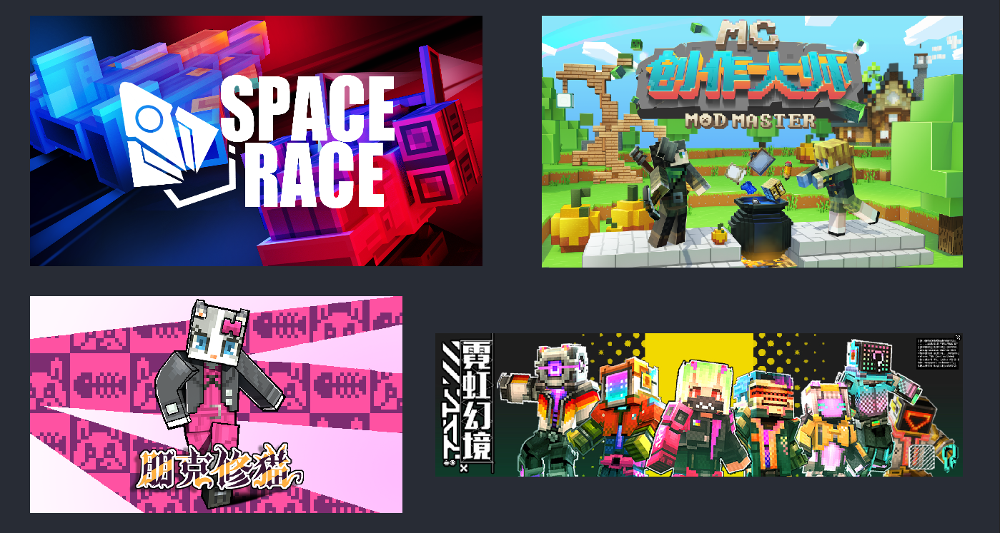
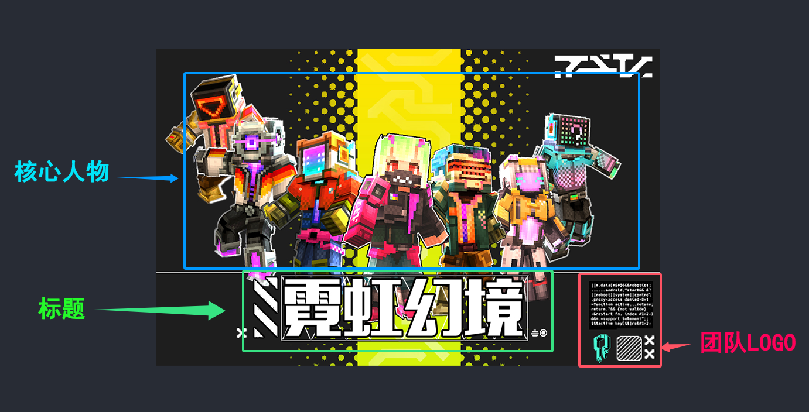
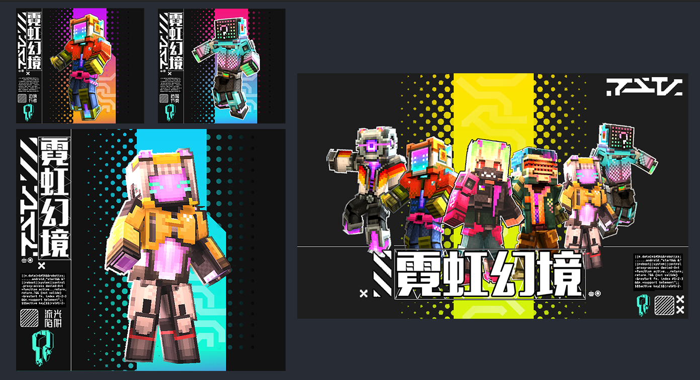

# 《启动你的探索工作室》

在现代竞争激烈的玩法市场中，视觉传播成为组件推广和产品宣传的核心工具。视觉宣传图作为这一工具的重要组成部分，不仅可以有效地传达信息，还能迅速吸引受众的注意力。本章将带你深入了解为什么要制作视觉宣传图，以及一张好的视觉宣传图能够带来的巨大价值。

**视觉宣传图对于一个好的玩法组件作品有什么好处？**
视觉宣传图对于作品的成功至关重要，尤其是在信息流速这么快的时代，玩家的注意力通常会变的很短暂。一张设计良好的宣传图能够在短时间内吸引玩家的眼球，将作品的核心信息和亮点快速传达给潜在受众。

它能够帮助玩家快速了解作品的内容、风格和特殊，从而提高玩家对组件作品的兴趣。

此外，宣传图还能通过特殊视觉元素和团队品牌LOGO元素加强品牌记忆，促进团队品牌再玩家观众群体所停留的长期影响力。因此，对于任何一个想要在玩法市场上脱颖而出的组件作品，制作宣传图都是不可或缺的环节。

**什么样的视觉宣传图是好的宣传图？**
好的视觉宣传图应该能够在短时间内传达清晰、有吸引力的信息，帮助挑选者快速理解作品的亮点。

视觉吸引力是关键，一张好的宣传图不仅在设计上具有美感，还要符合目标受众的视觉偏好。此外，信息的清晰度至关重要，一张宣传图的所有设计元素，包括文字、图像和排版，必须确保信息的传达是直观且易于理解的。

最后，团队品牌一致性也不容忽视，宣传图应与团队品牌整体形象协调，确保受众在不同渠道看到的是同一个团队品牌形象。

