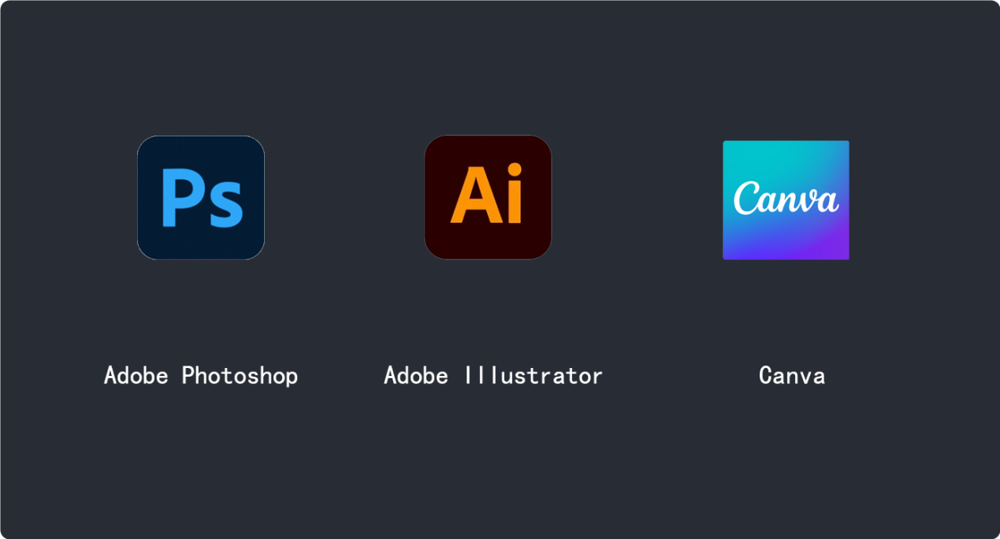
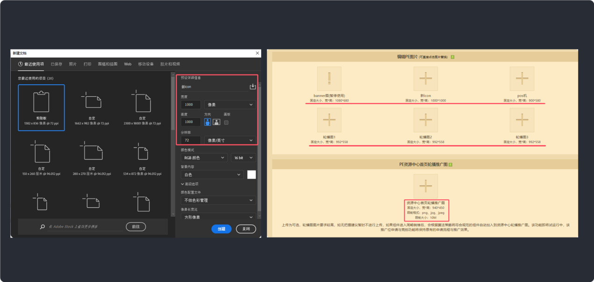
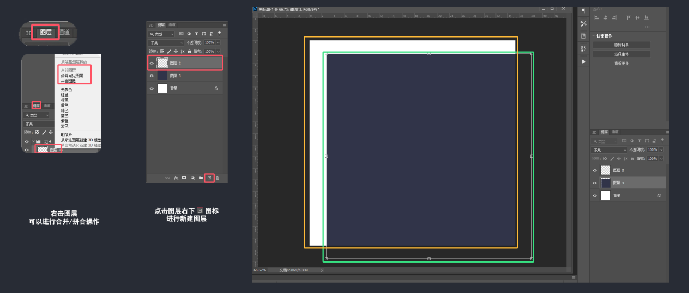
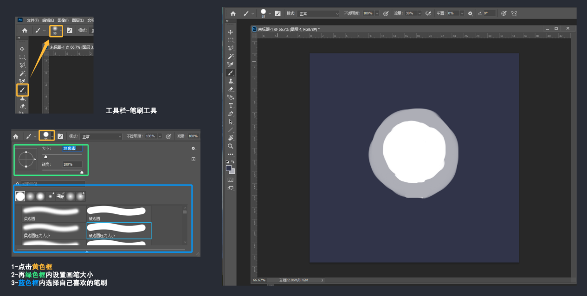
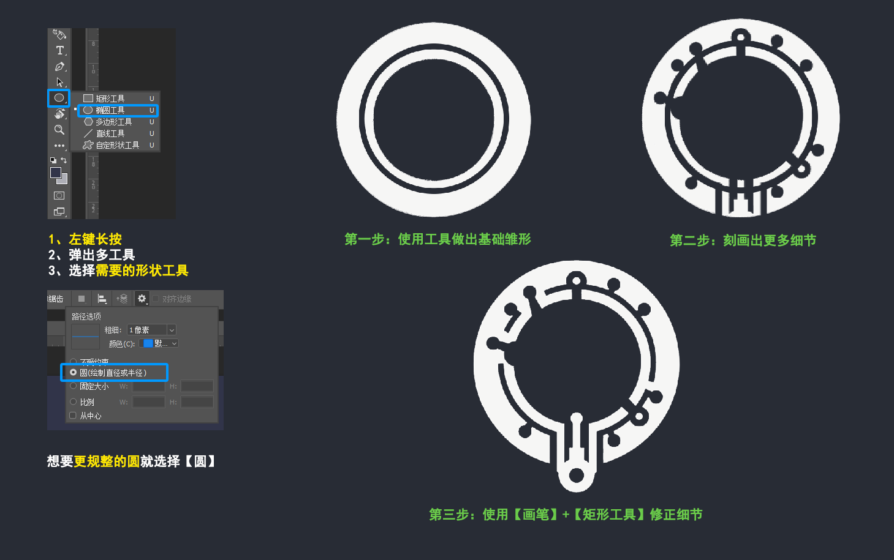
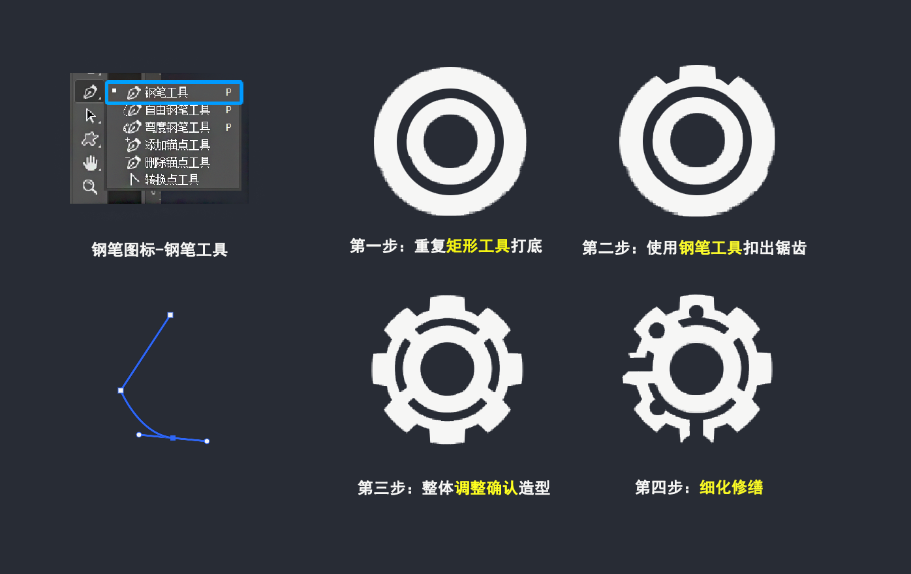
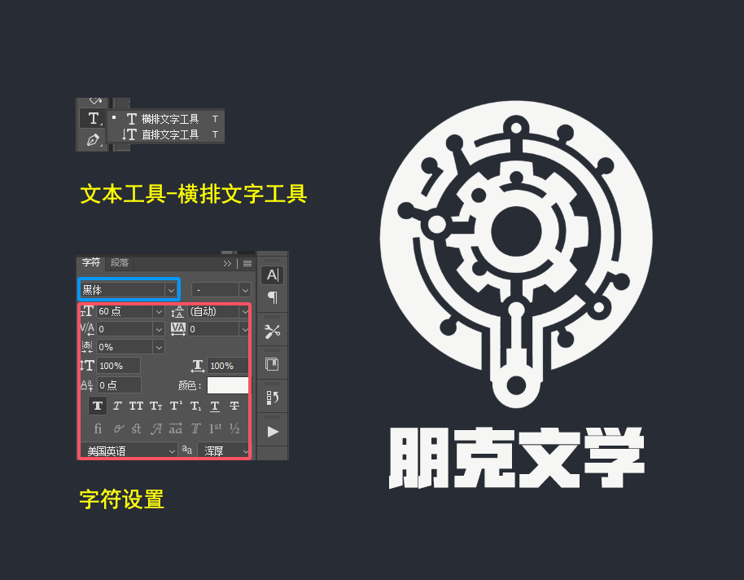
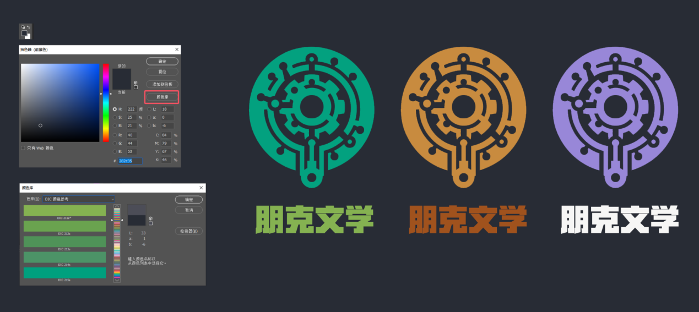
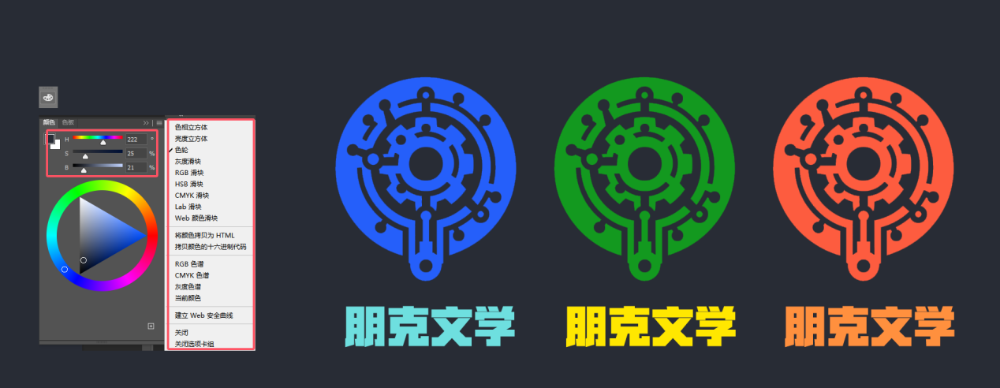

# 图像设计软件基础教学

掌握设计软件是创作高质量视觉宣传图的基本功。无论是Photoshop、Illustrator还是Canva，每个工具都有其独特的功能和优势。本章将带领你熟悉这些常用软件的基本操作，从而为后续的创作打下坚实的基础。

**选择适合于自己的软件：**

\-Adobe Photoshop是处理位图图像的强大工具，适用于复杂的图像编辑和修饰

\-Adobe Illustrator则专注于矢量图形，适合创建标志和插图

\-Canva则是一款易于上手的在线工具，适合快速设计和模板使用。

设计软件对于创作者而言是一把“武器”，只要熟练顺手你就可以随心所欲的使用它进行创作，并且每种软件都有其优势和不足，等到后期自我深入学习后，也可考虑设计任务的具体要求而选择不同的软件搭配。

**基本操作【通过Photoshop绘制一个简易LOGO来熟悉基础操作】：**

1.  **创建新项目**： 在任何设计开始前，需要设置对应画布尺寸。我们先根据我们的需求设置一个像素长宽在【1000\*1000】的画布。

    *Ps：组件发布前平台上传各类宣传图都有尺寸和图片大小标注，调整分辨率为72DPI以确保设计的清晰度。*

1.  **常用工具使用**： 通过使用掌握设计软件的核心工具，来进行图形的基础打稿。

    \-**图层**：通过图层进行分离和组织设计元素，更好的在我们规划制作时，自由的通过拖拉图层调整构图逻辑。

    例如，我们再新建画布之后，只有单一的背景图层，为了让图形不跟背景图层粘合，就需要新建一个新图层给【新图形】作为一个新的可自由活动的空间，方便我们后续的修改。

    

    \-**画笔工具**：我们可以使用画笔可以进行任何宣传图的草稿和构思描绘。

    例如，再构思logo图形想法的时候，可以直接先用画笔再画布的新图层上使用【画笔工具】-【选择自己合适的笔触】进行草图的绘制。

    

    \-矩形工具（直线/椭圆/多边形/自定形状）：矩形工具下可以使用多种不同形状的工具来组合出自己想要的图形。

    例如，我们的logo主要是结构希望是齿轮、圆形、多孔组合。那我们就可以使用【椭圆形工具】-【路径选项】-选择【圆】进行基础造型绘制。

    

\-钢笔工具：对于一些部分特殊结构矩形工具无法达成的时候，就可以使用钢笔勾勒选区来制作更多结构。

例如，logo的外轮廓我们已经搞定，但是内核的齿轮光使用矩形工具是无法实现的，这时候我就需要使用【钢笔】-【钢笔工具】来进行选区抠图细化。

\-文本工具：可以通过文本工具添加宣传图所需标题或文本。

例如，我们的logo已经组合成型，现就需要使用文字工具制作基础标题，来使作为团队品牌象征的logo更完整。我们可以选工具栏【文字工具】-【横排文字工具】-输入我们想好的标题/logo名-【文本属性】-设置【字符大小、颜色、字体】

Ps：如果对工具使用有使用不熟练和疑问，都可以使用软件自带辅助工具使用教程进行巩固。

1.  **颜色选择**： 颜色选择对设计的视觉效果有重大影响。在Photoshop颜色选择器中，拥有多种选择合适颜色的方法。

    \-颜色库：在拾色器内的颜色库中，拥有多种已经调配好的低饱和度颜色，可以通过不同色库的选色挑选喜欢的常用色，不容易失误。

    

    \-颜色色轮：你可以通过拖动滑块选择核实色相，在色调/亮度区域中选择特定的颜色，这里会更考验对于颜色的敏感度和熟练度，色彩新手容易选色偏艳。

    
