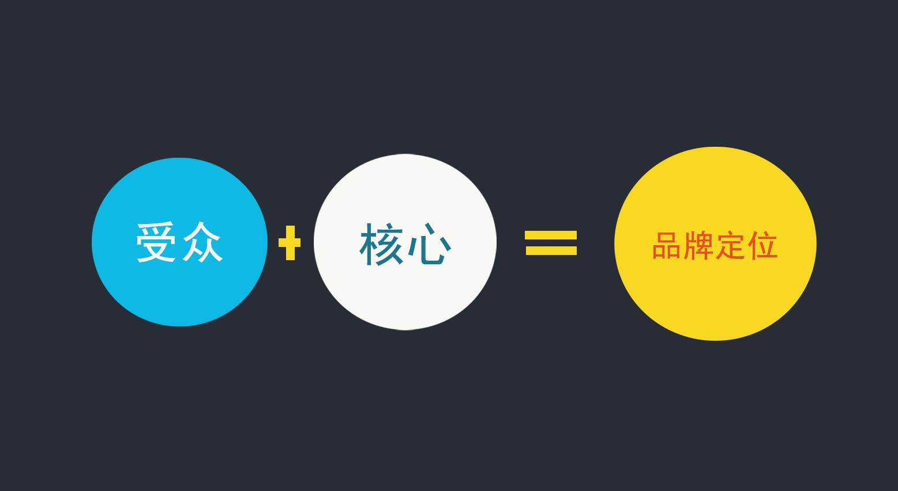
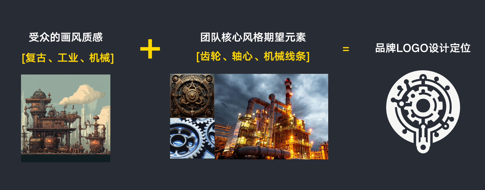
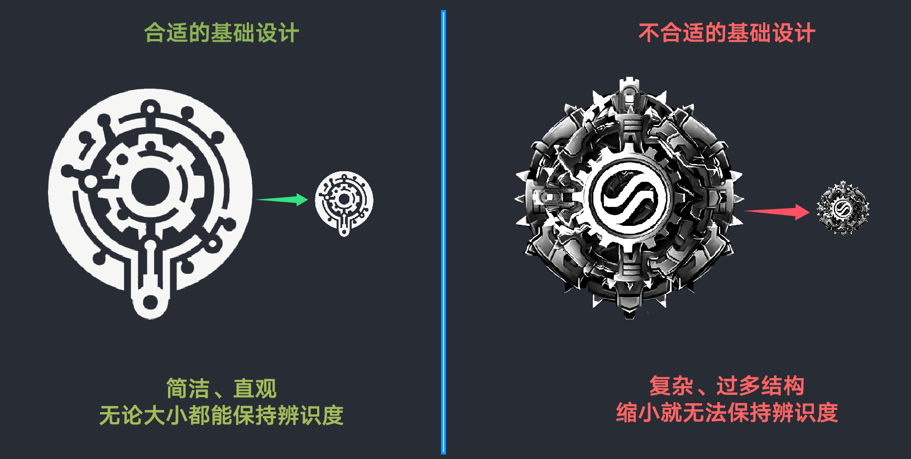
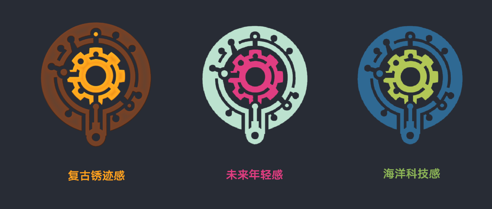
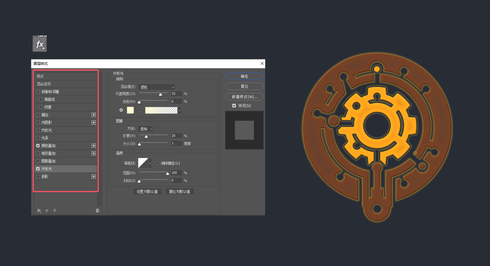
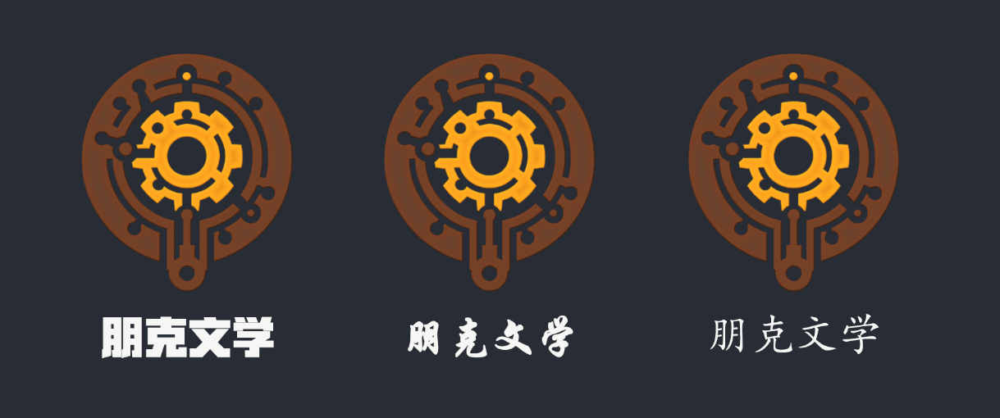
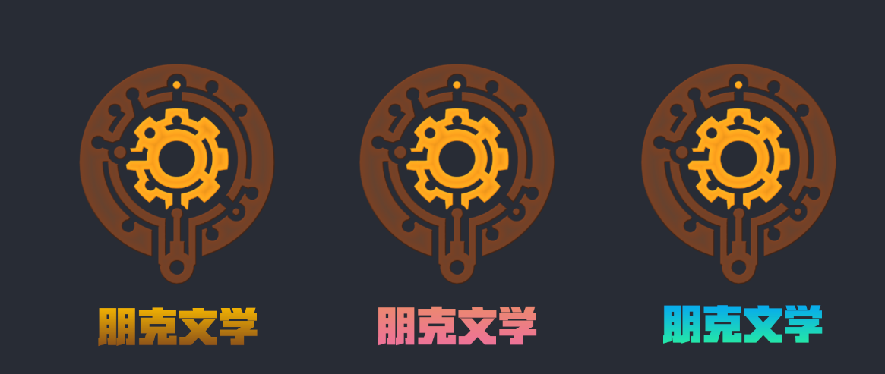

# 品牌和视觉身份创建

**根据上章节我们通过制作一个logo学习了核心工具的功能，这一章节则详细讲解如何塑造适合团队的品牌视觉。**

一个独特且有吸引力的Logo是品牌形象的生动体现。它不仅代表了品牌的核心价值，还能在视觉上给人留下深刻印象。本章将指导你如何设计构思一个独特且符合品牌形象的Logo，包括如何选择色彩和字体，以确保视觉和品牌一致性。

**Logo设计基础构思**：

1.  **品牌定位**：理解团队品牌的核心视觉和目标受众是Logo设计的基础。

例如，设想我们是一家专做蒸汽朋克风格的玩法团队。那么，品牌的核心视觉元素可以选择复古与工业机械的元素，目标受众方向是热爱复古风格和工业机械朋克的玩家群体。通过分析后，我们将已设想好的信息和元素罗列在画布上，就可以大致确定Logo的设计方向。

1.  **设计原则**：简洁性、独特性和易记性是成功Logo设计的关键原则。那么，结合品牌定位分析，我们再反过来看看之前教程中设计的logo是否符合我们预期的构思。

在这个品牌logo中，齿轮元素代表了蒸汽朋克的机械美学。确保Logo的独特性，则加入了轴心和机械断线设计，达成通过简化图案的同时，又可以突出核心元素构思。设计的整体，简洁且结构合理化，可以让Logo在各种尺寸和使用环境下都清晰可辨，使品牌形象在消费者心中留下深刻印象。

**色彩方案选择**：

-   **颜色心理学**：不同颜色影响受众的感受和品牌形象。

为Logo上色时，不同的颜色会表达不同风格，我们需要多试配色来选择最适合品牌特征的颜色组合，从上图组合配色来看，复古锈迹感会更符合我们的核心视觉思想。铜色代表了蒸汽朋克的复古和机械感，而深棕色则传达出稳重和经典的感觉。这种色彩组合很好的表达复古的硬朗感，同时传达出独特时代感。

-   **配色优化技巧**：选择和组合合适的颜色后，需要使用【图层样式】增加视觉上的和谐和细节感。

我们可以在图层样式中使用不同的样式效果与logo配色进行组合，例如在Logo的边缘加入金色轮廓光。这样不仅创造了视觉上的和谐感，还通过轮廓点缀，增强了图案的层次感，使Logo在视觉上更引人注目。

**字体风格/搭配**：

不同字体风格搭配上不同的色系组合，对品牌LOGO形象也会产生不同的效果，我们需要从多样的测试中，筛选出最搭配的字体。比如下图中，左中右三个不同字体搭配logo产生不同的感觉，从协调性和主题性来说，【左图】的是最符合我们预期的。

同样，确认好字体后，我们给它换上不同的颜色再次进行一次选择，为了传达出经典和怀旧的感觉，并且在色感没有那么好的时候，优先选择同色系的【左图】。

通过以上步骤，我们就成功构思设计了一个完整的蒸汽朋克风格的团队品牌Logo。

这个Logo结合了简洁的齿轮图案、复古铜色和深棕色的配色方案，选用合适字体搭配，成功地传达了品牌的核心视觉和独特风格。最终的Logo不仅视觉上引人注目，而且有效地建立了品牌形象和识别度。
