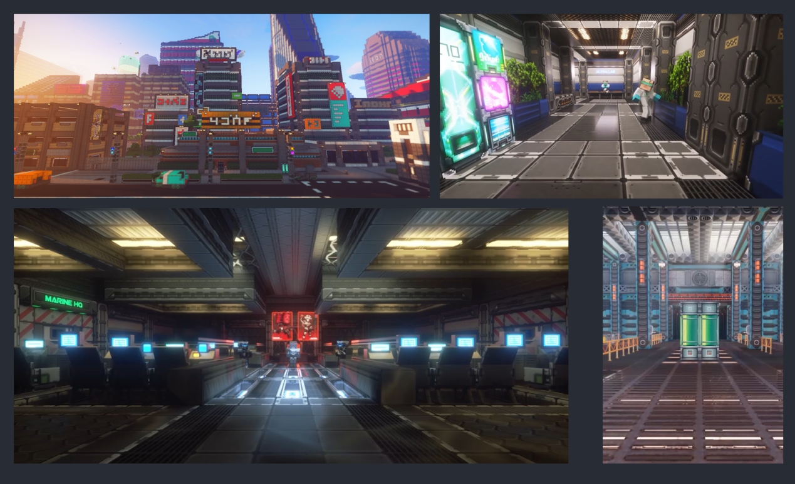
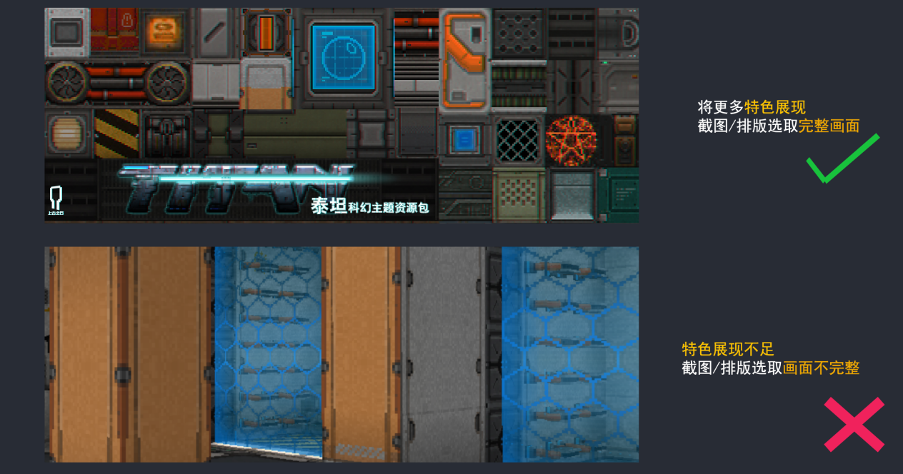
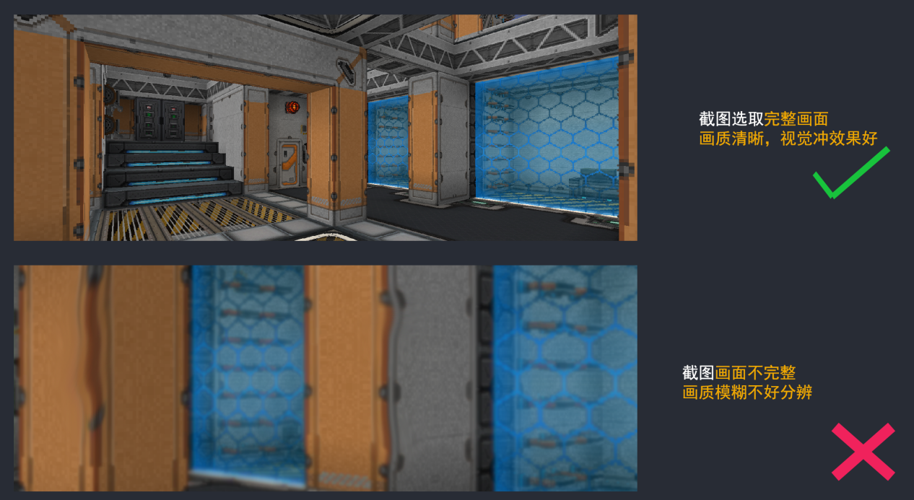
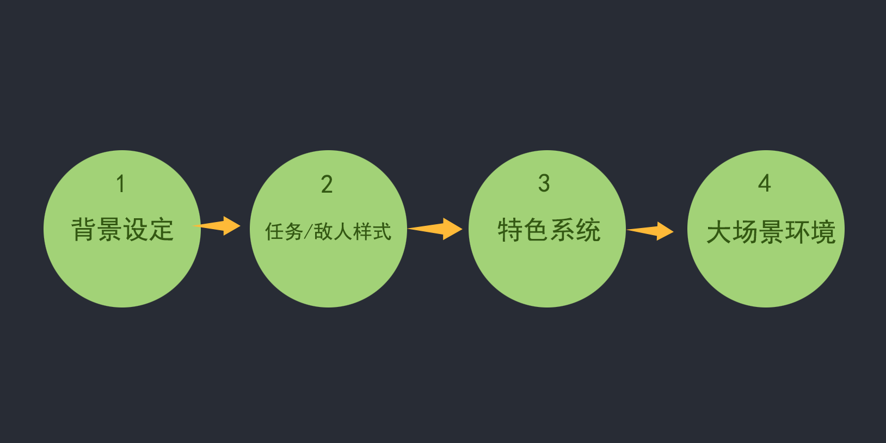
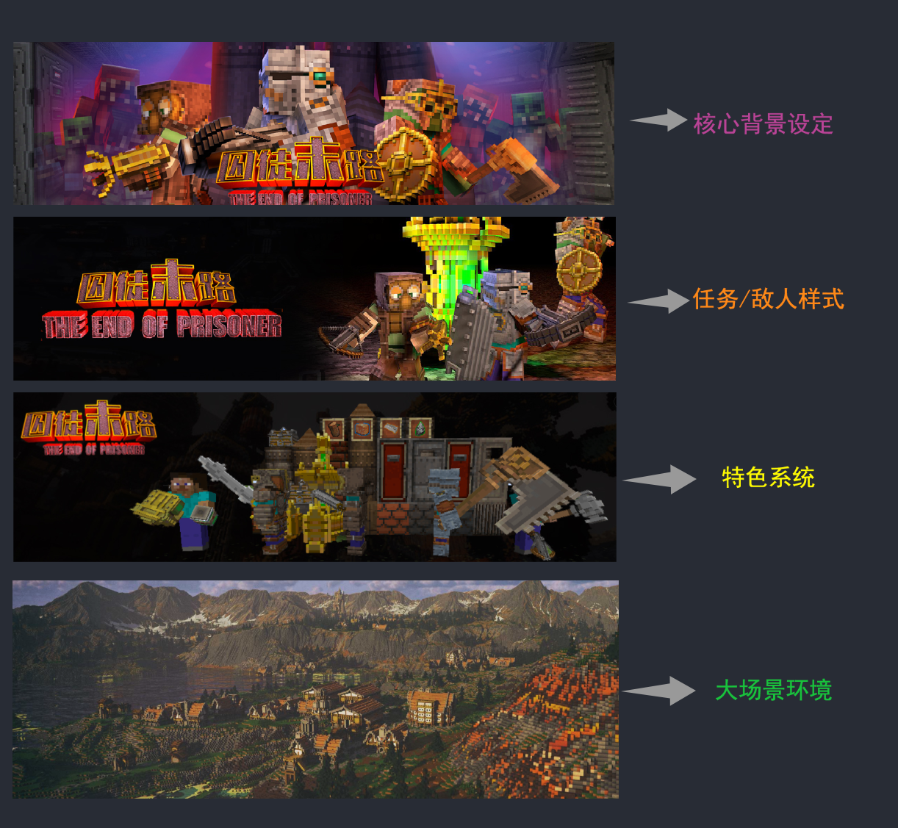
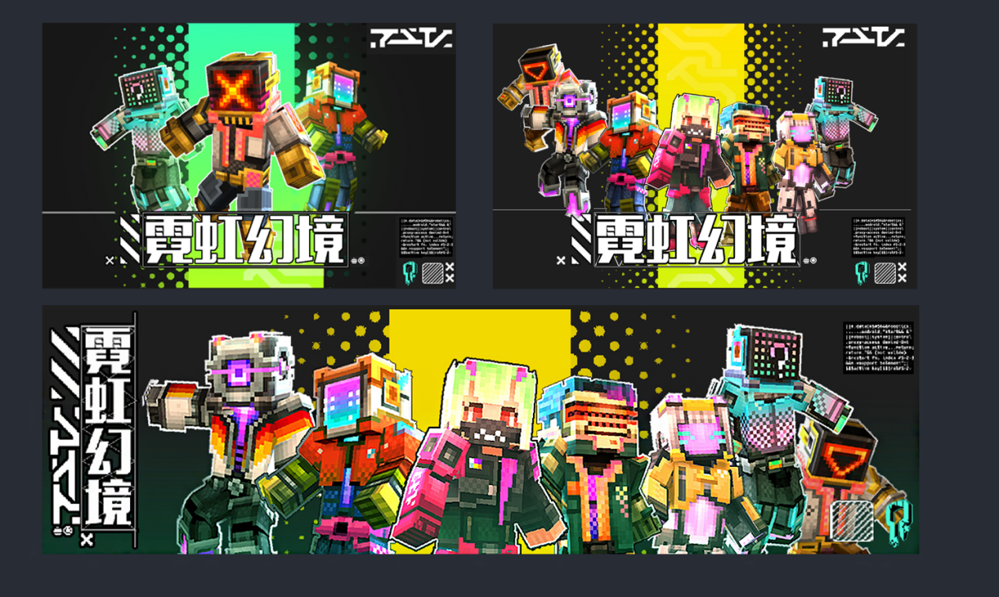
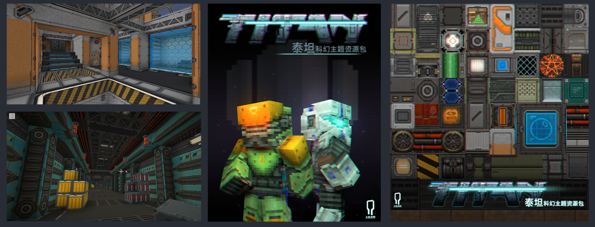

# 轮播图设计与排列

有效的游戏轮播图能够补充加深吸引玩家的注意，将主图无法展示的更多玩法的亮点和特色补充全面。本章将介绍如何截取和排列多张游戏轮播图，以最大化补充吸引力和信息传递。

**轮播图设计截取技巧：**

1.  **突出玩法组件亮点**：

截取图像时，确保每张截图/排版完整且突出展示玩法组件的核心亮点，如主要角色、激烈战斗场面或独特的组件素材等。

1.  **确保清晰度**

跟前面教程一样，宣传图的清晰度一定要保证。选择高分辨率图像，避免模糊或失真。确保组件视觉细节如角色特色和组件优势都清晰可见，以展现组件制作的高品质，过于模糊会让玩家在观看过程中产生对于组件是否精品的疑问。

**多张轮播图的排列和取舍**：

1.  **讲述“故事”**：按照玩法组件的主题或者故事背景进行排列，我们要做的是补充keyart图展示外的内容。

常规有的排序是（顺序可以根据个人想法进行调整也可以）：

**第一张图展示组件的背景设定**

**第二张图展示主要任务或敌人**

**第三张图展示玩法组件的特色系统或奖励**

**第四章补充组件场景**

既然有了思路，我们尝试根据排序分类进行组件截图。将组件的背景、任务质感、组件特色和场景进行一个精品展示，从而让玩家达到一步步被吸引到勾起想要尝试游戏的过程。

**2. 视觉连贯性**：保持轮播图风格的一致性，如统一的色调和视觉风格。例如，使用一致的滤镜和配色方案，以确保轮播图整体视觉效果协调。

皮肤案例

组件材质案例
