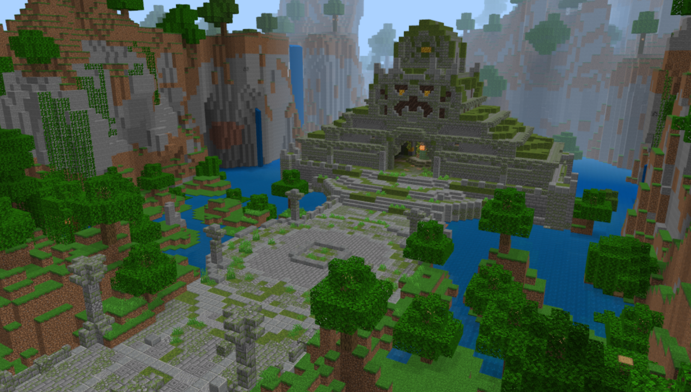
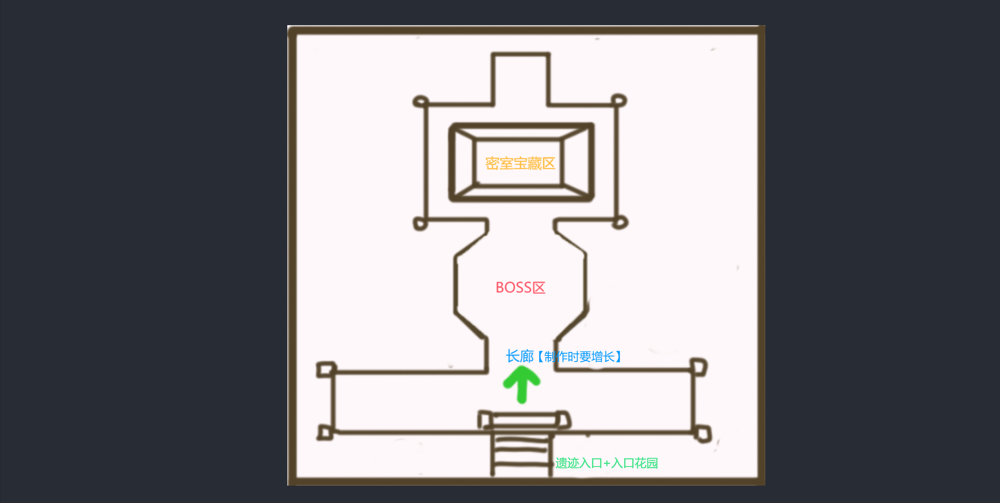
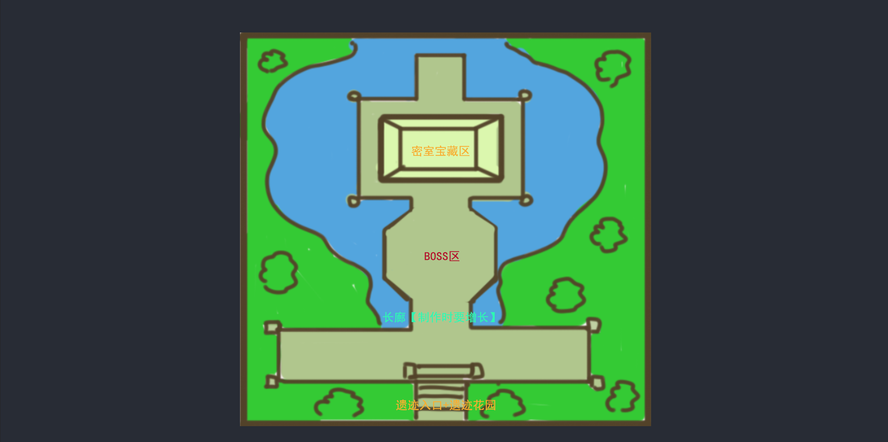
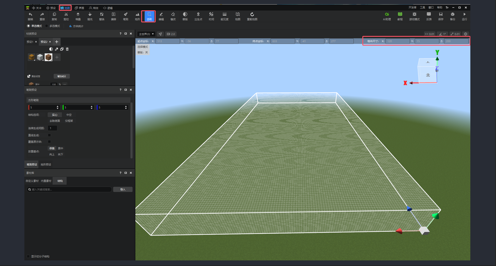
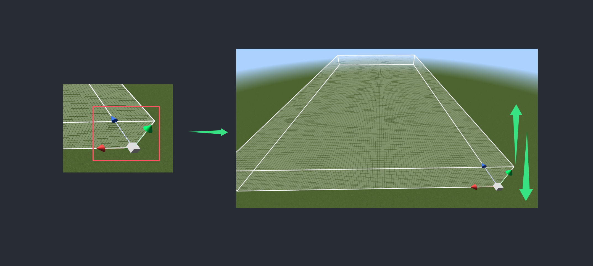
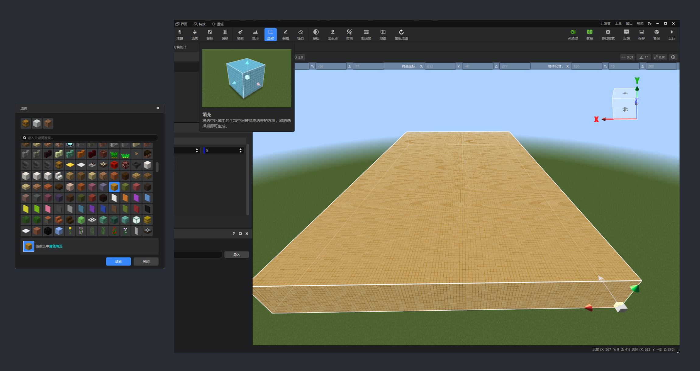
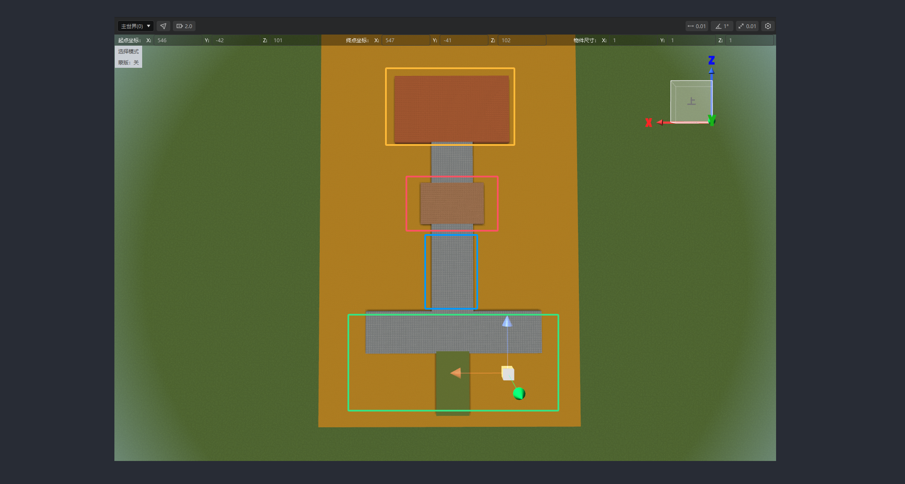

# 如何快速设计挖掘遗迹和规划场景

在所有教程开始之前，让我们先看一下本次教学的最终效果。结构分明，整体视觉效果舒适，看上去感觉是不是制作有点难度？别担心，接下来只要跟随教程一起一步步进行学习操作，就会发现一切都没那么难。

\-学会构思整体布局

在任何建筑场景开始搭建之前，永远不要从某一个单独建筑开始做，最好是先从大区块固定在做区局搭建，这样不至于做到最后，因为搭建空间预留不够而大修特修。我们可以使用两种简易且快速的方法结合来构思草图和确认整体布局。

1. 草图绘制：使用第三方软件或者纸，将场景区域根据需求进行简单的区块划分链接。

    例如，场景内必要条件区块先罗列：1个入口、1个长廊、1个密室和1个BOSS战区域。就像拼积木一样，将这些都拼合在一张图里，根据自己的想法排序搭配在一起。

    

    确认好主要的基础区域分化后，我们再将周围点缀的环境走势也描绘一下，再上一下颜色确认一下整体。

    

    到这里，是不是对自己即将要做的遗迹划分就有大约的概念和想法了啦！

2. 搭建基础结构：确认好了草图想法后，直接使用开发者工具-【地图编辑】-【选取】功能，再软件内进行基础底座结构确认。

    例如，基础底座是一个120长（X）、15高（Y）、200宽（Z）的尺寸，我们就可以直接在【选取】功能下的【物件尺寸】进行设置。

    

    如果想要让它暂时悬浮或者下沉，我们也可以使用方向轴来进行移位控制。

    

    方位确认无误后，我们则可以使用方便替换的基础有色方块，来进行填充。

    Tips：有色方块填充，可以在后期调整的时候，更准确的进行替换。

    

    根据上述的步骤，我们将整体规划都还原出来，再根据实际可以做一些调整延长，让草稿变成更直观的结构图，接下来，我们整体只要都在这个结构内操作搭建就可以很好的提高容错率。

    

    Tips：如果对工具操作理解记不住或者混淆的，可以将鼠标放置在工具图标上，不要点击就会出现基础操作指引提示和演示。
