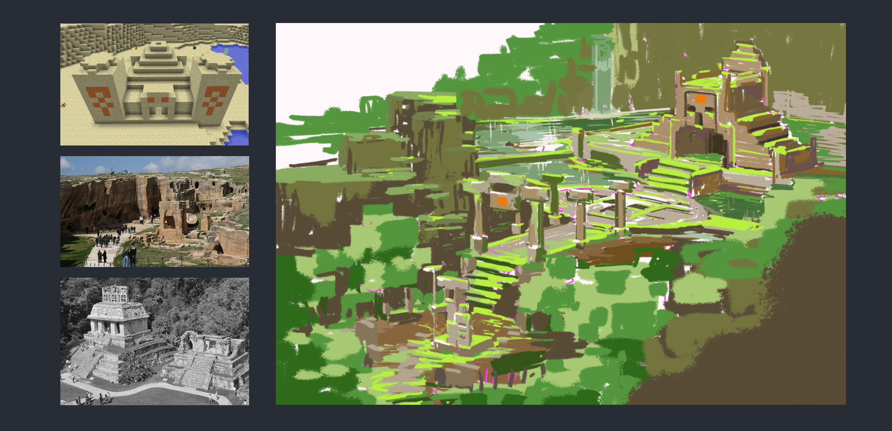
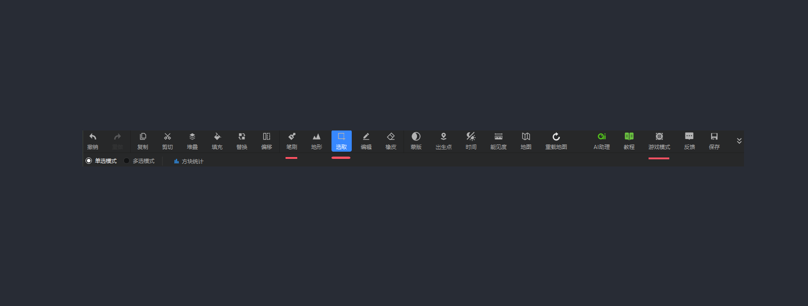
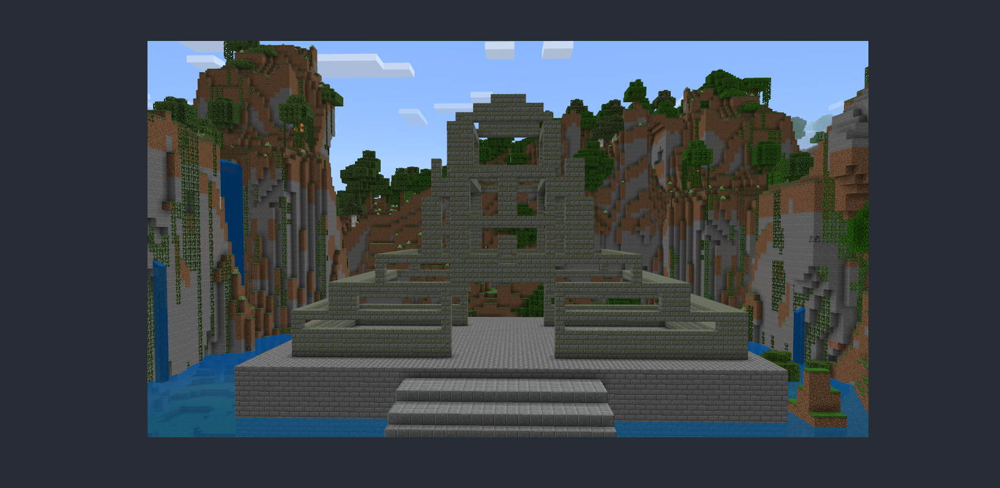
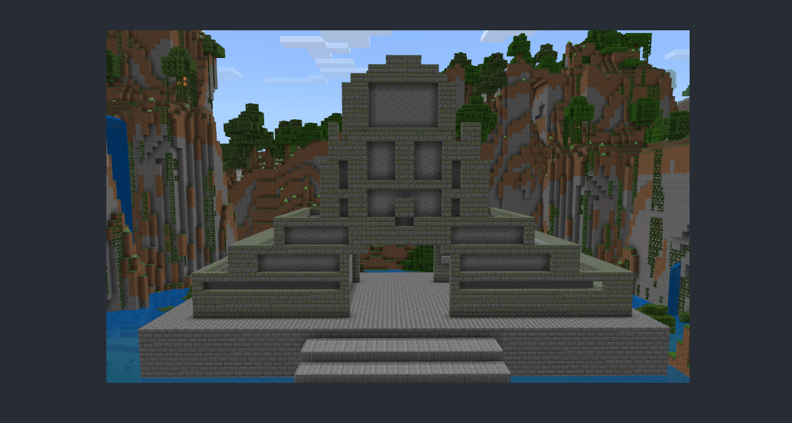
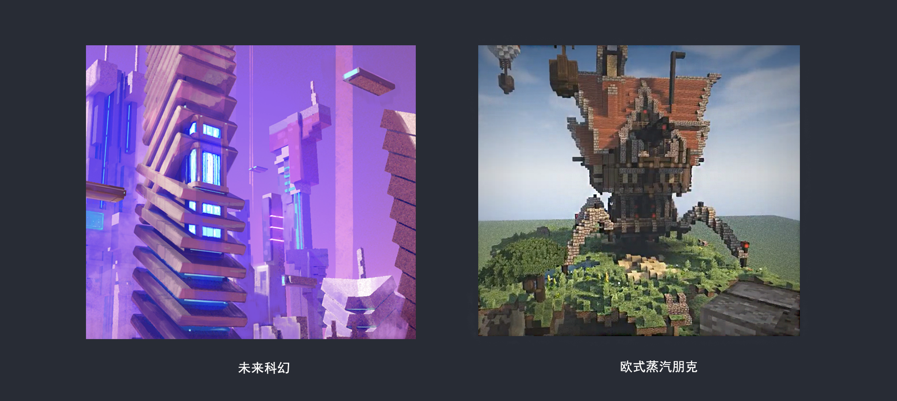
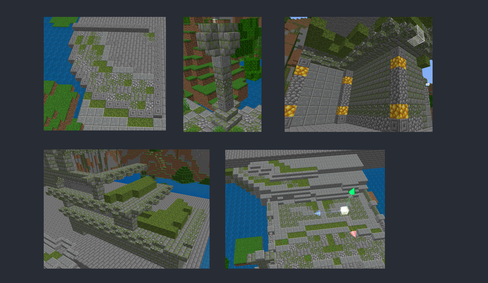
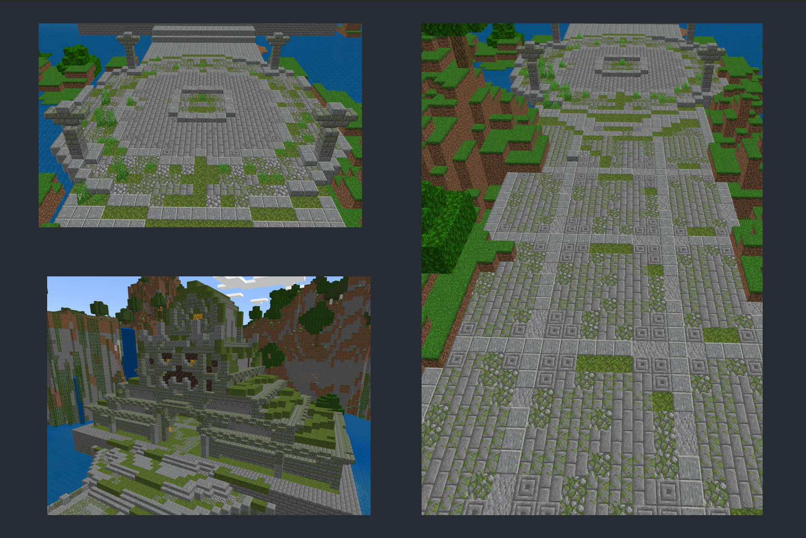
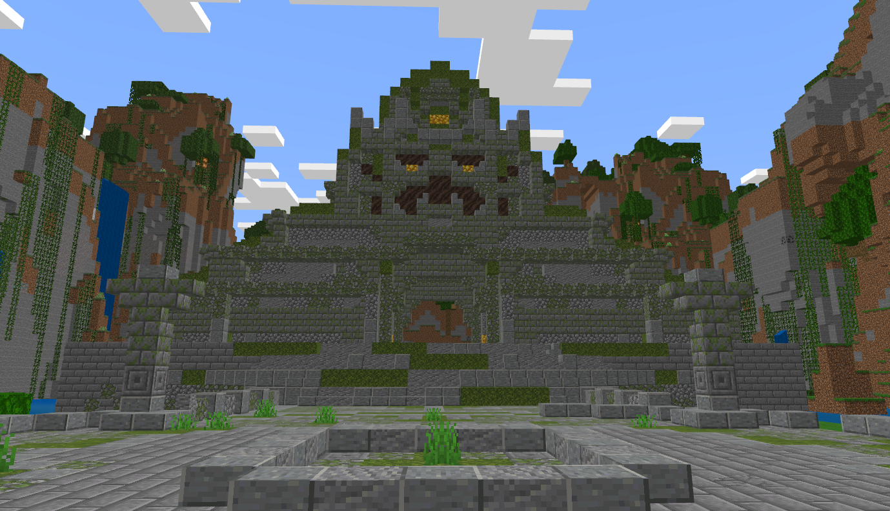
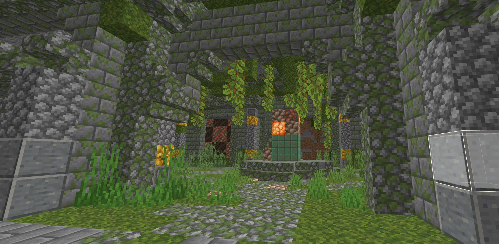
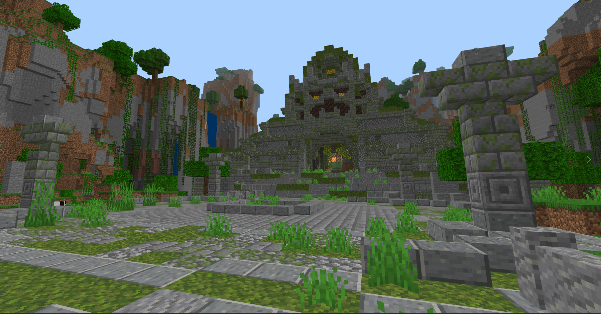

# 遗迹内饰的详细设计

在上节教程，我们通过各种工具辅助将完善地形的方法已经分析明白。接下来，针对内饰建筑等详细的设计搭建方法，也同理可通过这些工具辅助完成。

# 遗迹的宝藏密室设计

在制作建筑前，如果无法完全确认好自己想要搭建的造型，那么就可以试试先把原生游戏内有的相关建筑素材找寻出来，并找寻一些自己期望的参考，将他们放在一起进行魔改。

既然已经有了设计概念，在结合对于遗迹风格颜色的选用思考，就可以开始使用工具搭建基础框架了。

- 笔刷-半手动模式：直接使用直线模式进行一层层描绘。

- 选取-半自动模式：使用选取来进行结构堆叠。

- 游戏模式-纯手动模式：进入软件的游戏模式，进行生存创造模式搭建。

建筑框架制作好了之后，我们就可以进行用【选取】+【填充】，将第一个遗迹的宝藏密室的主体造型完善。

根据风格主题来对建筑附加“时间”细节

不同风格的建筑都会有不同的“时间”细节体现在它的身上，比如未来科幻建筑-结构几何交错但整体偏简洁色彩偏奶白黑白，欧式建筑-结构多样雕花多，色彩偏暗棕暗色。

由此可见，不同的建筑风格都有着自己“时间”感。作为遗迹也同样有这样的特点，我们给建筑上增加“时间”的裂纹、野蛮生长的青苔藤蔓、被“时间”风化的结构。

在接触到不熟悉的风格，就用这样的方法去思考和挂钩，让更多“时间”碎片叠加在所做的建筑上碰撞。我们就可以将陌生变为熟悉。

给建筑赋予故事该有的样子

建筑既然已经找回了自己的“时间”，那么在这个“时间”里，也会存在故事，就是历史。建筑的历史文化，光通过外表是无法完全展示的，这个时候我们需要再内部增加更多的历史故事细节，来补充上它的内在。例如：这曾经一座拥有高度文明的部落神庙，但因天灾，部落文明全部被暴雨洪水冲毁，神庙因高居山顶而留存下来，但神庙里破碎的祭坛、熄灭的篝火，仿佛还在静待着文明的重新开启。

不同的风格可以赋予不同的故事和历史的细节，将自己所的理解脑洞赋予建筑，新的历史，新的故事，通过我们自己的双手，唤起它新的样子。

