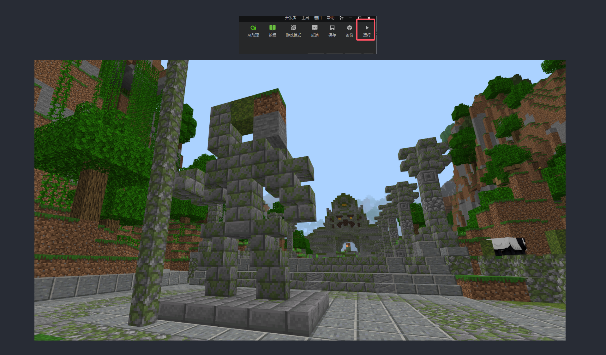
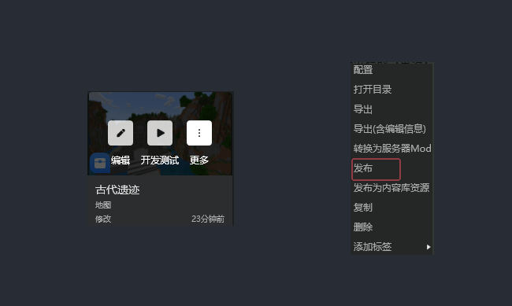
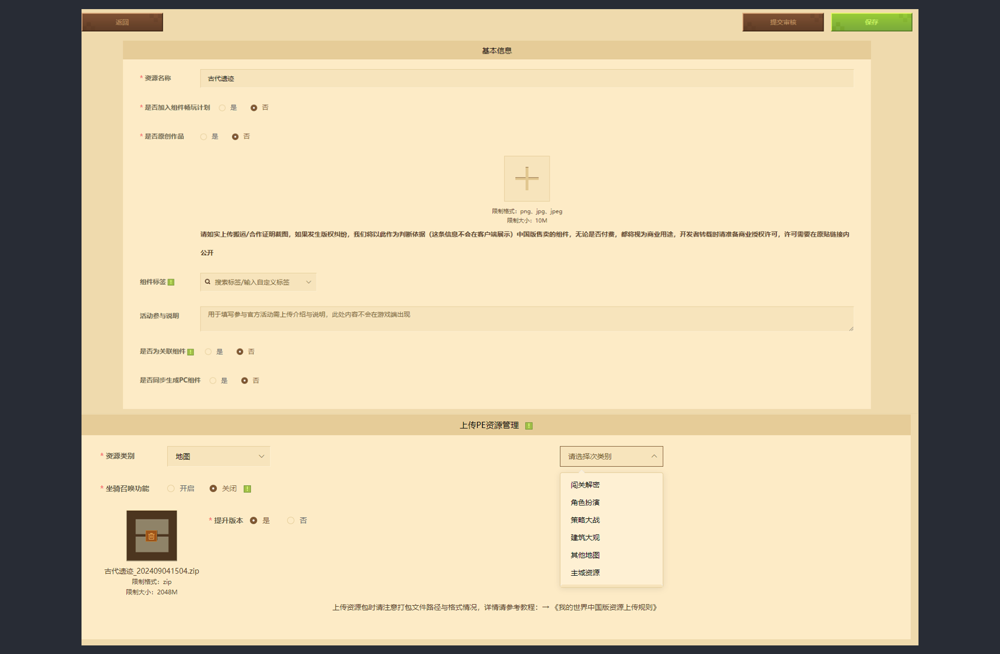
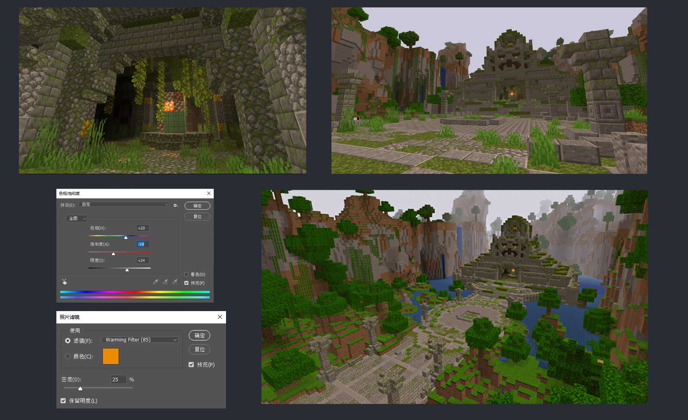
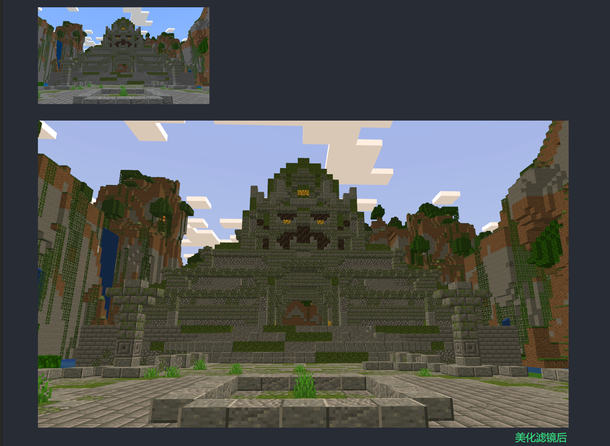
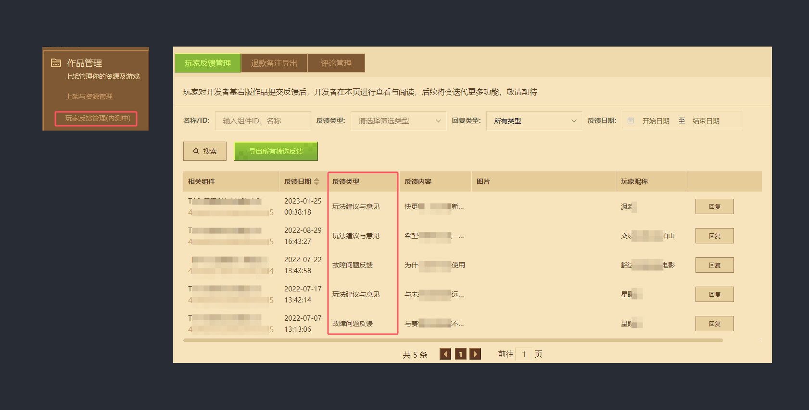

# 测试与发布

在游戏中检查地图

地图完成后，可以直接在MCstudio点击【运行】，进行预览测试

主要预览检查建筑地形的是否符合以下内容：

\~是否有可攀爬越过主体的区域
\~是否有地形漏洞和超过规划外的区域存在

\~测试对于玩法使用上空间是否足够

# 上传发布

MCstudio制作的地图可以直接通过作品分栏的【更多】-【发布】

软件会自动为我们跳转出上传发布页面，我们接下来只需要将一些宣传图和简介信息填写补充完成后，就可以提交审核发布了。

提审前，也需要注意几点关键点：

1. 确认地图已经是完整完结作品
2. 确认地图的资源类别（如果类别与地图制作内容不符会影响最终审核）
3. 地图简介信息编写，可以将故事性和规划图都编写其中，让简介不要显得太枯燥。

制作一些基础的宣传图片

1. 我们需要多选取几个能将地图意境风格，展现到最佳的视觉角度。不要选择太过随意的角度。
2. 根据需求选择使用不同的软件这里使用的是Photoshop的图像模式，来给整体建筑做一个调色

确认图片整体无误，我们则可以使用后期处理软件Photoshop等，对图片尺寸进行裁切。

- **新Icon**：1000×1000像素
- **Pos机**：900×580像素
- **轮播推广图**：940×450像素
- **轮播图1、2、3** ：992×558像素

然后我们前面已经调整选取的图片进行分类选择，比如icon属于作品的“头像”，就需要选择相对醒目吸引眼球的。而轮播图我们则可以选择视觉大图给人直观视觉感受的，毕竟在观赏轮播图的时候停留时间一般都是会最长的。

学会了解反馈

作品发布了不是结束，而是作品的起点，如何让作品在潜移默化中让玩家默默记住？那【玩家反馈管理】就是一个很重要的窗口。

在这里我们可以收集玩家对于作品的评论和反馈，并从中吸收好的合适的反馈，来为我们的地图设计进行更进一步的优化。
