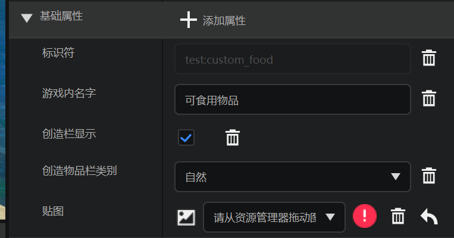
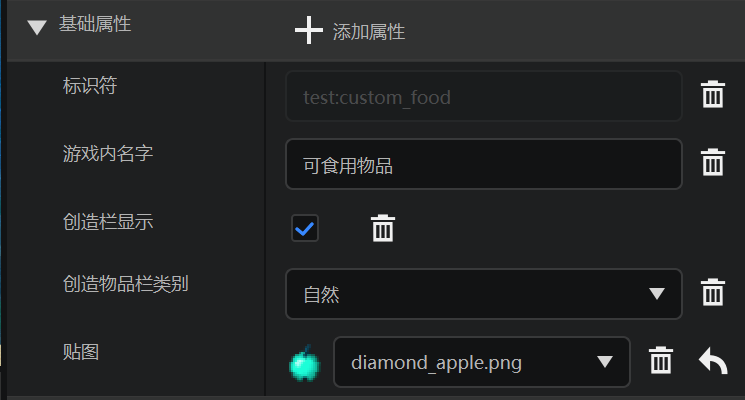
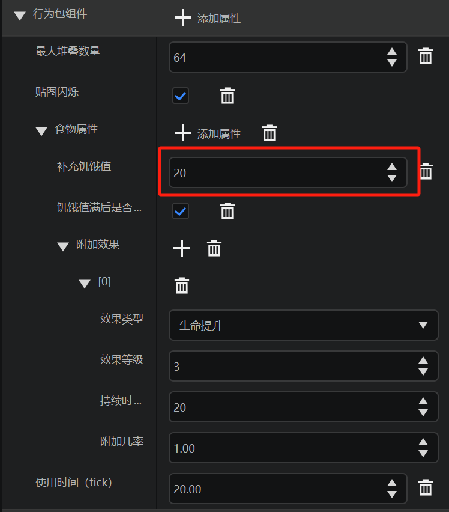
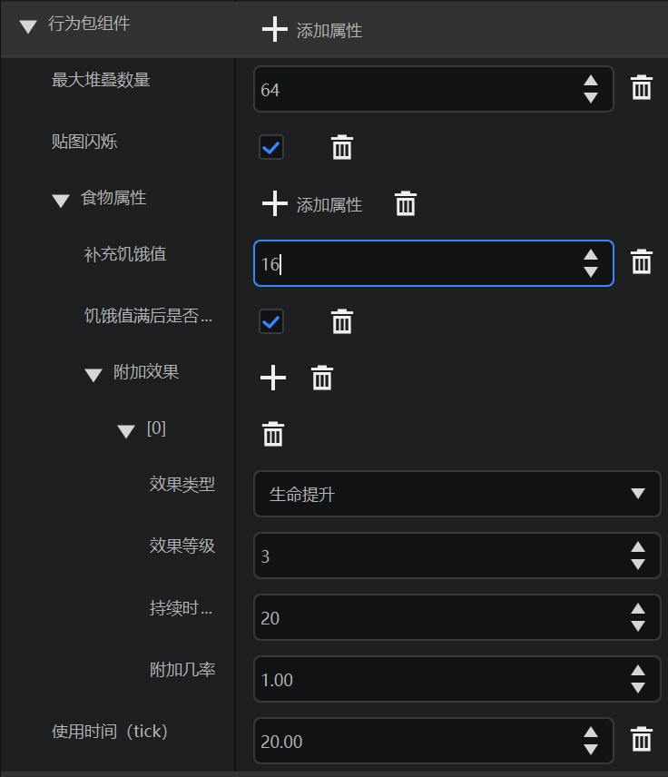
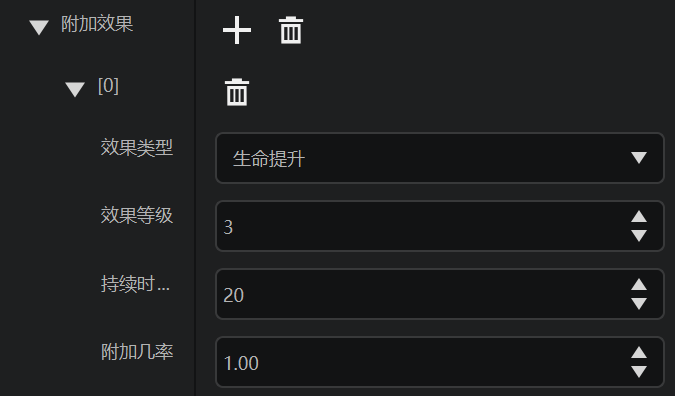
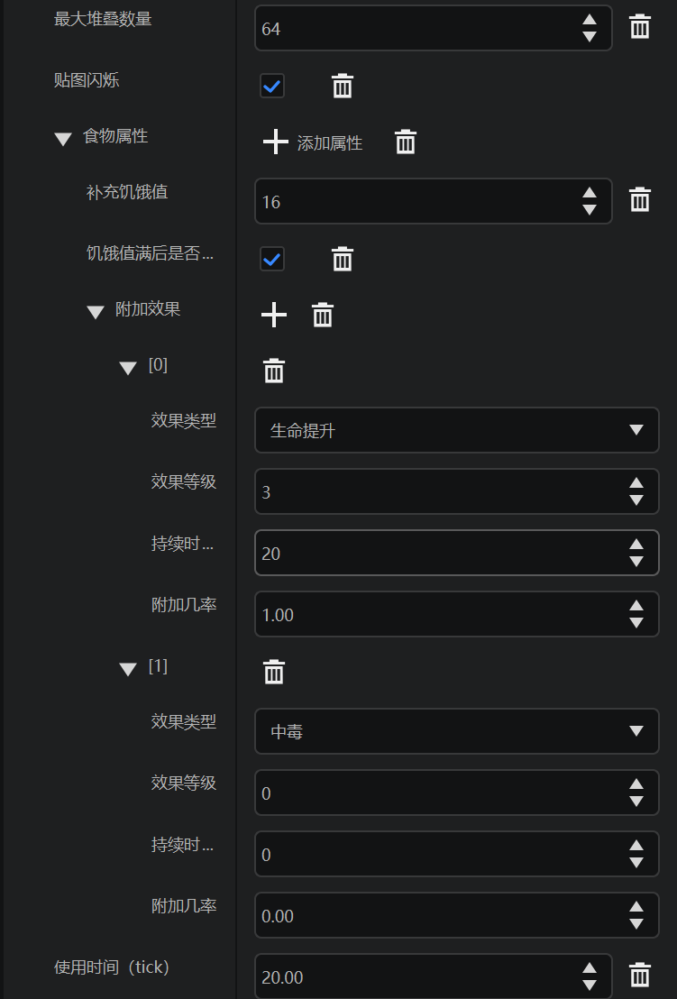
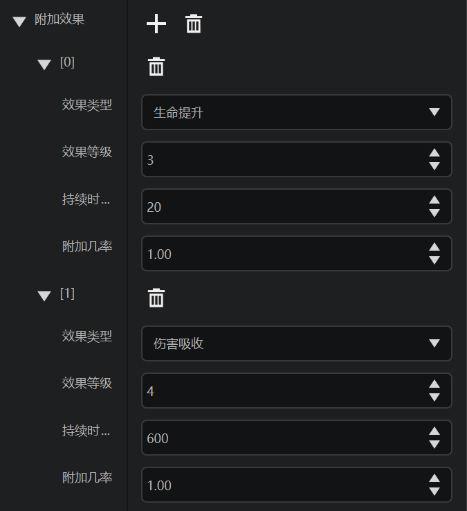

# 自定义奖励物品

在本节中，我们尝试自定义一个用于在遗迹中充当Boss战利品的奖励物品。我们不妨定义一个钻石苹果，这个钻石苹果有比金苹果更好的食用效果，非常适合用于较难关卡的奖励物品。

## 更改纹理

我们准备了一张变色自原版苹果的钻石颜色的苹果贴图。

在属性栏中找到基础属性，将该贴图从资源管理器拖动至下拉菜单处。

然后，我们发现苹果纹理已经成功更改了！

## 更改恢复的饥饿值

“补充饥饿值”一栏可以更改恢复的饥饿值。

原版的金苹果和附魔金苹果皆恢复8饥饿值，我们这里改成他们的两倍，即16。

## 更改状态效果

在“附加效果”栏中我们已经预设好了一个20秒的生命提升IV，我们可以以再为其添加一个10分钟的伤害吸收V为例，来演示添加一个状态效果。

点击“状态效果”栏右侧的“+”。他会出现一个新的状态效果项。

我们按照如图所示更改，便添加了伤害吸收V，时长为10分钟。注意，这里的效果等级是从0开始算的，因此伤害吸收V的等级为4。

这样，我们便成功添加了一个钻石苹果，用于作为后续高级战利品而存在。