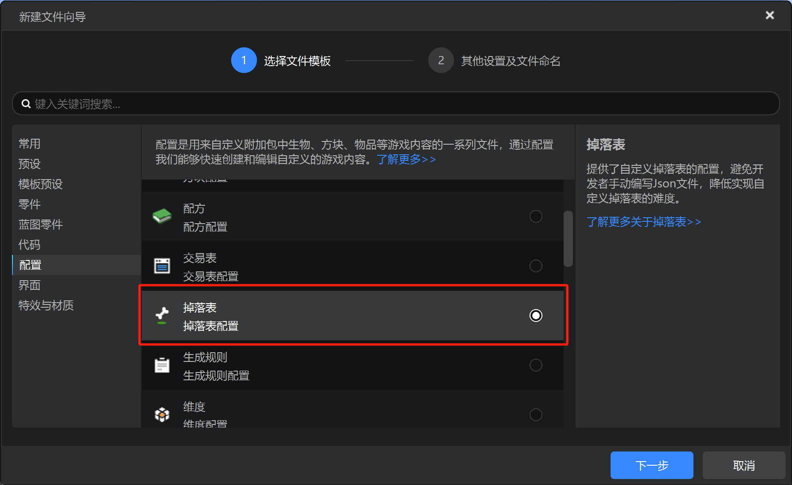
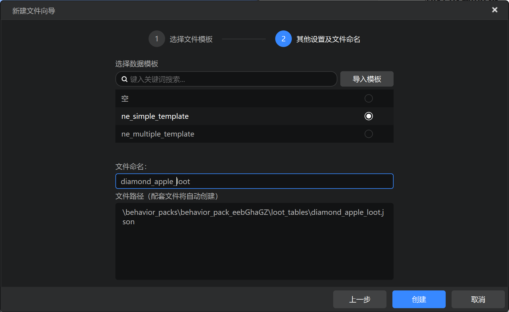
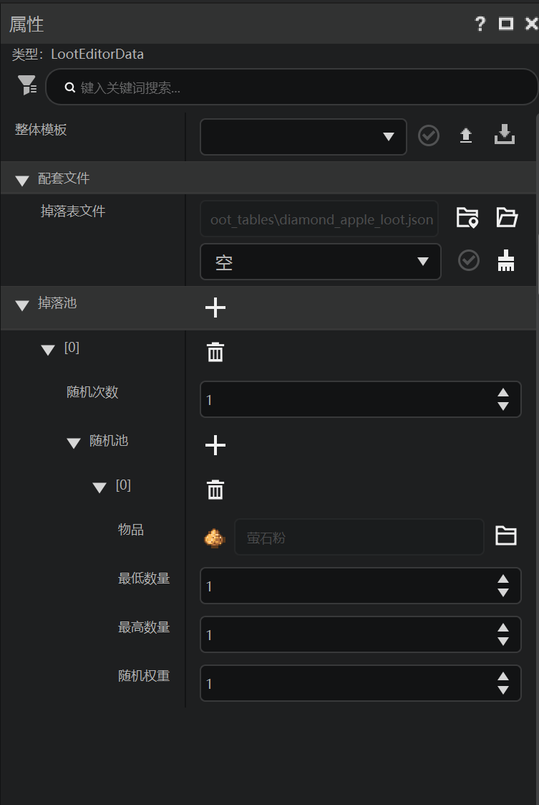
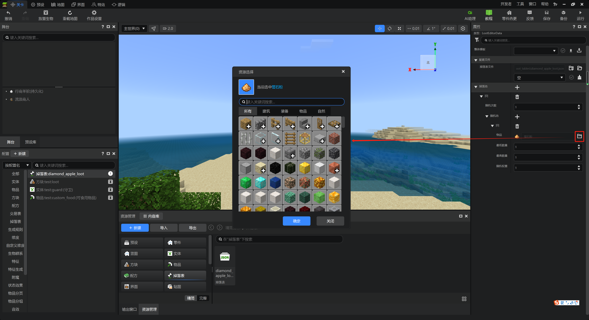
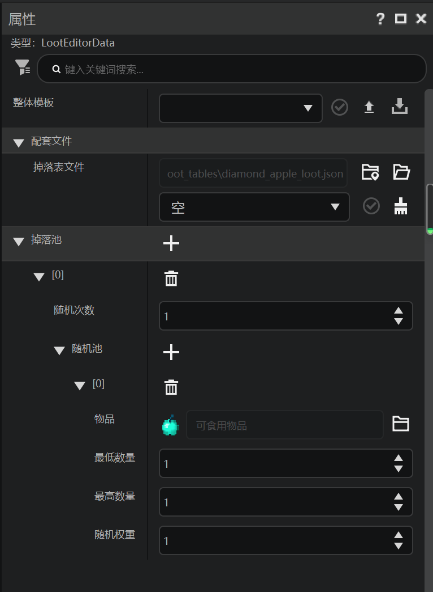
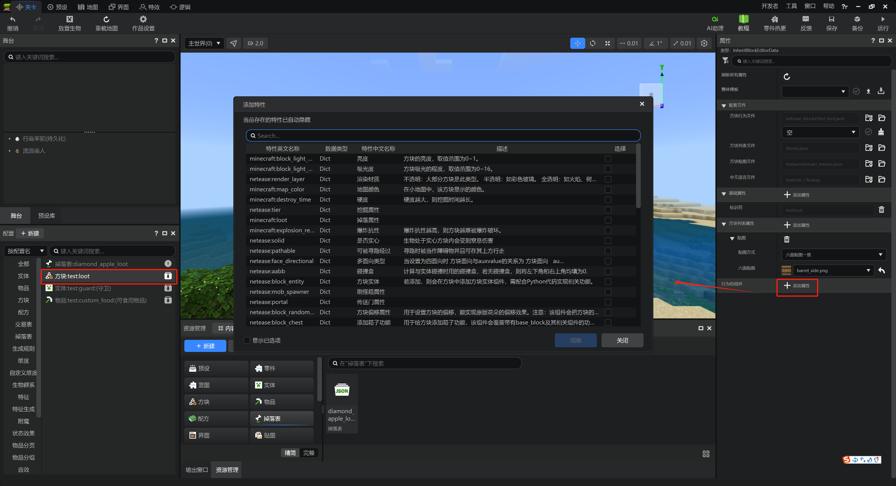
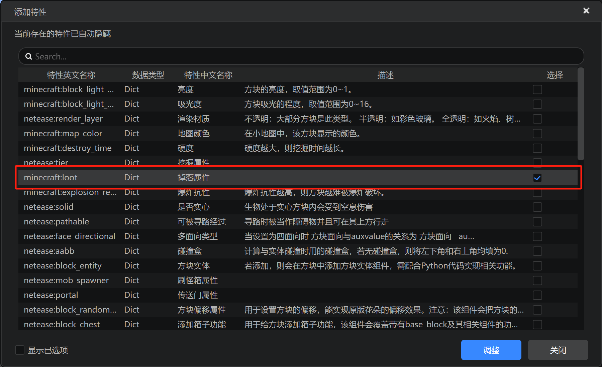
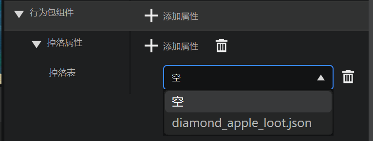
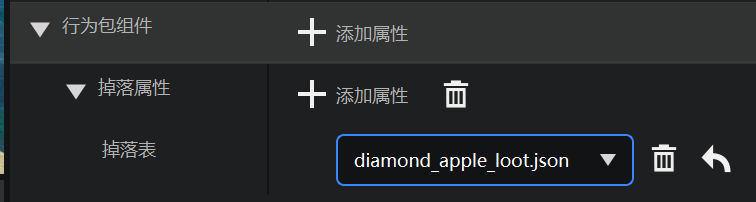

# 配置战利品

《我的世界》中有一种特殊的表格配置，被称为战利品表，也被称为掉落表。战利品表可以用来实现从一个大物品池中随机抓取物品的效果，以实现生成战利品及类似的事件。在本节中我们配置一个战利品表并将其附着到我们的自定义方块上。

## 新建战利品表

在新建配置的界面中，我们找到“掉落表”，并点击“下一步”。

作为例子，我们可以选择`ne_simple_template`，并命名为`diamond_apple_loot`。然后，我们点击“创建”。`ne_simple_template`用于快速创建单物品的战利品表，`ne_multiple_template`用于快速创建多物品的战利品表。

然后，我们看到属性窗格已经为我们配置好了掉落池，默认是100%生成一个萤石粉。

我们点击“物品”栏右侧的文件夹按钮，可以打开资源选择对话框。

由于在此之前，我们并没有为我们的钻石苹果重命名，因此我们的钻石苹果的名字还是默认名称“可食用物品”，我们可以用这个名称检索到我们的钻石苹果。如果你已经为苹果重命名，那么你可以用你自行选择的名称来检索。点击选择我们的钻石苹果，并点击“确定”。

然后，我们的战利品表便配置好了。

## 挂接战利品表

我们可以将战利品表挂接在方块上，作为方块被破坏之后的掉落物。

在左侧“配置”窗格中点击方块回到我们的方块属性。在行为包组件处点击添加属性。

我们勾选`minecraft:loot`属性，并点击“调整”。

在“掉落表”的下拉菜单中，我们可以看到`diamond_apple_loot.json`。这个便是我们刚才创建的战利品表。我们选择这个战利品表。

如图所示，这样，我们便完成了战利品表的配置。当我们挖掘掉落该方块时，该方块并不会掉落自身，而是会掉落我们配置的战利品表的内容，也就是会掉落我们的钻石苹果，作为回馈玩家的战利品。

## 战利品分布

在我们的实际地图中，我们可能不止会布置一种战利品。在遗迹探索的过程中，我们可以逐步布置一些不同的战利品，以吸引玩家奋勇向前直到关底。

在实践中，我们可以将战利品分为三类，第一类是用于吸引玩家前来探索的最低级战利品，这类战利品往往比较显眼，分布在遗迹外围，并且其中内容品级较低。玩家看到之后便可以猜测此处遗迹内可能有更好地物品，便会前来探索。

第二类分布在遗迹内通向最终Boss的道路上，这类战利品稍微难以发现，但是价值不菲，可以用于为遗迹稍微添加一些解密要素，也能让玩家拥有成就感。

第三类便是关底Boss的击败战利品，这类战利品往往最具价值，品级最高，用于嘉奖勇于战胜Boss的玩家。

合理布置三种战利品，便可以设计出一个吸引人且具有丰富挑战性的遗迹关卡！