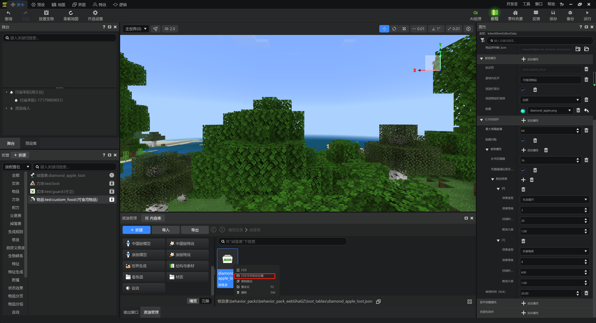
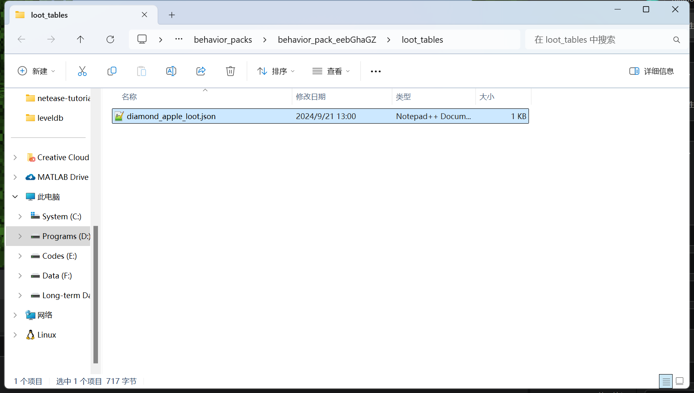

# JSON在我的世界基岩版中的应用

在《我的世界》中，JSON用于提供一切自定义对象的数据。所有使用这种方式自定义的内容都被称为“数据驱动”的内容。我们可以在《我的世界》用数据驱动的方式定义物品、方块、实体、维度、生物群系、状态效果、魔咒、配方、战利品表、交易、音效、书本等各类内容，几乎涵盖了大部分可自定义的内容。

值得注意的是，数据驱动的方式只能定义一个对象的“初始状态”。如果要在游戏内运行时中动态地更改内容，你还需要脚本的辅助。这不在本教程的教学范围内，你可以参考《我的世界》开发者官网中找到相关内容。

## 找到JSON文件的位置



任意找到一个配置对象，在“资源管理”窗格中找到对应的文件，点击右键，并点击“打开文件所在位置”，便可以在资源管理器中打开相关文件所在的文件夹。



文件名后缀为`.json`的文件便是JSON了。这里，我们以钻石苹果的战利品表为例，打开可以看到相关的JSON内容：

```json
{
    "pools": [
        {
            "entries": [
                {
                    "functions": [
                        {
                            "count": {
                                "max": 1,
                                "min": 1
                            },
                            "function": "set_count"
                        },
                        {
                            "data": 0,
                            "function": "set_data"
                        }
                    ],
                    "name": "test:custom_food",
                    "type": "item",
                    "weight": 1
                }
            ],
            "rolls": 1
        }
    ]
}
```

这个JSON的效果和之前我们在编辑器中定义过的“100%掉落一个钻石苹果物品”的效果是一致的。准确的说，编辑器的属性窗格的作用就是可视化地编辑该文件。之后，《我的世界》会加载该文件，并实现我们的战利品表效果。

## 文件结构

在文件所在位置的周围探索，你会发现有些JSON数据文件位于名为`behavior_pack_xxxx`的文件夹下，而有些位于`resource_pack_xxxx`文件夹下。前者被称为行为包，后者被称为资源包。不管在行为包还是资源包中，JSON数据文件一般都是成组地被分在不同的子文件夹下。比如战利品表就都位于`loot_tables`文件夹内，而网易的自定义方块则位于`netease_blocks`文件夹下。

这里，我们给出一些常用的文件夹名称及其内容物。

| 资源包                  | 内容               |
| ----------------------- | ------------------ |
| `textures`              | 纹理               |
| `sounds`                | 音效、音乐         |
| `texts`                 | 语言文件           |
| `materials`             | 材质               |
| `shaders`               | 着色器             |
| `models`                | 模型               |
| `entity`                | 实体客户端         |
| `attachables`           | 附着物             |
| `animations`            | 动画               |
| `animation_controllers` | 动画控制器         |
| `render_controllers`    | 渲染控制器         |
| `netease_items_res`     | 中国版物品客户端   |
| `effects`               | 中国版特效（粒子） |
| `particles`             | 国际版粒子         |
| `fog`                   | 迷雾               |
| `ui`                    | JSON UI            |

| 行为包                        | 内容                       |
| ----------------------------- | -------------------------- |
| `entities`                    | 实体服务端                 |
| `netease_items_beh`           | 中国版物品服务端           |
| `netease_blocks`              | 中国版方块                 |
| `netease_dimension`           | 中国版维度                 |
| `netease_biomes`              | 中国版地物                 |
| `netease_features`            | 中国版特征（地物）         |
| `netease_feature_rules`       | 中国版特征规则（地物规则） |
| `netease_tab`                 | 中国版物品分类             |
| `netease_group`               | 中国版物品分组             |
| `netease_recipes`             | 中国版配方                 |
| `netease_effects`             | 中国版状态效果             |
| `netease_enchants`            | 中国版魔咒                 |
| `netease_micro_blocks`        | 中国版微缩方块             |
| `netease_large_feature_pools` | 中国版拼图结构池           |
| `netease_large_feature_rules` | 中国版拼图规则             |
| `customBooks`                 | 中国版书本                 |
| `customAchievements`          | 中国版成就                 |
| `animations`                  | 服务端动画                 |
| `animation_controllers`       | 服务端动画控制器           |
| `loot_tables`                 | 战利品表                   |
| `trading`                     | 交易表                     |
| `spawn_rules`                 | 实体生成规则               |
| `structures`                  | 结构                       |
| `functions`                   | 函数                       |
| `storyline`                   | 中国版蓝图                 |
| `config`                      | 中国版配置                 |

当然，除了文件夹之外，还有一些零散的单独文件，比如不论是资源包还是行为包，都必须具有的最重要的文件`manifest.json`，被称为清单文件。这些零散的文件大家可以自行在附加包中探索，观察具体的结构。
